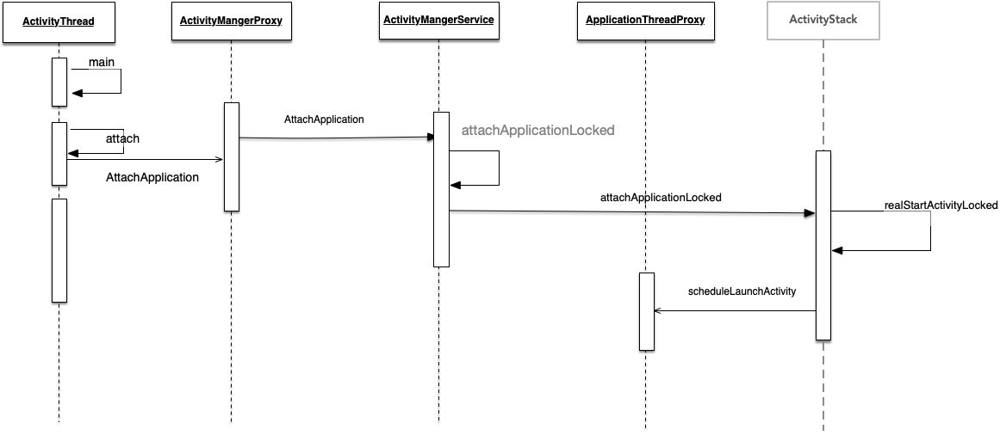
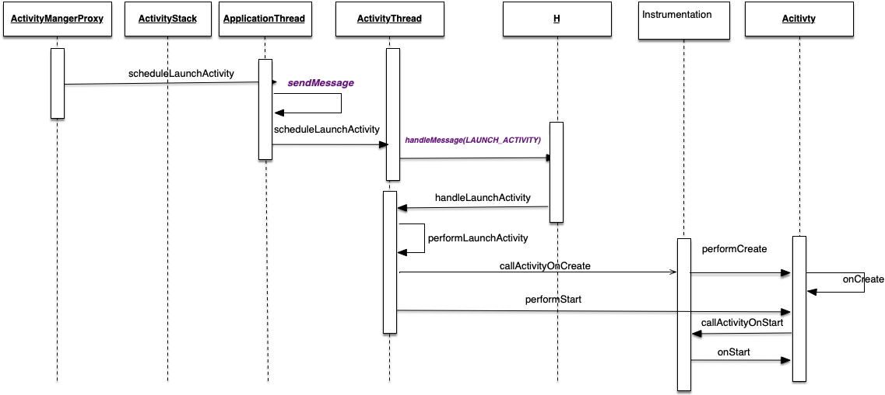

##### Application OnCreate()





```
public static void main(String[] args) {
		   Looper.prepareMainLooper();		//创建消息循环

        ActivityThread thread = new ActivityThread();  
        thread.attach(false);

        if (sMainThreadHandler == null) {
            sMainThreadHandler = thread.getHandler();
        }

        if (false) {
            Looper.myLooper().setMessageLogging(new
                    LogPrinter(Log.DEBUG, "ActivityThread"));
        }

        // End of event ActivityThreadMain.
        Trace.traceEnd(Trace.TRACE_TAG_ACTIVITY_MANAGER);
        Looper.loop();					//使当前进程进入消息循环
}
```

在这里我们就不再详细分析prepareMainLooper和loop方法，其主要功能就是准备好主线程的Looper以及消息队列，最后再开启主线程的消息循环。

```
private void attach(boolean system) {

 IActivityManager mgr = ActivityManagerNative.getDefault(); //获得ApplicationThreadNative
 																									//代理类ActivityManagerProxy 
            try {
                mgr.attachApplication(mAppThread);
            } catch (RemoteException ex) {
                throw ex.rethrowFromSystemServer();
            }
            // Watch for getting close to heap limit.
            BinderInternal.addGcWatcher(new Runnable() {
                @Override public void run() {
                    if (!mSomeActivitiesChanged) {
                        return;
                    }
                    Runtime runtime = Runtime.getRuntime();
                    long dalvikMax = runtime.maxMemory();
                    long dalvikUsed = runtime.totalMemory() - runtime.freeMemory();
                    if (dalvikUsed > ((3*dalvikMax)/4)) {
                        if (DEBUG_MEMORY_TRIM) Slog.d(TAG, "Dalvik max=" + (dalvikMax/1024)
                                + " total=" + (runtime.totalMemory()/1024)
                                + " used=" + (dalvikUsed/1024));
                        mSomeActivitiesChanged = false;
                        try {
                            mgr.releaseSomeActivities(mAppThread);
                        } catch (RemoteException e) {
                            throw e.rethrowFromSystemServer();
                        }
                    }
                }
            });
}
```

可以看到由于在ActivityThread的attach中我们传入的是false，故在attach方法中将执行!system里的代码，通过调用AMS的attachApplication来将ActivityThread中的内部类ApplicationThread对象绑定至AMS，这样AMS就可以通过这个代理对象 来控制应用进程。接着为这个进程添加垃圾回收观察者，每当系统触发垃圾回收的时候就在run方法中计算应用使用了多大的内存，如果超过总量的3/4就尝试释放内存。

```
public void attachApplication(IApplicationThread app) throws RemoteException
{
    Parcel data = Parcel.obtain();
    Parcel reply = Parcel.obtain();
    data.writeInterfaceToken(IActivityManager.descriptor);
    data.writeStrongBinder(app.asBinder());
    mRemote.transact(ATTACH_APPLICATION_TRANSACTION, data, reply, 0);
    reply.readException();
    data.recycle();
    reply.recycle();
}
```


```
@Override
public boolean onTransact(int code, Parcel data, Parcel reply, int flags)
        throws RemoteException {
    switch (code) {
    	  case ATTACH_APPLICATION_TRANSACTION: {
            data.enforceInterface(IActivityManager.descriptor);
            IApplicationThread app = ApplicationThreadNative.asInterface(
                    data.readStrongBinder()); //得到代理类ApplicationThreadProxy 
            if (app != null) {
                attachApplication(app);
            }
            reply.writeNoException();
            return true;
        }
    }
}
```


```
@Override
public final void attachApplication(IApplicationThread thread) {
    synchronized (this) {
        int callingPid = Binder.getCallingPid();
        final long origId = Binder.clearCallingIdentity();
        attachApplicationLocked(thread, callingPid);
        Binder.restoreCallingIdentity(origId);
    }
}
```


​	将应用进程的ApplicationThread对象绑定到AMS，即AMS获得ApplicationThread的代理对象 

```
private final boolean attachApplicationLocked(IApplicationThread thread,
        int pid) {
        	//创建Application
          thread.bindApplication(processName, appInfo, providers, app.instrumentationClass,
                    profilerInfo, app.instrumentationArguments, app.instrumentationWatcher,
                    app.instrumentationUiAutomationConnection, testMode,
                    mBinderTransactionTrackingEnabled, enableTrackAllocation,
                    isRestrictedBackupMode || !normalMode, app.persistent,
                    new Configuration(mConfiguration), app.compat,
                    getCommonServicesLocked(app.isolated),
                                   mCoreSettingsObserver.getCoreSettingsLocked());
        
         //创建Activity
         if (mStackSupervisor.attachApplicationLocked(app)) {
                    didSomething = true;
         }
        
}
```


##### create Application


```
@Override
public final void bindApplication(String packageName, ApplicationInfo info,
        List<ProviderInfo> providers, ComponentName testName, ProfilerInfo profilerInfo,
        Bundle testArgs, IInstrumentationWatcher testWatcher,
        IUiAutomationConnection uiAutomationConnection, int debugMode,
        boolean enableBinderTracking, boolean trackAllocation, boolean restrictedBackupMode,
        boolean persistent, Configuration config, CompatibilityInfo compatInfo,
        Map<String, IBinder> services, Bundle coreSettings) throws RemoteException {
   
    data.writeInt(restrictedBackupMode ? 1 : 0);
    data.writeInt(persistent ? 1 : 0);
    config.writeToParcel(data, 0);
    compatInfo.writeToParcel(data, 0);
    data.writeMap(services);
    data.writeBundle(coreSettings);
    mRemote.transact(BIND_APPLICATION_TRANSACTION, data, null,
            IBinder.FLAG_ONEWAY);
    data.recycle();
}
```


```
 @Override
    public boolean onTransact(int code, Parcel data, Parcel reply, int flags)
            throws RemoteException {
        switch (code) {
					case BIND_APPLICATION_TRANSACTION:

   					 boolean trackAllocation = data.readInt() != 0;
    boolean restrictedBackupMode = (data.readInt() != 0);
    boolean persistent = (data.readInt() != 0);
    Configuration config = Configuration.CREATOR.createFromParcel(data);
    CompatibilityInfo compatInfo = CompatibilityInfo.CREATOR.createFromParcel(data);
    HashMap<String, IBinder> services = data.readHashMap(null);
    Bundle coreSettings = data.readBundle();
    bindApplication(packageName, info, providers, testName, profilerInfo, testArgs,
            testWatcher, uiAutomationConnection, testMode, enableBinderTracking,
            trackAllocation, restrictedBackupMode, persistent, config, compatInfo, services,
            coreSettings);
    return true;
	
	      }
}
```


```
public final void bindApplication(String processName, ApplicationInfo appInfo,
        List<ProviderInfo> providers, ComponentName instrumentationName,
        ProfilerInfo profilerInfo, Bundle instrumentationArgs,
        IInstrumentationWatcher instrumentationWatcher,
        IUiAutomationConnection instrumentationUiConnection, int debugMode,
        boolean enableBinderTracking, boolean trackAllocation,
        boolean isRestrictedBackupMode, boolean persistent, Configuration config,
        CompatibilityInfo compatInfo, Map<String, IBinder> services, Bundle coreSettings) {

 
    data.restrictedBackupMode = isRestrictedBackupMode;
    data.persistent = persistent;
    data.config = config;
    data.compatInfo = compatInfo;
    data.initProfilerInfo = profilerInfo;
    sendMessage(H.BIND_APPLICATION, data);
}
```


```
case BIND_APPLICATION:
    Trace.traceBegin(Trace.TRACE_TAG_ACTIVITY_MANAGER, "bindApplication");
    AppBindData data = (AppBindData)msg.obj;
    handleBindApplication(data);
    Trace.traceEnd(Trace.TRACE_TAG_ACTIVITY_MANAGER);
```


```
private void handleBindApplication(AppBindData data) {
      // If the app is being launched for full backup or restore, bring it up in
            // a restricted environment with the base application class.
            Application app = data.info.makeApplication(data.restrictedBackupMode, null);
            mInitialApplication = app;
	
					
					  mInstrumentation.callApplicationOnCreate(app); //调用Application的create方法

    
}
```


```
public Application makeApplication(boolean forceDefaultAppClass,
        Instrumentation instrumentation) {
    if (mApplication != null) {
        return mApplication;
    }
    
        Application app = null;

        String appClass = mApplicationInfo.className;
        if (forceDefaultAppClass || (appClass == null)) {
            appClass = "android.app.Application";
        }

        try {
            java.lang.ClassLoader cl = getClassLoader();
            if (!mPackageName.equals("android")) {
                Trace.traceBegin(Trace.TRACE_TAG_ACTIVITY_MANAGER,
                        "initializeJavaContextClassLoader");
                initializeJavaContextClassLoader();
                Trace.traceEnd(Trace.TRACE_TAG_ACTIVITY_MANAGER);
            }
            ContextImpl appContext = ContextImpl.createAppContext(mActivityThread, this);
            app = mActivityThread.mInstrumentation.newApplication(
                    cl, appClass, appContext);
            appContext.setOuterContext(app);
}
```





#####  LaunchActivity


```
// we use token to identify this activity without having to send the
        // activity itself back to the activity manager. (matters more with ipc)
        @Override
   public final void scheduleLaunchActivity(Intent intent, IBinder token, int ident,
                ActivityInfo info, Configuration curConfig, Configuration overrideConfig,
                CompatibilityInfo compatInfo, String referrer, IVoiceInteractor voiceInteractor,
                int procState, Bundle state, PersistableBundle persistentState,
                List<ResultInfo> pendingResults, List<ReferrerIntent> pendingNewIntents,
                boolean notResumed, boolean isForward, ProfilerInfo profilerInfo) {
                
            ActivityClientRecord r = new ActivityClientRecord();
            r.token = token;
            r.ident = ident;
            r.intent = intent;
            r.referrer = referrer;
            r.voiceInteractor = voiceInteractor;
            r.activityInfo = info;
            r.compatInfo = compatInfo;
            r.state = state;
            r.persistentState = persistentState;

            r.pendingResults = pendingResults;
            r.pendingIntents = pendingNewIntents;

            r.startsNotResumed = notResumed;
            r.isForward = isForward;

            r.profilerInfo = profilerInfo;

            r.overrideConfig = overrideConfig;
            updatePendingConfiguration(curConfig);

            sendMessage(H.LAUNCH_ACTIVITY, r);
                
    }
```


```
public void handleMessage(Message msg) {
    if (DEBUG_MESSAGES) Slog.v(TAG, ">>> handling: " + codeToString(msg.what));
    switch (msg.what) {
        case LAUNCH_ACTIVITY: {
            Trace.traceBegin(Trace.TRACE_TAG_ACTIVITY_MANAGER, "activityStart");
            final ActivityClientRecord r = (ActivityClientRecord) msg.obj;

            r.packageInfo = getPackageInfoNoCheck(
                    r.activityInfo.applicationInfo, r.compatInfo);
            handleLaunchActivity(r, null, "LAUNCH_ACTIVITY");
            Trace.traceEnd(Trace.TRACE_TAG_ACTIVITY_MANAGER);
        } break;
  }
```


```
private void handleLaunchActivity(ActivityClientRecord r, Intent customIntent, String reason) {
  //通过Activity所在的应用程序信息及该Activity对应的CompatibilityInfo信息从PMS服务中查询当前Activity的包信息  
    ActivityInfo aInfo = r.activityInfo;
    if (r.packageInfo == null) {
        r.packageInfo = getPackageInfo(aInfo.applicationInfo, r.compatInfo,
                Context.CONTEXT_INCLUDE_CODE);
    }
    //获取当前Activity的组件信息  
    ComponentName component = r.intent.getComponent();
    if (component == null) {
        component = r.intent.resolveActivity(
            mInitialApplication.getPackageManager());
        r.intent.setComponent(component);
    }
    //packageName为启动Activity的包名，targetActivity为Activity的类名  
    if (r.activityInfo.targetActivity != null) {
        component = new ComponentName(r.activityInfo.packageName,
                r.activityInfo.targetActivity);
    }
    //通过类反射方式加载即将启动的Activity
    Activity activity = null;
    try {
        java.lang.ClassLoader cl = r.packageInfo.getClassLoader();
        activity = mInstrumentation.newActivity(
                cl, component.getClassName(), r.intent);
        StrictMode.incrementExpectedActivityCount(activity.getClass());
        r.intent.setExtrasClassLoader(cl);
        r.intent.prepareToEnterProcess();
        if (r.state != null) {
            r.state.setClassLoader(cl);
        }
    } ......
    try {
        //通过单例模式为应用程序进程创建Application对象  
        Application app = r.packageInfo.makeApplication(false, mInstrumentation);

       ......
        if (activity != null) {
            //为当前Activity创建上下文对象ContextImpl  
            Context appContext = createBaseContextForActivity(r, activity);
            ......
            //将当前启动的Activity和上下文ContextImpl、Application绑定
            activity.attach(appContext, this, getInstrumentation(), r.token,
                    r.ident, app, r.intent, r.activityInfo, title, r.parent,
                    r.embeddedID, r.lastNonConfigurationInstances, config,
                    r.referrer, r.voiceInteractor, window);

            ......
            //将Activity保存到ActivityClientRecord中，ActivityClientRecord为Activity在应用程序进程中的描述符  
            r.activity = activity;
            activity.mCalled = false;
            if (r.isPersistable()) {
                mInstrumentation.callActivityOnCreate(activity, r.state, r.persistentState);
            } else {
                mInstrumentation.callActivityOnCreate(activity, r.state);
            }
            ......
            //生命周期onStart、onresume
            if (!r.activity.mFinished) {
                activity.performStart();
                r.stopped = false;
            }

            //ActivityThread的成员变量mActivities保存了当前应用程序进程中的所有Activity的描述符
            mActivities.put(r.token, r);
            ......
    return activity;
}

```

在上述方法中将调用performLaunchActivity来启动Activity，如下

应用程序进程通过performLaunchActivity函数将即将要启动的Activity加载到当前进程空间来，同时为启动Activity做准备。 [ActivityThread.java #performLaunchActivity()]

```
private Activity performLaunchActivity(ActivityClientRecord r, Intent customIntent) {
		 	//用类加载器来创建该Activity的实例
     activity = mInstrumentation.newActivity(
                    cl, component.getClassName(), r.intent);
}

 public Activity newActivity(ClassLoader cl, String className,
            Intent intent)
            throws InstantiationException, IllegalAccessException,
            ClassNotFoundException {
        return (Activity)cl.loadClass(className).newInstance();
 }
```


##### 解决问题

Application Activity创建流程 

Launch app启动问题 


https://juejin.im/post/5baf275f5188255c9a7740ba