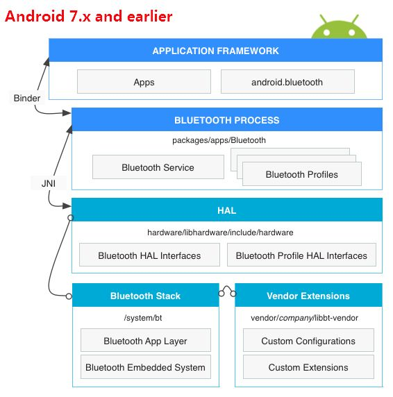

#### BLE stack(蓝牙协议栈)

 作为 Android 开发者，我们不必理解 BLE 的协议栈每个细节，这里大概介绍一下协议架构。 协议一般都是分层设计的。BLE 协议栈也不例外。我们来看一下这个图。整个协议栈大致分为三部分，从下到上分别为，控制器    （Controller）→主机（Host）→应用（Applications）。 

- Controller :  它是协议栈的底层的实现，直接与硬件相关，一般直接集成在 SoC 中，由芯片厂商实现，包括物理层和链路层。 
- HOST : 这是协议栈的上层实现，是硬件的抽象，与具体的硬件和厂家无关 
- 应用层： 就是使用 Host 层提供的 API，开发的应用。 

#### Controller

* PhysicalLayer(物理层 ): 蓝牙是工作在 2.4GHz 附近，这是工业、科学、医疗 ISM 频段。可以看到它和 WiFi 工作在同一个频段。蓝牙把频段切分为 40 个通道，3 个广播通道，37 个数据通道，按照一定规律跳频通信（高斯频移键控 GFSK）。 

* HCI   : 在 Host 层和 Controller 之间有一个接口层 :主机和控制器之间就是通过 HCI 命令和事件交互的。HCI 这一层是协议栈中是可选的，例如在一些简单小型的设备上可能就没有，但是所有的 Android 设备上肯定是有。这是蓝牙上层应用和芯片的交互的必经之路。后面我们会讲到，这一层的 log，能够很好的帮助我们分析和调试问题。 

#### Host

##### ATT (Attribute Protocol)

它是 BLE 通信的基础。ATT 把数据封装，向外暴露为“属性”，提供“属性”的为服务端，获取“属性”的为客户端。ATT 是专门为低功耗蓝牙设计的，结构非常简单，数据长度很短 .

##### GATT(Generic Attribute Profile)

 全称叫做通用属性配置文件，它是建立在前面说的 ATT 的基础上，对 ATT 进行进一步的逻辑封装，定义数据的交互方式和含义。这是我们做 BLE 开发的时候直接接触的概念。 GATT 按照层级定义了三个概念：服务（Service）、特征（Characteristic）和描述（Descriptor）。 一个 Service 包含若干个 Characteristic，一个 Characteristic 可以包含若干 Descriptor。而 Characteristic 定义了数值和操作。Characteristic 的操作这几种权限：读、写、通知等权限。我们说的 BLE 通信，其实就是对 Characteristic 的读写或者订阅通知。还有最外面一层，Profile配置文件，把若干个相关的 Service 组合在一起，就成为了一个 Profile，Profile 就是定义了一个实际的应用场景。 

Service、Characteristic相当于标签（Service相当于他的类别，Characteristic相当于它的名字），而value才真正的包含数据，Descriptor是对这个value进行的说明和描述，当然我们可以从不同角度来描述和说明，因此可以有多个Descriptor. 

* 例如: 

常见的小米手环是一个BLE设备，（假设）它包含三个Service,分别是提供设备信息的Service、提供步数的Service、检测心率的Service; 而设备信息的service中包含的characteristic包括厂商信息、硬件信息、版本信息等；而心率Service则包括心率characteristic等，而心率characteristic中的value则真正的包含心率的数据，而descriptor则是对该value的描述说明，比如value的单位啊，描述啊，权限啊等。 

##### GAP(Generic Access Profile)

它定义了 BLE 整个通信过程中的流程，例如广播、扫描、连接等流程。还定义了参与通信的设备角色，以及他们各自的职能，例如广播数据的 Broadcaster，接收广播的 Observer，还有被连接的“外设” Peripheral 和发起连接的“中心设备” Central。可以看到，参与交互的设备角色都不是对等 

##### Applications

就是使用 Host 提供的 API 开发的低功耗蓝牙应用。 到这里，我们就把 BLE 的协议栈过了一下，为我们开发 BLE 有了一些理论基础。 

#### BLE on Android

* Central mode :  从Android 4.3 Jelly Bean，也就是 API 18 才开始支持低功耗蓝牙(蓝牙4.0)。这时支持 BLE 的 Central 模式，也就是我们在上面 GAP 中说的，Android 设备只能作为中心设备去连接其他设备。

* Peripheral mode:从 Android 5.0 开始才支持外设模式(蓝牙4.1)。Android 设备现在可以发挥蓝牙 LE *外围设备*的作用。应用可以利用此功能让附近设备发现它。例如，您可以开发这样的应用：让设备发挥计步器或健康监测仪的作用，并与其他蓝牙 LE 设备进行数据通信。
  
  新增的 `android.bluetooth.le` API 让您的应用可以发布广告、扫描响应以及与附近的蓝牙 LE 设备建立连接。要使用新增的广告和扫描功能，请在您的清单中添加 `BLUETOOTH_ADMIN` 权限。当用户更新您的应用或从 Play 商店下载您的应用时，会被要求向您的应用授予以下权限：“Bluetooth connection information:Allows the app to control Bluetooth, including broadcasting to or getting information about nearby Bluetooth devices.”
  
  要启动蓝牙 LE 广播，以便其他设备能发现您的应用，请调用 `startAdvertising()`，并传入 `AdvertiseCallback` 类的实现。回调对象会收到广播操作成功或失败的报告。
  
  Android 5.0 引入了 `ScanFilter` 类，让您的应用可以只扫描其感兴趣的特定类型设备。要开始扫描蓝牙 LE 设备，请调用 `startScan()`，并传入筛选器列表。在方法调用中，您还必须提供 `ScanCallback` 的实现，以便在发现蓝牙 LE 广播时进行报告。
  
  https://developer.android.com/about/versions/android-5.0?hl=zh-cn#BluetoothBroadcasting
  
  https://en.wikipedia.org/wiki/Bluetooth#Communication_and_connection

##### Android 7.0 蓝牙架构

##### Android 8.0 蓝牙架构

Android 提供支持经典蓝牙和蓝牙低功耗的默认蓝牙堆栈。借助蓝牙，Android 设备可以创建个人区域网络，以便通过附近的蓝牙设备发送和接收数据。

在 Android 4.3 及更高版本中，Android 蓝牙堆栈可提供实现蓝牙低功耗 (BLE) 的功能。要充分利用 BLE API，请遵循 [Android 蓝牙 HCI 要求](https://source.android.com/devices/bluetooth/hci_requirements.html?hl=zh-cn)。具有合格芯片组的 Android 设备可以实现经典蓝牙或同时实现经典蓝牙和 BLE。BLE 不能向后兼容较旧版本的蓝牙芯片组。

在 Android 8.0 中，原生蓝牙堆栈完全符合蓝牙 5.0 的要求。要使用可用的蓝牙 5.0 功能，该设备需要具有符合蓝牙 5 要求的芯片组。

**注意**：Android 8.0 及以前版本之间的原生蓝牙堆栈的最大变化是使用[高音](https://source.android.com/devices/architecture/treble.html?hl=zh-cn)。Android 8.0 中的供应商实现必须使用 HIDL 而不是 `libbt-vendor`。

- 蓝牙系统服务
  
  蓝牙系统服务（位于 `packages/apps/Bluetooth` 中）被打包为 Android 应用，并在 Android 框架层实现蓝牙服务和配置文件。此应用通过 JNI 调用原生蓝牙堆栈。

- JNI
  
  与 android.bluetooth 相关联的 JNI 代码位于 `packages/apps/Bluetooth/jni` 中。当发生特定蓝牙操作时（例如发现设备时），JNI 代码会调用蓝牙堆栈。

- 蓝牙堆栈
  
  系统在 AOSP 中提供了默认蓝牙堆栈，它位于 `system/bt` 中。该堆栈会实现常规蓝牙 HAL，并通过扩展程序和更改配置对其进行自定义。

- 供应商实现
  
  供应商设备使用硬件接口设计语言 (HIDL) 与蓝牙堆栈交互。

#### HIDL

[HIDL](https://source.android.com/devices/architecture/hidl.html?hl=zh-cn) 定义了蓝牙堆栈和供应商实现之间的接口。要生成蓝牙 HIDL 文件，请将蓝牙接口文件传递到 HIDL 生成工具中。接口文件位于 `hardware/interfaces/bluetooth` 下。

~~Android 7.x 及更早版本的蓝牙架构~~

https://developer.android.com/guide/platform/?hl=zh-cn

https://source.android.com/setup/

https://source.android.com/devices/bluetooth/?hl=zh-cn

##### Android 中 BLE 操作的过程

这里介绍一下 Android 中 BLE 操作的过程，APP 发起一个 BLE 操作，然后理解返回，操作结果通过回调上报。操作被封装为一个消息，然后放到协议栈的消息队列中，有一个独立的线程获取消息进行处理，类似于 Looper 和 Handler 机制。

因为是使用消息机制，回调的时候必须知道通知哪个客户端？客户端发起请求之前，首先要向协议栈注册客户端，注册成功以后，返回一个 clientIf，这是一个整型，是客户端在协议栈的一个句柄，客户端的后续操作，都只需要带上这个 clientIf 句柄即可。

在操作完成的时候，一般都有一个显式的停止操作，用来释放前面的申请的 clientIf 和资源。如果不能正确的释放，不仅会造成内存泄漏，而且可能会导致后续所有的 BLE 操作都是不能做了。因为这个 clientIf 是有限，在现在蓝牙协议栈中只有 32 个，而且是Android 上所有 APP 共用的。当这些资源用完以后，只有通过杀掉对应的 APP 或者重启蓝牙才能恢复。

##### BLE 应用

BLE 应用可以分为两大类：基于非连接的和连接的。

* Beacon 基于非连接的，这种应用就是依赖 BLE 的广播，也叫作 Beacon。这里有两个角色，发送广播的一方叫做 Broadcaster，监听广播的一方叫 Observer。

* 基于连接的，就是通过建立 GATT 连接，收发数据。这里也有两个角色，发起连接的一方，叫做中心设备—Central，被连接的设备，叫做外设—Peripheral。

###### 非连接

它的网络拓扑结构如下。我们知道广播是单向的，Broadcaster 向外广播，监听者接收附近的广播，整体来说形成一个单向的星型。网络中可以有多个外设，也可以有多个监听者 

还有些设备，可以同时实现两个角色，既能发送广播，也可以接收广播。一个设备接收到广播，可以通过处理，然后再转发出去，这样就可以形成一个双向的网格，这就是蓝牙的 Mesh。这样的网络可以不受蓝牙传输距离限制了，只要在空间中布置足够密集的节点，就能把信息从网络一点，传递到任何一点。这个可以应用在物联网和智能家居系统中。 

前面在介绍协议栈物理层的时候，我们知道广播只在37、38、39这三个广播频道进行广播，监听者也在这三个频道进行监听。我们前面介绍了，蓝牙通信是跳频的，只有双方设备在某个时刻跳到同一个频到上，才能收到广播，这种传播数据效率比较低，数据量也有限，不适合大规模的数据传输。 

* 广播包 

​    广播数据其实包含两部分：Advertising Data（广播数据） 和 Scan Response Data（扫描响应数据）。通常    情况下，广播的一方，按照一定的间隔，往空中广播 Advertising Data，当某个监听设备监听到这个广播数据时    候，会通过发送 Scan Response Request，请求广播方发送扫描响应数据数据。这两部分数据的长度都是固定的 31 字节。在 Android 中，系统会把这两个数据拼接在一起，返回一个 62 字节的数组。

广播数据包的结构如这个图所示。广播包中是包含一个一个的小 AD structure，每个 AD structure 是一个完整的数据，它的结构是：第一个字节表示长度 n，后面紧接 n 个字节的数据。数据部分第一个字节表示数据类型，也就是后面的数据含义，后面 n - 1 个字节表示真实数据.

这些广播数据可以自己手动去解析，在 Android 5.0 也提供 ScanRecord 帮你解析，直接可以通过这个类获得有意义的数据。

* 广播数据类型：设备连接属性，标识设备支持的 BLE 模式，这个是必须的。设备名字，设备包含的关键 GATT service，或者 Service data，厂商自定义数据等等。  

* RSSI （信号强度 ）：RSSI 单位是 dB，通过 RSSI 能够大致推测出距离的远近。但是这个在 Android 设备上非常不靠谱，RSSI 的值波动很大，跟环境和手机的角度关系很大。 
  
  ​     Android 作为接收者怎么接收广播数据，扫描设备。代码其实很简单，首先创建一个 LeScanCallback，用来接收收到广播以后，回调上报数据。然后会用 BluetoothAdapter 的 startLeScan 来开始扫描，需要停止扫描的时候，使用 stopLeScan 来停止。 有 BluetoothDevice 这个参数，代表扫描到的设备，关键是设备的的 MAC 地址信息。然后就是 RSSI，表示扫描到的设备的信号强度，接下来 scanRecord 就是我们前面介绍的广播数据，这个数据的长度是62字节。值得提的一点是，BLE 所有回调函数都不是在主线程中的。
  
  这里有几点需要注意，这里在不需要扫描以后，一定要 stopLeScan，而且 start 和 stop 中传入的 LeScanCallback 一定要是同一个，因为 LeScanCallback 就是我们客户端的标识。否者就会出现我们前面说的 clientIf 不释放的问题。在 Android 开发中，我们经常会使用匿名内部类来做参数，在这里就千万不要这么做。
  
  在 Android 5.0 中，提供了全新的扫描 API — BluetoothLeScanner，它提供了对扫描更加精细的控制。
  
  除了这种方法，还可以使用经典蓝牙扫描的方式，BluetoothAdapter 的 startDiscovery()，然后通过 BroadcastReceiver 来接收收到的广播。如果只是做 BLE 的开发，不建议使用这个方法，这是一个非常重的操作，灵活性非常差。

* 扫描的工作流程 
  
  
  
  ​    首先 APP 发起扫描请求，通过蓝牙的 Service 发送请求给蓝牙芯片。蓝牙芯片开始扫描，扫描到了设备，就通过回调上报。我们知道，扫描真正执行实在 BT 芯片中，只要 APP 发送了请求下去以后，Android 系统就可以休眠了，也就是我们常说的 AP （Application Processor），等扫描到了设备以后，底层 BP （Baseband Processor）就会唤醒上层 AP，执行回调通知到 APP，（动画）就像我们图中红色框标出的这样。这里有一个问题，随着我们周围的 BLE 设备逐渐增多，频繁扫描到设备，系统就会被频繁的唤醒，甚至睡眠不下去，从而导致耗电严重。
  
  为了避免这种问题，耗电的问题。我们需要尽可能少的使用扫描。即使需要扫描，我们也希望尽可能少的上报扫描到的设备。这里就可以使用 Android 5.0 上提供的新接口，设置 ScanFilter，通过一定的规则过滤，只有扫描到了符合我们的规则的设备才上报，或者通过设置延迟上报，从而减少唤醒系统的次数。
  
  这里总结一下扫描中一些建议。1、首先，尽可能使用新的 API，功能更强大；2、尽可能少地扫描，因为毕竟扫描是一个比较重的操作，耗电，也会减慢 BLE 连接速度；3、扫描的时候，尽量设置 ScanFilter，只扫描那些你感兴趣的设备，而不是全盘扫描；4、正确使用 API，特别是合理停止扫描，防止资源泄漏。

* Android手机 作为 Broadcaster
  
  从 Android 5.0 开始，Android 设备就可以像外设一样发送 BLE 广播了。这时 Android 设备之间就可以通过 BLE 来交互数据，或者发现对方设备了，例如类似 NFC 一样交换简单信息的应用，想象空间还是很大的。
  
  Android 中实现的代码如下，通过前面的介绍，我们知道广播有两种包：Advertising Data 和 Scan Response Data，我们这里设置好这两种包，然后通过 BluetoothLeAdvertier 的 startAdvertising 就可以了。这里需要注意的点和前面一样，Start 了，需要注意 Stop。
  
  

##### 基于连接

BLE 连接的建立是通过 GAP 来协商和创建连接。Central 设备发起连接，外设接收连接请求，并协商连接参数。

前面我们介绍了 GATT，GATT 核心内容就是 Service、Characteristic 以及 Descriptor。每个 BLE 外设，根据自己的功能，向外暴露 Service 等。其实最重要的获取 Service 中的 Characteristic，Characteristic 可以被读、写、还有变化的时候有通知，这样就实现了双向的通信。

 

​            连接到GATT服务器（发送数据的BLE设备）

https://blog.csdn.net/Roshen_android/article/details/76916111

https://www.race604.com/android-ble-in-action/

 http://yannischeng.com/Android%20BLE%20%E8%93%9D%E7%89%99%E5%BC%80%E5%8F%91/