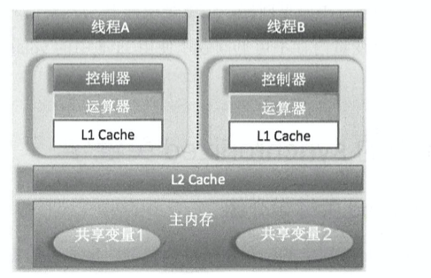

####  MESI

为什么需要MESI协议 : CPU的高度运算需要高速的数据,然而内存和硬盘的发展速度远远不及CPU


一个CPU的变量发生改变，其他拥有这个变量CPU需要同步.

查看如下链接的 多核缓存协同操作流程图


 https://www.bilibili.com/video/BV1fK4y1E7NC视频讲解了这个状态图的各个情况.

https://www.cnblogs.com/yanlong300/p/8986041.html

https://www.codenong.com/cs106520859/


Memory Barriers

通过 Store Forwarding 解决了单个 CPU 执行顺序性和内存可见性问题，但是在全局多 CPU 的环境下，这种内存可见性恐怕就很难保证了。

```java
void foo(void)
{
 a = 1;
 b = 1;
}

void bar(void)
{
 while (b == 0) continue;
 assert(a == 1);
}
```

假设上面的 foo 方法被 CPU 0 执行，bar 方法被 CPU 1  执行，也就是我们常说的多线程环境。试想，即便在多线程环境下，foo 和 bar 如若严格按照理想的顺序执行，是无论如何都不会出现 assert  failed 的情况的。但往往事与愿违，这种看似很诡异的且有一定几率发生的 assert failed ，结合上面所说的 Store  Buffer 就一点都不难理解了。

我们来还原 assert failed 的整个过程，假设 a,b 初始值为 0 ，a 被 CPU0 和 CPU1 共同持有，b 被 CPU0 独占；

CPU0 处理 a=1 之前发送 Invalidate 消息给 CPU1 ，并将其**放入 Store Buffer ，尚未及时刷入缓存**；

CPU 0 转而处理 b=1 ，此时 b=1 直接被刷入缓存；
 CPU 1 发出 Read 消息读取 b 的值，发现 b 为 1 ，跳出 while 语句；

CPU 1 发出 Read 消息读取 a 的值，发现 a 却为旧值 0，assert failed。

在日常开发过程中也是完全有可能遇到上面的情况，由于 a 的变更对 CPU1 不可见，虽然执行指令的时序没有真正被打乱，但对于 CPU1  来说，这造成了 b=1 先于 a=1 执行的假象，这种看是乱序的问题，通常称为 “重排序”。当然上面所说的情况，只是指令重排序的一种可能。


#####  Java内存模型 工作内存与主内存之间的原子操作

lock( 锁定 )：作用于**主内存的变量**，把一个变量标识为一条线程独占的状态。

unlock（解锁）：作用于**主内存**的变量，把一个处于锁定的变量释放出来，释放变量才可以被其他线程锁定。

read（读取）：作用于**主内存**的变量，把一个变量的值从主内存传输到线程的工作内存中，以便随后的load动作使用。

load（载入）：作用于***工作内存***的变量，它把read操作从主内存中得到的变量值放入工作内存的变量副本中。

use（使用）：作用于***工作内***存种的变量，它把工作内存中一个变量的值传递给执行引擎，每当虚拟机遇到一个需要使用到变量的值的字节码指令时将会执行这个操作。

assign（赋值）：作用于***工作内存***中的变量，它把一个从执行引擎接收到的值赋给工作内存的变量，每当虚拟机遇到一个给变量赋值的字节码指令时执行这个操作。

store（存储）：作用于***工作内存***的变量，它把工作内存中一个变量的值传送到主内存中，以便随后的write操作使用

write（写入）：作用于**主内存**的变量，它把store操作从工作内存中得到的值放入主内存的变量中。


深入理解java虚拟机(12.3.2 内存间交互操作)


##### 总线上传递的消息

首先不同CPU之间也是需要沟通的，这里的沟通是通过在消息总线上传递message实现的。


**Read**: sent if CPU needs to read from an address

***Read Response:*** response to a *read* message, carries the data at the requested address

**Invalidate**: asks others to evict a cache line *Invalidate Acknowledge:* reply indicating that an

**Read Invalidate:** like *Read* + *Invalidate* (also called “read with intend to modify”)

​		

**Writeback:** info on what data has been sent to main memory

​						该消息包含一个物理内存地址和数据内容，目的是把这块数据通过总线写回内存里。


-  Read：当CPU在自己的cache中没有发现需要的物理地址，就会发送一条“READ”消息，该消息包括缓存行需要读的物理地址。

  

-  Read Response: 顾名思义，”Read Response”消息是回复“Read”消息的。“Read  Response”消息是由内存或者其他CPU缓存提供的。如果其他缓存请求一个处于“modified”状态的数据，则本地缓存必须提供“Read  Response”消息。这个很容易理解，别的CPU在请求本地缓存中的数据，而这份数据还没有刷新到内存，所以必须告诉其他CPU该数据的最新值。接收到”Read Response”消息后，该数据的缓存状态就由”invalid”变成了”share”或者”exclusive”，这取决于”Read  Response”的提供者是内存还是其他CPU缓存。

  

- Invalidate：“ invalidate”  消息包含要使无效的缓存行的物理地址。其他的缓存必须从它们的缓存中移除相应的数据并且响应此消息。当CPU要对一个变量进行写操作，而此变量处于只读状态(share)，就需要发送“invalid”消息。由于一个变量被多个CPU缓存，所以单个CPU的改写会造成缓存不一致，所以在写之前必须告诉其他CPU你们缓存的值马上就要过时了。接受到”invalidate”消息的CPU就会把本地缓存中的对应数据无效掉。

- Invalidate Acknowledge：一个接收到“invalidate”消息的  CPU必须在移除指定数据后响应一个“invalidate  acknowledge”消息。这个消息就是告诉“invalidate”消息的提供者“我已经知道你要更改这个数据了，我放弃使用自己缓存中的拷贝！”

- Read Invalidate：”read  invalidate”消息包含要缓存行读取的物理地址。同时指示其他缓存移除数据。因此，它包含一个”read”和一个”invalidate”。“read invalidate”也需要“read response”以及”invalidate acknowledge”消息集。
      “Read  Invalidate”消息的发送时机有两个：第一个是CPU对一个数据进行原子读写操作，但是该数据没有在本地CPU的缓存中，在其他CPU缓存中可能有该数据的拷贝。所以它需要发送一条“Read Invalidate”消息，它不仅需要读取该数据的最新值，还要无效掉其他的CPU缓存(它马上就要改写该数据)。

- Writeback：“writeback”消息包含要回写到内存的地址和数据。这个消息允许缓存在必要时换出“modified”状态的数据以腾出空间。消息的发送时机是，CPU把本地缓存中的数据刷新到内存中，而该数据是share状态(只读)，它需要告诉其他CPU”我不再使用这些缓存数据了”

http://intheworld.win/2015/07/16/%E5%A4%9A%E6%A0%B8%E7%A8%8B%E5%BA%8F%E8%AE%BE%E8%AE%A1%E7%BC%93%E5%AD%98%E4%B8%80%E8%87%B4%E6%80%A7%E5%8D%8F%E8%AE%AEmesi/


##### MESI为什么还需要volatile?

volatile 和MESI 中间差了好几层抽象，中间会经历java编译器，java虚拟机和JIT，操作系统，CPU核心。


volatile 是Java 中标识变量可见性的关键字，说直接点：使用volatile 修饰的变量是有内存可见性的，这是Java  语法定的，Java 不关心你底层操作系统、硬件CPU 是如何实现内存可见的，我的语法规定就是volatile 修饰的变量必须是具有可见性的。

CPU 有X86（复杂指令集）、ARM（精简指令集）等体系架构，版本类型也有很多种，CPU 可能通过锁总线、MESI  协议实现多核心缓存的一致性。因为有硬件的差异以及编译器和处理器的指令重排优化的存在，所以Java  需要一种协议来规避硬件平台的差异，保障同一段代表在所有平台运行效果一致，这个协议叫做Java 内存模型（Java Memory Model）。

https://www.wwwbuild.net/java3y/5614.html


可见性问题存在的主要原因就是，Store Buffer ，尚未及时刷入缓存，然后其他CPU还是从内存里面取出旧值.为了提高CPU效率，MESI引入了缓存失效机制.

https://www.cnblogs.com/xmzJava/p/11417943.html   **这篇文章很好**

而对于JAVA而言，他必须要屏蔽各个处理器的差异，所以才有了java内存模型(JMM),volatile只是内存模型的一小部分，实现了变量的可见性和禁止指令重排序优化的功能。整个内存模型必须要实现可见性，原子性，和有序性。而volatile实现了其中的可见性和有序性。


##### 思考

上面说的意思是volitle是上层实现，不管底层是什么，其实MESI volatile还是没搞懂，但是MESI是CPU具体存在的，而且MESI也和可见性差不多原理，如果不用volatile就没有MESI了？


https://www.scss.tcd.ie/jeremy.jones/VivioJS/caches/MESI.htm

各种文章人云亦云，要么直接回避上面问题，有的还说volatile保障MESI,自己相信吗?

https://www.youtube.com/watch?v=q8r7b1KMUlE

看了**这个视频感觉**能说通了，volatile是在MESI基础上，禁止指令重排序(加了栅栏),来保障可见性。

有空看看其他几个视频链接，该删的删.


##### CPU代码执行顺序

```java
public class VisibilityThread {
    private static volatile boolean initFlag = true;

    public static void main(String[] args) throws InterruptedException {
        new Thread(() -> {
            System.out.println("waiting data...");
            while (!initFlag) {

            }
            System.out.println("=========success");
        }).start();

        Thread.sleep(2000);

        initFlag = false;
        
        new Thread(()->prepareData()).start();
    }

    private static void prepareData() {
        System.out.println("prepareData");
        initFlag = true;
        System.out.println("prepare data end..");
    }
}

```


流程图


https://www.bilibili.com/video/BV1XZ4y157Pj?p=4


#####  Volatile禁止重排序

单个线程中，只要重排序不会对结果产生影响，就不能保证其中的操作一定按照程序写定的顺序执行——即使重排序对于其他线程会产生影响。java并发编程实战3.1

这个视频讲了 Volatile重排序的实现，没讲可见性

https://www.bilibili.com/video/BV1UD4y127Kw?p=4 

https://blog.csdn.net/reliveIT/article/details/50450136

第五章 Cache - 处理器的肚量(大话处理器-处理器基础知识读本)

https://zhuanlan.zhihu.com/p/148772753

https://www.bilibili.com/video/BV1tE411o7oj?p=2

https://wudaijun.com/2019/04/cpu-cache-and-memory-model/#valine-comments


#### Sychronized三种应用方式

- 修饰实例方法，作用于当前实例加锁，进入同步代码前要获得当前实例的锁
- 修饰静态方法，作用于当前类对象加锁，进入同步代码前要获得当前类对象的锁
- 修饰代码块，指定加锁对象，对给定对象加锁，进入同步代码库前要获得给定对象的锁。


1. 作用于实例方法

   ```java
     public synchronized void increase(){
           i++;
     }
   ```

   示例 

   ```java
   public class AccountingSync implements Runnable{
       //共享资源(临界资源)
       static int i=0;
   
       /**
        * synchronized 修饰实例方法
        */
       public synchronized void increase(){
           i++;
       }
       @Override
       public void run() {
           for(int j=0;j<1000000;j++){
               increase();
           }
       }
       public static void main(String[] args) throws InterruptedException {
           AccountingSync instance=new AccountingSync();
           Thread t1=new Thread(instance);
           Thread t2=new Thread(instance);
           t1.start();
           t2.start();
           t1.join();
           t2.join();
           System.out.println(i);
       }
       /**
        * 输出结果:
        * 2000000
        */
   
   ```

   当一个线程正在访问一个对象的 synchronized 实例方法，那么其他线程不能访问该对象的其他 synchronized 方法，毕竟一个对象只有一把锁。

   

   如果是一个线程 A 需要访问实例对象 obj1 的 synchronized 方法 f1(当前对象锁是obj1)，另一个线程 B  需要访问实例对象 obj2 的 synchronized 方法 f2(当前对象锁是obj2)，这样是允许的，因为两个实例对象锁并不同相同

   

2. synchronized作用于静态方法

   ```java
   public class synchronized_01 implements Runnable {
       static int i = 0;
   
       /**
        * 对于全局
        */
       public static synchronized void increase() {
           i++;
       }
   
       @Override
       public void run() {
           for (int j = 0; j < 1000000; j++) {
               increase();
           }
       }
   
       public static void main(String[] args) throws InterruptedException {
           //new新实例
           Thread t1 = new Thread(new AccountingSyncBad());
           t1.start();
   
           for (int j = 0; j < 1000000; j++) {
               increase();
           }
           TimeUnit.SECONDS.sleep(2);
           System.out.println(i);
       }
   }
   
       /**
        * 输出结果:
        * 2000000
        */
   ```

   其锁对象是当前类的class对象. 可以看到主线程和自线程发生互斥。

3. synchronized同步代码块

   ```java
   
   public class synchronized_03 implements Runnable {
       static synchronized_03 instance=new synchronized_03();
       static int i=0;
       @Override
       public void run() {
           //省略其他耗时操作....
           //使用同步代码块对变量i进行同步操作,锁对象为instance
           synchronized(instance){
               for(int j=0;j<1000000;j++){
                   i++;
               }
           }
       }
   
       
       public static void main(String[] args) throws InterruptedException {
           //new新实例
           Thread t1 = new Thread(new synchronized_03());
           t1.start();
           System.out.println(i);
       }
   }
   ```

   将synchronized作用于一个给定的实例对象instance，即当前实例对象就是锁对象.当然除了instance作为对象外，我们还可以使用this对象(代表当前实例)或者当前类的class对象作为锁

   //this,当前实例对象锁

   ```
   synchronized(this){
       for(int j=0;j<1000000;j++){
           i++;
       }
   }
   
   //class对象锁
   synchronized(AccountingSync.class){
       for(int j=0;j<1000000;j++){
           i++;
       }
   }
   ```

   https://blog.csdn.net/javazejian/article/details/72828483

   

   

   ##### Sychronized volatile区别？

* Sychronized 

 保证原子性和可见性	synchronized可见性，线程加锁时，必须清空工作内存中共享变量的值，从而使用共享变量时需要从主内存重新读取；线程在解锁时，需要把工作内存中最新的共享变量的值写入到主存，以此来保证共享变量的可见性

* volatile

   只能保证可见性


#### CAS原理

##### CAS操作流程


CPU1发现 待修改的变量值是100，期望值100，启动修改

Cpu2发现不是100了，修改失败

##### CAS缺点

1. ABA问题

   从上一次看到这个值以来到现在，这个值是否发生过变化,从 A 变成了 B，再由 B 变回了 A,CAS 并不能检测出在此期间值是不是被修改过，它只能检查出现在的值和最初的值是不是一样。

   通过添加版本号解决,A→B→A 变成了 1A→2B→3A,atomic 包中提供了 AtomicStampedReference 这个类，它是专门用来解决 ABA 问题的

2. 自旋时间过长

   CAS 往往是配合着循环来实现的，有的时候甚至是死循环，不停地进行重试，直到线程竞争不激烈的时候，才能修改成功

3. 范围不能灵活控制

   执行 CAS 的时候，是针对某一个，而不是多个共享变量的，这个变量可能是 Integer 类型，也有可能是 Long 类型、对象类型等等，但是我们不能针对多个共享变量同时进行 CAS 操作，因为这多个变量之间是独立的，简单的把原子操作组合到一起，并不具备原子性.

   解决方案:那就是利用一个新的类，来整合刚才这一组共享变量，这个新的类中的多个成员变量就是刚才的那多个共享变量，然后再利用 atomic 包中的 AtomicReference 来把这个新对象整体进行 CAS 操作，这样就可以保证线程安全。


