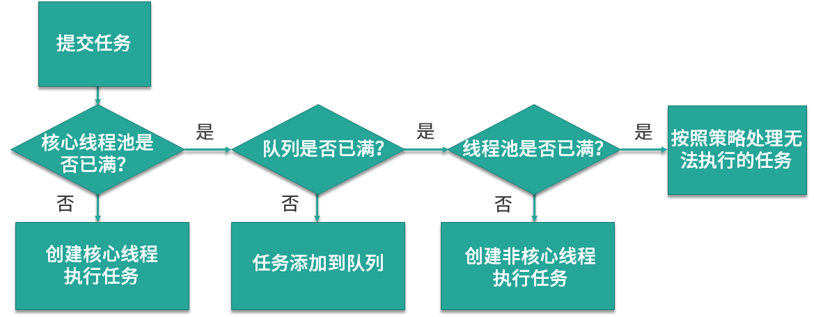

#### 线程池状态切换


1、RUNNING

(1) 状态说明：线程池处在RUNNING状态时，能够接收新任务，以及对已添加的任务进行处理。
 (02) 状态切换：线程池的初始化状态是RUNNING。换句话说，线程池被一旦被创建，就处于RUNNING状态，并且线程池中的任务数为0！

- 1

2、 SHUTDOWN

(1) 状态说明：线程池处在SHUTDOWN状态时，不接收新任务，但能处理已添加的任务。
 (2) 状态切换：调用线程池的shutdown()接口时，线程池由RUNNING -> SHUTDOWN。

3、STOP

(1) 状态说明：线程池处在STOP状态时，不接收新任务，不处理已添加的任务，并且会中断正在处理的任务。
 (2) 状态切换：调用线程池的shutdownNow()接口时，线程池由(RUNNING or SHUTDOWN ) -> STOP。

4、TIDYING

(1)  状态说明：当所有的任务已终止，ctl记录的”任务数量”为0，线程池会变为TIDYING状态。当线程池变为TIDYING状态时，会执行钩子函数terminated()。terminated()在ThreadPoolExecutor类中是空的，若用户想在线程池变为TIDYING时，进行相应的处理；可以通过重载terminated()函数来实现。
 (2) 状态切换：当线程池在SHUTDOWN状态下，阻塞队列为空并且线程池中执行的任务也为空时，就会由 SHUTDOWN -> TIDYING。
 当线程池在STOP状态下，线程池中执行的任务为空时，就会由STOP -> TIDYING。

5、 TERMINATED

(1) 状态说明：线程池彻底终止，就变成TERMINATED状态。
 (2) 状态切换：线程池处在TIDYING状态时，执行完terminated()之后，就会由 TIDYING -> TERMINATED。


https://blog.csdn.net/nmjhehe/article/details/115901549

https://www.cnblogs.com/east7/p/14417977.html

#### 线程池工作原理


##### 各参数含义

###### corePoolSize

线程池初始化时线程数默认为 0，当有新的任务提交后，会创建新线程执行任务，如果不做特殊设置，此后线程数通常不会再小于 corePoolSize ，因为它们是核心线程，即便未来可能没有可执行的任务也不会被销毁。

###### maximumPoolSize

​	maximumPoolSize 最大线程数，线程池会在 corePoolSize 核心线程数的基础上继续创建线程来执行任务，假设任务被不断提交，线程池会持续创建线程直到线程数达到 maximumPoolSize 最大线程数，如果依然有任务被提交，这就超过了线程池的最大处理能力，这个时候线程池就会拒绝这些任务，我们可以看到实际上任务进来之后，线程池会逐一判断 corePoolSize、workQueue、maximumPoolSize，如果依然不能满足需求，则会拒绝任务。

###### keepAliveTime+时间单位      

​	当线程池中线程数量多于核心线程数时，而此时又没有任务可做，线程池就会检测线程的 keepAliveTime，如果超过规定的时间，无事可做的线程就会被销毁，以便减少内存的占用和资源消耗。但是要注意到了核心线程数就不会销毁了。




如上图所示，当提交任务后，线程池首先会检查当前线程数，如果此时线程数小于核心线程数，比如最开始线程数量为 0，则新建线程并执行任务，随着任务的不断增加，线程数会逐渐增加并达到核心线程数，此时如果仍有任务被不断提交，就会被放入 workQueue 任务队列中，等待核心线程执行完当前任务后重新从 workQueue 中提取正在等待被执行的任务。

 

此时，假设我们的任务特别的多，已经达到了 workQueue 的容量上限，这时线程池就会启动后备力量，也就是 maximumPoolSize 最大线程数，线程池会在 corePoolSize 核心线程数的基础上继续创建线程来执行任务，假设任务被不断提交，线程池会持续创建线程直到线程数达到 maximumPoolSize 最大线程数，如果依然有任务被提交，这就超过了线程池的最大处理能力，这个时候线程池就会拒绝这些任务，我们可以看到实际上任务进来之后，线程池会逐一判断 corePoolSize、workQueue、maximumPoolSize，如果依然不能满足需求，则会拒绝任务。


#### 6 种线程池

1. FixedThreadPool

   它的核心线程数和最大线程数是一样的

2. CachedThreadPool

   它的特点在于线程数是几乎可以无限增加的（实际最大可以达到 Integer.MAX_VALUE，为 2^31-1),当我们提交一个任务后，线程池会判断已创建的线程中是否有空闲线程，如果有空闲线程则将任务直接指派给空闲线程，如果没有空闲线程，则新建线程去执行任务，这样就做到了动态地新增线程。

   ```java
   ExecutorService service = Executors.newCachedThreadPool();
       for (int i = 0; i < 1000; i++) { 
           service.execute(new Task() { 
       });
    }
   ```

   使用 for 循环提交 1000 个任务给 CachedThreadPool，假设这些任务处理的时间非常长，会发生什么情况呢？因为 for 循环提交任务的操作是非常快的，但执行任务却比较耗时，就可能导致 1000 个任务都提交完了但第一个任务还没有被执行完，所以此时 CachedThreadPool 就可以动态的伸缩线程数量，随着任务的提交，不停地创建 1000 个线程来执行任务，而当任务执行完之后，假设没有新的任务了，那么大量的闲置线程又会造成内存资源的浪费，这时线程池就会检测线程在 60 秒内有没有可执行任务，如果没有就会被销毁，最终线程数量会减为 0。

3. ScheduledThreadPool

   周期性的执行任务
   
4. SingleThreadExecutor

   它会使用唯一的线程去执行任务，原理和 FixedThreadPool 是一样的，只不过这里线程只有一个，如果线程在执行任务的过程中发生异常，线程池也会重新创建一个线程来执行后续的任务

5. SingleThreadScheduledExecutor

   它实际和第三种 ScheduledThreadPool 线程池非常相似，它只是 ScheduledThreadPool 的一个特例，内部只有一个线程.

6. ForkJoinPool

   我们有一个 Task，这个 Task 可以产生三个子任务，三个子任务并行执行完毕后将结果汇总给 Result。

   


#### 拒绝策略

* 第一种拒绝策略是 AbortPolicy，这种拒绝策略在拒绝任务时，会直接抛出一个类型为 RejectedExecutionException 的 RuntimeException，让你感知到任务被拒绝了，于是你便可以根据业务逻辑选择重试或者放弃提交等策略。

* 第二种拒绝策略是 DiscardPolicy，这种拒绝策略正如它的名字所描述的一样，当新任务被提交后直接被丢弃掉，也不会给你任何的通知，相对而言存在一定的风险，因为我们提交的时候根本不知道这个任务会被丢弃，可能造成数据丢失。

* 第三种拒绝策略是 DiscardOldestPolicy，如果线程池没被关闭且没有能力执行，则会丢弃任务队列中的头结点，通常是存活时间最长的任务，这种策略与第二种不同之处在于它丢弃的不是最新提交的，而是队列中存活时间最长的，这样就可以腾出空间给新提交的任务，但同理它也存在一定的数据丢失风险。

* 第四种拒绝策略是 CallerRunsPolicy，相对而言它就比较完善了，当有新任务提交后，如果线程池没被关闭且没有能力执行，则把这个任务交于提交任务的线程执行，也就是谁提交任务，谁就负责执行任务。这样做主要有两点好处。
  第一点新提交的任务不会被丢弃，这样也就不会造成业务损失。
  第二点好处是，由于谁提交任务谁就要负责执行任务，这样提交任务的线程就得负责执行任务，而执行任务又是比较耗时的，在这段期间，提交任务的线程被占用，也就不会再提交新的任务，减缓了任务提交的速度，相当于是一个负反馈。在此期间，线程池中的线程也可以充分利用这段时间来执行掉一部分任务，腾出一定的空间，相当于是给了线程池一定的缓冲期。

  **提交任务的线程是不固定的，取决于具体是哪个线程执行submit等方法的**

https://kaiwu.lagou.com/course/courseInfo.htm?courseId=16#/detail/pc?id=248

#### 线程数量和CPU核数关系

`线程数 = CPU 核心数 *（1+平均等待时间/平均工作时间）`

1. 线程平均等待时间所占比例越高，就需要越多的线程

   > 耗时 IO 型任务 , 比如数据库、文件的读写，网络通信等任务，这种任务的特点是并不会特别消耗 CPU 资源，但是 IO 操作很耗时，总体会占用比较多的时间 , 因为 IO 读写速度相比于 CPU 的速度而言是比较慢的，如果我们设置过少的线程数，就可能导致 CPU 资源的浪费,而如果我们设置更多的线程数，那么当一部分线程正在等待 IO 的时候，它们此时并不需要 CPU 来计算，那么另外的线程便可以利用 CPU 去执行其他的任务，互不影响，这样的话在任务队列中等待的任务就会减少，可以更好地利用资源。

2.  线程的平均工作时间所占比例越高，就需要越少的线程

   >  平均工作时间长 : CPU密集型任务，加密、解密、压缩、计算等一系列需要大量耗费 CPU 资源的任务。因为计算任务非常重，会占用大量的 CPU 资源，所以这时 CPU 的每个核心工作基本都是满负荷的，而我们又设置了过多的线程，每个线程都想去利用 CPU 资源来执行自己的任务，这就会造成不必要的上下文切换，此时线程数的增多并没有让性能提升，反而由于线程数量过多会导致性能下降。

   可以通过写代码等办法统计到各部分语句的运行时长


如果我们执行的任务类型不是固定的，比如可能一段时间是 CPU 密集型，另一段时间是 IO 密集型，或是同时有两种任务相互混搭。那么在这种情况下，我们可以把最大线程数设置成核心线程数的几倍，以便应对任务突发情况。当然更好的办法是用不同的线程池执行不同类型的任务，让任务按照类型区分开，而不是混杂在一起，这样就可以按照上一课时估算的线程数或经过压测得到的结果来设置合理的线程数了，达到更好的性能。

https://kaiwu.lagou.com/course/courseInfo.htm?courseId=16#/detail/pc?id=254


#### 阻塞队列

##### 5种常见的线程池


```java
ExecutorService fixedThreadPool = Executors.newFixedThreadPool(1);      //LinkedBlockingQueue
ExecutorService singleThreadExecutor = Executors.newSingleThreadExecutor();     // LinkedBlockingQueue
ExecutorService cachedThreadPool = Executors.newCachedThreadPool();             // SynchronousQueue
ScheduledExecutorService scheduledThreadPool = Executors.newScheduledThreadPool(1); //DelayedWorkQueue
ScheduledExecutorService singleThreadScheduledExecutor = Executors.newSingleThreadScheduledExecutor(); //DelayedWorkQueue
```


上图 前面是线程池，后面是使用的阻塞队列

1. LinkedBlockingQueue (FixedThreadPool,SingleThreadExector)

   使用的有 FixedThreadPool ,SingleThreadExector,它们使用的阻塞队列是容量为 Integer.MAX_VALUE 的 LinkedBlockingQueue,可以认为是无界队列。由于 FixedThreadPool 线程池的线程数是固定的，所以没有办法增加特别多的线程来处理任务，这时就*需要 LinkedBlockingQueue 这样一个没有容量限制的阻塞队列来存放任务*。

   *缺点*: 最终大量堆积的任务会占用大量内存，并发生 OOM ，也就是OutOfMemoryError.

2. SynchronousQueue  (CachedThreadPool)

   对应的线程池是 CachedThreadPool,线程池 CachedThreadPool 的最大线程数是 Integer 的最大值，可以理解为线程数是可以无限扩展的。和LinkedBlockingQueue阻塞队列重复相反，

   *缺点*: 当任务数量特别多的时候，就可能会导致创建非常多的线程，最终超过了操作系统的上限而无法创建新线程，或者导致内存不足。

3. DelayedWorkQueue (DelayedWorkQueue)

   顾名思义，特点就是可以延迟执行任务

   *缺点*: 它采用的任务队列是 DelayedWorkQueue，这是一个延迟队列，同时也是一个无界队列，所以和 LinkedBlockingQueue 一样，如果队列中存放过多的任务，就可能导致 OOM

##### OkHttp线程池

```java
ThreadPoolExecutor executor = new ThreadPoolExecutor(
        0, Integer.MAX_VALUE, 60, TimeUnit.SECONDS, new SynchronousQueue<Runnable>());
```

可以看到 corePoolSize  0 ,  MaxPoolSize Integer.MAX_VALUE

根据线程池执行流程： 

1. 首先核心线程，corePoolSize 为0 。
2. 把任务加入SynchronousQueue，但是这个队列加入就会失败。
3. 创建非核心线程，数量为Integer.MAX_VALUE，可以创建。
4. 当任务执行完后，3创建的非核心线程 根据keepAliveTime时间，逐步销毁。


#### 问题

OkHttpThreadPool.java

```java
ThreadPoolExecutor executor = new ThreadPoolExecutor(
        0, Integer.MAX_VALUE, 60, TimeUnit.SECONDS, new LinkedBlockingDeque<>());
executor.execute(() -> {
    System.out.println("任务1");
    System.out.println(Thread.currentThread());
    while (true) {

    }
});

executor.execute(() -> {
    System.out.println("任务1");
    System.out.println(Thread.currentThread());
});

executor.execute(() -> {
    System.out.println("任务1");
    System.out.println(Thread.currentThread());
});
```

运行结果: 

任务1
Thread[pool-1-thread-1,5,main]


如果 new LinkedBlockingDeque<>(1)能正常执行，因为LinkedBlockingDeque加入 任务1 就满了，后面的任务创建非核心线程

但是有点疑惑，我这里核心线程是0，任务都加入到LinkedBlockingDeque, 按照线程池流程，**非核心就不应该创建呀？怎么任务1就执行了呢**


https://www.bilibili.com/video/BV15y4y1B7Rw?p=5

https://mp.weixin.qq.com/s/BHDrSgwUVXkzvswK1khidQ

https://github.com/Snailclimb/programmer-advancement

https://juejin.im/post/6855586076132655118

https://mp.weixin.qq.com/s?__biz=Mzg2OTA0Njk0OA==&mid=2247485441&idx=1&sn=303a25ab02fa9f14a319923e6b0d9759&chksm=cea247caf9d5cedc3a5e1d31f26c08d8ae4c11c349fbdc91ac1d90d8b35807517accb5f5d527&token=2128752750&lang=zh_CN#rd

