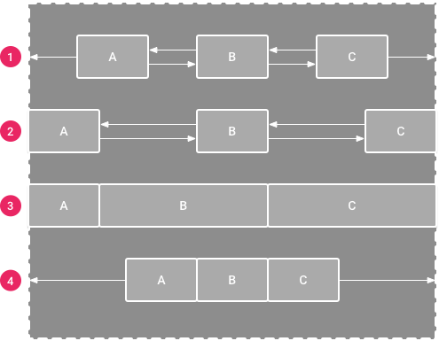

##### introduce

https://developer.android.com/reference/androidx/constraintlayout/widget/ConstraintLayout

https://juejin.cn/post/6949186887609221133#heading-6

##### Group

可以控制一组控件的隐藏和显示

```
  <androidx.constraintlayout.widget.Group
        android:id="@+id/gp_1"
        android:layout_width="wrap_content"
        android:layout_height="wrap_content"
        android:visibility="gone"
        app:constraint_referenced_ids="cl_h4,cl_h2" />
```

```
((Group)findViewById(R.id.gp_1)).setVisibility(View.GONE);
```

​	`findViewById(R.id.gp_2).setVisibility(View.INVISIBLE);  doesnt not work`


https://juejin.cn/post/6844903875569254414#heading-17


#####  Here is the list of available constraints (Fig. 2):

layout_constraintBaseline_toBaselineOf    	 //元素对齐 
layout_constraintStart_toEndOf		控件开始位置 相对另一控件的结束位置

They all take a reference id to another widget, or the parent (which will reference the parent container, i.e. the ConstraintLayout):

```
<Button android:id="@+id/buttonB" ...
                 app:layout_constraintLeft_toLeftOf="parent" />
```

layout_constraintBaseline_toBaselineOf : 表示此控件与某个空间水平对齐

#####  Margins

If side margins are set, they will be applied to the corresponding constraints (if they exist) (Fig. 3), enforcing the margin as a space between the target and the source side. The usual layout margin attributes can be used to this effect:


android:layout_marginBottom
Note that a margin can only be positive or equals to zero, and takes a Dimension.

Margins when connected to a GONE widget
When a position constraint target's visibility is View.GONE, you can also indicate a different margin value to be used using the following attributes:

layout_goneMarginStart

layout_goneMarginBottom

Centering positioning and bias
A useful aspect of ConstraintLayout is in how it deals with "impossible" constrains. For example, if we have something like:

```
           <android.support.constraint.ConstraintLayout ...>
             <Button android:id="@+id/button" ...
                 app:layout_constraintLeft_toLeftOf="parent"
                 app:layout_constraintRight_toRightOf="parent/>
           </>
         
```

 

##### Start_End

```
<?xml version="1.0" encoding="utf-8"?>
<android.support.constraint.ConstraintLayout
    xmlns:android="http://schemas.android.com/apk/res/android"
    xmlns:app="http://schemas.android.com/apk/res-auto"
    android:layout_width="match_parent"
    android:layout_height="match_parent">

    //全局居中
    <android.support.v7.widget.AppCompatButton
        android:id="@+id/button1"
        android:layout_width="100dp"
        android:layout_height="100dp"
        android:text="button1"
        app:layout_constraintBottom_toBottomOf="parent" //底部以父布局的底部为约束
        app:layout_constraintEnd_toEndOf="parent" //右侧结束以父布局的右侧为约束
        app:layout_constraintStart_toStartOf="parent" //左侧起始以父布局的左侧为约束
        app:layout_constraintTop_toTopOf="parent"/> //顶部以父布局的顶部为约束


    <android.support.v7.widget.AppCompatButton
        android:id="@+id/button2"
        android:layout_width="100dp"
        android:layout_height="100dp"
        android:layout_marginLeft="30dp"
        android:layout_marginTop="30dp"
        android:text="button2"
        app:layout_constraintStart_toStartOf="parent"
        app:layout_constraintTop_toTopOf="parent"/>


    // 以 button2 为约束的纵向居中
    <android.support.v7.widget.AppCompatButton
        android:id="@+id/button3"
        android:layout_width="wrap_content"
        android:layout_height="wrap_content"
        android:text="button3"
        app:layout_constraintBottom_toBottomOf="@id/button2" //底部以button2的底部为约束
        app:layout_constraintStart_toEndOf="@id/button2" 
        app:layout_constraintTop_toTopOf="@id/button2"/>  //顶部以button2的顶部为约束


</android.support.constraint.ConstraintLayout>

```


#####  Guideline使用

https://developer.android.com/reference/android/support/constraint/Guideline.html

```
app:layout_constraintGuide_percent="0.2"
app:layout_constraintGuide_begin="100dp"
```

#####   特色属性

* layout_constraintDimensionRatio

  指定高度，宽度随着宽高比自适应

  ```
  <ImageView
      android:id="@+id/iv_img01"
      android:layout_width="0dp"
      android:layout_height="wrap_content"
      android:src="@mipmap/img_1"
      app:layout_constraintDimensionRatio="1:1"
      app:layout_constraintLeft_toLeftOf="parent" />
  ```

  <!--指定高度，宽度随着宽高比自适应 app:layout_constraintDimensionRatio="H,16:9"  H: 表示高宽比-->     

* layout_constraintHorizontal_bias  先设置约束

```
app:layout_constraintLeft_toLeftOf="parent"
app:layout_constraintRight_toRightOf="parent"
```

#####  然后是比例

#####  应用

* 居中显示 : 四个方向添加约束

```
<?xml version="1.0" encoding="utf-8"?>
<android.support.constraint.ConstraintLayout xmlns:android="http://schemas.android.com/apk/res/android"
    xmlns:app="http://schemas.android.com/apk/res-auto"

    android:id="@+id/constraint_layout"
    android:layout_width="match_parent"
    android:layout_height="match_parent">

    <Button
        android:layout_width="wrap_content"
        android:layout_height="wrap_content"
        android:background="@color/white"
        app:layout_constraintBottom_toBottomOf="@+id/constraint_layout"
        app:layout_constraintEnd_toEndOf="@id/constraint_layout"
        app:layout_constraintStart_toStartOf="@id/constraint_layout"
        app:layout_constraintTop_toTopOf="@+id/constraint_layout">
    </Button>
</android.support.constraint.ConstraintLayout>

```

* 相对邻里控件 居中

```
	   <android.support.constraint.ConstraintLayout
        android:layout_width="match_parent"
        android:layout_height="match_parent"
        android:paddingLeft="@dimen/dimen_16"
        android:paddingRight="@dimen/dimen_16">

        <TextView
            android:id="@+id/tv_calculate_date"
            android:layout_width="wrap_content"
            android:layout_height="wrap_content"
            android:background="@drawable/bg_rectangle_blue"
            android:paddingBottom="4dp"
            android:paddingLeft="@dimen/dimen_16"
            android:paddingRight="@dimen/dimen_16"
            android:paddingTop="4dp"
            android:text="三个月"
            android:textColor="@color/white"
            android:textSize="@dimen/text_size_12"
            app:layout_constraintStart_toStartOf="parent" />

        <TextView
            android:id="@+id/tv_calculate_money"
            android:layout_width="wrap_content"
            android:layout_height="wrap_content"
            android:layout_marginLeft="@dimen/dimen_16"
            android:text="￥ 2000"
            android:textColor="#0097fc"
            android:textSize="@dimen/text_size_12"
            app:layout_constraintBottom_toBottomOf="@+id/tv_calculate_date"
            app:layout_constraintTop_toTopOf="@+id/tv_calculate_date" />

    </android.support.constraint.ConstraintLayout>

```


#####  chain

 3个Button 两两依赖,相当于组成了一个链

* Button均分 width = match_constraint (0dp)

 


```
 <Button
        android:id="@+id/bt_00"
        android:layout_width="0dp"
        android:layout_height="wrap_content"
        android:text="Button_00"
        app:layout_constraintLeft_toLeftOf="parent"
        app:layout_constraintRight_toLeftOf="@+id/bt_01" />

    <Button
        android:id="@+id/bt_01"
        android:layout_width="0dp"
        android:layout_height="wrap_content"
        android:text="Button_01"
        app:layout_constraintLeft_toRightOf="@+id/bt_00"
        app:layout_constraintRight_toLeftOf="@+id/bt_02" />

    <Button
        android:id="@+id/bt_02"
        android:layout_width="0dp"
        android:layout_height="wrap_content"
        android:text="Button_02"
        app:layout_constraintLeft_toRightOf="@+id/bt_01"
        app:layout_constraintRight_toRightOf="parent" />
```

##  `  app:layout_constraintHorizontal_weight="2"`　
看属性也可以猜到是干嘛用的了.


```
 <androidx.constraintlayout.widget.ConstraintLayout
        android:layout_width="match_parent"
        app:layout_constraintTop_toBottomOf="@+id/guideline_00"
        android:layout_height="wrap_content">
        <Button
            android:id="@+id/bt_00"
            android:layout_width="0dp"
            android:layout_height="wrap_content"
            android:text="Button_00"
            app:layout_constraintHorizontal_weight="2"
            app:layout_constraintLeft_toLeftOf="parent"
            app:layout_constraintRight_toLeftOf="@+id/bt_01" />

        <Button
            android:id="@+id/bt_01"
            android:layout_width="0dp"
            android:layout_height="wrap_content"
            android:text="Button_01"
            app:layout_constraintHorizontal_weight="1"
            app:layout_constraintLeft_toRightOf="@+id/bt_00"
            app:layout_constraintRight_toLeftOf="@+id/bt_02" />

        <Button
            android:id="@+id/bt_02"
            android:layout_width="0dp"
            android:layout_height="wrap_content"
            app:layout_constraintHorizontal_weight="1"
            android:text="Button_02"
            app:layout_constraintLeft_toRightOf="@+id/bt_01"
            app:layout_constraintRight_toRightOf="parent" />
    </androidx.constraintlayout.widget.ConstraintLayout>
```


* Button均份　宽度不为match_constraint


```
 <Button
            android:id="@+id/bt_10"
            android:layout_width="wrap_content"
            android:layout_height="wrap_content"
            android:text="Button_00"
            app:layout_constraintLeft_toLeftOf="parent"
            app:layout_constraintRight_toLeftOf="@+id/bt_11" />

        <Button
            android:id="@+id/bt_11"
            android:layout_width="wrap_content"
            android:layout_height="wrap_content"
            android:text="Button_01"
            app:layout_constraintLeft_toRightOf="@+id/bt_10"
            app:layout_constraintRight_toLeftOf="@+id/bt_12" />

        <Button
            android:id="@+id/bt_12"
            android:layout_width="wrap_content"
            android:layout_height="wrap_content"
            android:text="Button_02"
            app:layout_constraintLeft_toRightOf="@+id/bt_11"
            app:layout_constraintRight_toRightOf="parent" />
```
* layout_constraintHorizontal_chainStyle

    这个属性默认是　spread，还有另外两种方式 packed 和spread_inside

* packed


```
  <Button
            android:id="@+id/bt_20"
            android:layout_width="wrap_content"
            android:layout_height="wrap_content"
            android:text="Button_20"
            app:layout_constraintHorizontal_chainStyle="packed"
            app:layout_constraintLeft_toLeftOf="parent"
            app:layout_constraintRight_toLeftOf="@+id/bt_21" />

        <Button
            android:id="@+id/bt_21"
            android:layout_width="wrap_content"
            android:layout_height="wrap_content"
            android:text="Button_21"
            app:layout_constraintLeft_toRightOf="@+id/bt_20"
            app:layout_constraintRight_toLeftOf="@+id/bt_22" />

        <Button
            android:id="@+id/bt_22"
            android:layout_width="wrap_content"
            android:layout_height="wrap_content"
            android:text="Button_22"
            app:layout_constraintLeft_toRightOf="@+id/bt_21"
            app:layout_constraintRight_toRightOf="parent" />
```


*  spread_inside     :  width = wrap_content
    

*  spread_inside     :  width = 0dp
    

[代码](http://45.77.222.97:3000/root/MineUtils/src/master/app/src/main/java/com/jonzhou/mineutils/layout) 

* 概述

经过上面的实践，再来张官方的图就好理解了


> 1、 Spread: The views are evenly distributed (after margins are accounted for). This is the default.
> 2 、 Spread inside: The first and last view are affixed to the constraints on each end of the chain and the rest are evenly distributed.
> ３、Weighted: When the chain is set to either spread or spread inside, you can fill the remaining space by setting one or more views to "match constraints" (0dp). By default, the space is evenly distributed between each view that's set to "match constraints," but you can assign a weight of importance to each view using the layout_constraintHorizontal_weight and layout_constraintVertical_weight attributes. If you're familiar with layout_weight in a linear layout, this works the same way. So the view with the highest weight value gets the most amount of space; views that have the same weight get the same amount of space.
> ４、Packed: The views are packed together (after margins are accounted for). You can then adjust the whole chain's bias (left/right or up/down) by changing the chain's head view bias.

参考:https://developer.android.com/training/constraint-layout/index.html
最后就是边应用边理解了

##### Barrier 

用于控制 Barrier 相对于给定的 View 的位置， app:barrierDirection="right",表示barrier在constraint_referenced_ids给定ID的右侧,constraint_referenced_ids的id就是左侧的这些控件

输入信息挺有用的 

https://mp.weixin.qq.com/s/QIuww9b0TsNjajEUS8c2fg

```
  <android.support.constraint.ConstraintLayout
        android:layout_width="match_parent"
        android:layout_height="wrap_content"
        android:layout_margin="@dimen/dimen_11">

        <TextView
            android:id="@+id/tv_order_num"
            android:layout_width="wrap_content"
            android:layout_height="wrap_content"
            android:text="订单编号：10002220000001234"
            android:textColor="#ff999999"
            android:textSize="19sp"
            app:layout_constraintTop_toTopOf="parent"
            app:layout_constraintStart_toStartOf="parent" />

        <TextView
            android:id="@+id/tv_order_pro"
            android:layout_width="wrap_content"
            android:layout_height="wrap_content"
            android:layout_marginTop="@dimen/dimen_11"
            android:text="订购产品：爱达康高血压监护服务"
            android:textColor="#ff666666"
            android:textSize="21sp"
            app:layout_constraintLeft_toLeftOf="parent"
            app:layout_constraintTop_toBottomOf="@+id/tv_order_num" />

        <TextView
            android:id="@+id/tv_service_team"
            android:layout_width="wrap_content"
            android:layout_height="wrap_content"
            android:text="服务团队：爱达康远程监护团队"
            android:textColor="#ff666666"
            android:textSize="21sp"
            app:layout_constraintLeft_toLeftOf="parent"
            app:layout_constraintTop_toBottomOf="@+id/tv_order_pro" />

        <TextView
            android:id="@+id/tv_period_valid"
            android:layout_width="wrap_content"
            android:layout_height="wrap_content"
            android:text="有效期：2019-03-01至2019-12-31"
            android:textColor="#ff999999"
            android:textSize="19sp"
            app:layout_constraintStart_toEndOf="@+id/barrier" />

        <TextView
            android:id="@+id/tv_order_time"
            android:layout_width="wrap_content"
            android:layout_height="wrap_content"
            android:layout_marginTop="@dimen/dimen_11"
            android:text="订购时间：2019-03-11 12:00:00"
            android:textColor="#ff666666"
            android:textSize="21sp"
            app:layout_constraintStart_toEndOf="@+id/barrier"
            app:layout_constraintTop_toBottomOf="@+id/tv_period_valid" />

        <TextView
            android:id="@+id/tv_order_count"
            android:layout_width="wrap_content"
            android:layout_height="wrap_content"
            android:text="订购数量：500次"
            android:textColor="#ff666666"
            android:textSize="21sp"
            app:layout_constraintStart_toEndOf="@+id/barrier"
            app:layout_constraintTop_toBottomOf="@+id/tv_order_time" />


        <android.support.constraint.Barrier
            android:id="@+id/barrier"
            android:layout_width="wrap_content"
            android:layout_height="wrap_content"
            app:barrierDirection="right"
            app:constraint_referenced_ids="tv_order_num,tv_order_pro,tv_service_team" />

    </android.support.constraint.ConstraintLayout>
```


