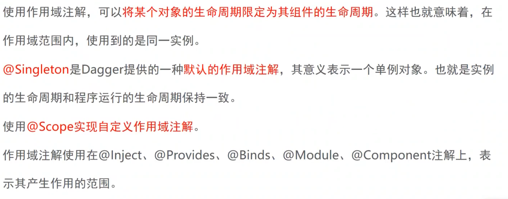
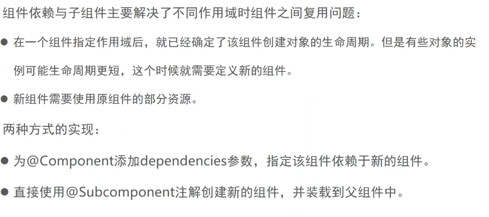

### 


#### 依赖注入

1. 构造方法注入
2. Setter注入(字段注入)


```java
public class Car {
    Engine engine;
    
    //构造方法注入
    public Car(Engine engine) {
        this.engine = engine;
    }
    // setter注入(字段注入)
    public void setEngine(Engine engine) {
        this.engine = engine;
    }
    
    public void start(){
        engine = new Engine();
        engine.start();
    }
    
}

class Engine{
    public void start(){}
}
```


##### IOC框架

1. 基于反射的方式实现： Spring IOC(动态的进行依赖关系的建立)
2. 静态方式 ： 程序在编译时就已经提供好了建立依赖关系的类。Dagger2


两种注入方式


#### Dagger注入

##### 构造方法注入

构造方法构造实例注入步骤

1. 使用 @Inject注解在构造方法上；就是告知Dagger可以通过构造方法来创建并获取到User的实例

   ```java
   public class User {
       // 1.使用 @Inject注解在构造方法上；就是告知Dagger可以通过构造方法来创建并获取到User的实例
   
       @Inject
       public User() { //构造方法构造实例
       }
   }
   ```

2. 当作IOC容器,把对象注入到目标类中

   ```java
   // 2. 当作IOC容器,把对象注入到目标类中
   @Component
   public interface ApplicationComponent {
       void inject(DaggerActivity daggerActivity);//指定DaggerActivity作为要注入的目标类
   }
   ```

3. 设置Inject注解

   DaggerActivity.java

   ```
   //3.设置Inject注解
   @Inject
   User user;
   ```

4. 执行注入动作

   ```java
      //3.设置Inject注解
   		@Inject
   		User user;
   
   		@Override
       protected void onCreate(Bundle savedInstanceState) {
           super.onCreate(savedInstanceState);
           setContentView(R.layout.activity_dagger2);
     //4.执行注入动作
         DaggerApplicationComponent.create().inject(this);//DaggerApplicationComponent相当于DaggerApplication的实现类 
         // DaggerApplicationComponent.create()获取到实例,inject(this)注入到Activity中
         
         
           Log.i(TAG, "user: " + user);
       }
   ```


##### Module Dagger模块注入 

针对第三方库

 上面User是我们自己定义的类， 如果是第三方框架的类，怎么实现依赖注入？

1. 第二种方式告知Dagger,可以通过调用该方法来获取到注入对象的实例

   ```java
   @Module
   public class NetModule {
      public User ProvideUser(){
        return new User();
      }
     
   	 
       //第二种方式告知Dagger,可以通过调用该方法来获取到注入对象的实例
       @Provides
       public Retrofit provideRetrofit(){
           return new Retrofit.Builder()
               .baseUrl("http://www.google.com")
               .build();
       }
   }
   ```


2. compoent

   ```
   // 2. 当作IOC容器,把对象注入到目标类中
   @Component(modules = {NetModule.class}) //模块装载到组件上去
   public interface ApplicationComponent {
   }
   ```

3. DaggerActivity.java

   ```java
   public class DaggerActivity extends AppCompatActivity {
       String TAG = "DaggerActivity";
   
       //3.设置Inject注解
    
       @Inject
       Retrofit retrofit;
     
       Log.i(TAG, "retrofit: " + retrofit);
   
   }
   ```


#####   Retrofit使用场景

​	

```java
public interface ApiService {

    @GET("/user/info")
    Call<String> requestInfo();
}
```


```java
//Module已经知道怎么获取retrofit实例
//接着同一个Module中的方法，就可以作为参数直接传入 使用
// 比如provideApiService需要Retrofit实例，会从当前容器查找是否已经有Retrofit实例
// 然后从当前容器直接获取
@Provides
public ApiService provideApiService(Retrofit retrofit){
    return retrofit.create(ApiService.class);
}
```


```java
@Inject
ApiService apiService;

Log.i(TAG, "apiService: " +apiService);

```

Module已经知道怎么获取retrofit实例
接着同一个Module中的方法，就可以作为参数直接传入 使用
// 比如provideApiService需要Retrofit实例，会从当前容器查找是否已经有Retrofit实例
// 然后从当前容器直接获取


```java
@Module
public class NetModule {

    //第二种方式告知Dagger,可以通过调用该方法来获取到注入对象的实例
    @Provides
    public Retrofit provideRetrofit(){
        return new Retrofit.Builder()
            .baseUrl("http://www.google.com")
            .build();
    }

    //Module已经知道怎么获取retrofit实例
    //接着同一个Module中的方法，就可以作为参数直接传入 使用
    // 比如provideApiService需要Retrofit实例，会从当前容器查找是否已经有Retrofit实例
    // 然后从当前容器直接获取
    @Provides
    public ApiService provideApiService(Retrofit retrofit){
        return retrofit.create(ApiService.class);
    }


    @Provides
    public OkHttpClient provideOkHttpClient() {
        return new OkHttpClient.Builder().build();
    }
}

```


#### 局部单例实现




3个对象实例指定了作用域是 @Singleton,这个作用域和使用了@Singleton组件的生命周期一致。


##### 局部实例1


```java

//Dagger模块
@Module
public class NetModule1 {

    public User providerUser() {
        return new User();
    }

    //第二种方式告知Dagger,可以通过调用该方法来获取到注入对象的实例
    //@Provides
    //public Retrofit provideRetrofit() {
    //    return new Retrofit.Builder()
    //        .baseUrl("http://www.google.com")
    //        .build();
    //}
    @Singleton
    @Provides
    public Retrofit provideRetrofit(OkHttpClient okHttpClient) {
        return new Retrofit.Builder()
            .client(okHttpClient)
            .baseUrl("http://www.google.com")
            .build();
    }

    //Module已经知道怎么获取retrofit实例
    //接着同一个Module中的方法，就可以作为参数直接传入 使用
    // 比如provideApiService需要Retrofit实例，会从当前容器查找是否已经有Retrofit实例
    // 然后从当前容器直接获取
    @Singleton
    @Provides
    public ApiService provideApiService(Retrofit retrofit) {
        return retrofit.create(ApiService.class);
    }

    //@Singleton是Dagger提供的一种作用域
    // 作用域就是用来管理Component来获取对象实例的生命周期
    @Singleton
    @Provides
    public OkHttpClient provideOkHttpClient() {
        return new OkHttpClient.Builder().build();
    }
}
```


```java
// 2. 当作IOC容器,把对象注入到目标类中
@Singleton // 设置作用域和ApplicationComponent组件的生命周期一致
@Component(modules = {NetModule1.class}) //模块装载到组件上去
public interface ApplicationComponent1 {
    void inject(DaggerActivity daggerActivity);//指定目标类

    void inject(SecondActivity secondActivity);
}
```


```java
public class DaggerActivity extends AppCompatActivity {
    String TAG = "DaggerActivity";

    //3.设置Inject注解
    @Inject
    User user;

    @Inject
    User user2;

    @Inject
    Retrofit retrofit;

    @Inject
    ApiService apiService;

    @Inject
    ApiService apiService2;

    @Override
    protected void onCreate(Bundle savedInstanceState) {
        super.onCreate(savedInstanceState);
        setContentView(R.layout.activity_dagger2);
        //4.执行注入动作
        DaggerApplicationComponent.create().inject(this);//DaggerApplicationComponent相当于DaggerApplication的实现类

        Log.i(TAG, "user: " + user);
        Log.i(TAG, "user2: " + user2);

        Log.i(TAG, "retrofit: " + retrofit);

        Log.i(TAG, "apiService: " +apiService);
        Log.i(TAG, "apiService2: " +apiService2);
    }
}
```

运行结构

```
2092-2092/com.comm.util I/DaggerActivity: user: com.comm.util.dagger.dn.di.User@2129cef
2092-2092/com.comm.util I/DaggerActivity: user2: com.comm.util.dagger.dn.di.User@d97d3fc
2092-2092/com.comm.util I/DaggerActivity: retrofit: retrofit2.Retrofit@d243a85
2092-2092/com.comm.util I/DaggerActivity: apiService: retrofit2.Retrofit$1@a1fa0da
2092-2092/com.comm.util I/DaggerActivity: apiService2: retrofit2.Retrofit$1@a1fa0da
```

可以看到 user 是2个实例

apiService用了同一个对象实例,所以可以看到和DaggerApplicationComponent组件生命周期一致。


##### 局部实例2

添加一个Activity

```java
public class SecondActivity extends AppCompatActivity {
    String TAG = "SecondActivity";

    @Inject
    ApiService apiService3;

    @Override
    protected void onCreate(Bundle savedInstanceState) {
        super.onCreate(savedInstanceState);
        setContentView(R.layout.activity_second2);

        //DaggerApplicationComponent相当于DaggerApplication的实现类
        DaggerApplicationComponent.create().inject(this);

        Log.i(TAG, "apiService3: " + apiService3);
    }
}
```


```java
void inject(SecondActivity secondActivity);
```

```java
startActivity(new Intent(this,SecondActivity.class));
```


```
7410-7410/com.comm.util I/DaggerActivity: apiService: retrofit2.Retrofit$1@a1fa0da
7410-7410/com.comm.util I/DaggerActivity: apiService2: retrofit2.Retrofit$1@a1fa0da
2021-08-29 22:28:35.812 7410-7410/com.comm.util I/SecondActivity: apiService3: retrofit2.Retrofit$1@84eb79a
```

不同的DaggerApplicationComponent组件，不同的实例


##### 全局实例

保证组件全局实例

Module作用域生命周期和 ApplicationComponent保持一致。


MyApplication.java

```java
static ApplicationComponent  applicationComponent = DaggerApplicationComponent.create();

public static ApplicationComponent getApplicationComponent() {
    return applicationComponent;
}
```

```java
MyApplication.getApplicationComponent().inject(this);
```


```
8044-8044/com.comm.util I/DaggerActivity: apiService: retrofit2.Retrofit$1@516190b
8044-8044/com.comm.util I/DaggerActivity: apiService2: retrofit2.Retrofit$1@516190b
8044-8044/com.comm.util I/SecondActivity: apiService3: retrofit2.Retrofit$1@516190b
```


##### 使用作用域遵循的规则


组件ApplicationComponent指定了作用域,组件中的模块modules = {NetModule.class}，也要指定相同的作用域。


NetModule中的方法设置@Singleton 那么ApplicationComponent也必须设置@Singleton

NetModule中的方法设置@MyScope 那么ApplicationComponent也必须设置@MyScope


```java
@Singleton // 设置作用域和ApplicationComponent组件的生命周期一致，
@Component(modules = {NetModule.class})
public interface ApplicationComponent {
    void inject(DaggerActivity daggerActivity);//指定目标类

    void inject(SecondActivity secondActivity);
}
```


####  组件依赖

08 0 9组件依赖有问题




https://www.bilibili.com/video/BV1Ki4y1A7hA?p=07


#### Dagger 3要素


##### 注入流程


