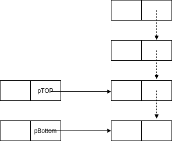
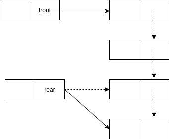
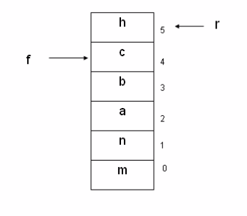
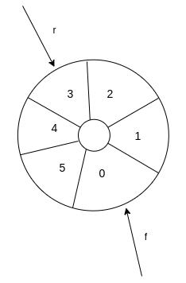

#### 链表 

* 首节点 

   第一个有效节点

* 尾节点

   最后一个有效节点

* 头节点

  头节点的数据类型和首节点类型一样

  第一个有效节点之前的那个节点，只存放了 首节点 的地址

  头节点并不存在有效数据

  加头节点的目的主要是为了方便对链表的操作

* 头指针

​		指向头节点的指针变量

​		只占用4个byte,比头节点占用空间小.

* 尾指针

  指向尾节点的指针变量

#### 栈

```c
#include <printf.h>
#include <stdlib.h>
#include <stdio.h>
#include <stdbool.h>

typedef struct Node {
    int data;
    struct Node *pNext;
} NODE, *PNODE;

typedef struct Stack {
    PNODE pTop;
    PNODE pBottom;
} STACK, *PSTACK; //PSTACK等价于 stuct STACK *

void init(PSTACK);

void push(STACK *pStack, int i);

void traverse(STACK *pStack);

bool pop(PSTACK pS, int *pVal);
void  clear(PSTACK ps);

bool empty(PSTACK pStack);

int main() {
    STACK S; //等价于 struct Stack
    init(&S);
    push(&S, 1);
    push(&S, 22);
    push(&S, 88);

    traverse(&S);
    int val;
//    if (pop(&S, &val)) {
//        printf("出栈成功\n");
//        printf("出栈的数据 %d \n", val);
//    } else {
//        printf("出栈失败\n");
//    }

    clear(&S);

    printf("清空数据\n");
    traverse(&S);
}

void push(STACK *pStack, int val) {
    PNODE pNew = (PNODE) malloc(sizeof(NODE));
    pNew->data = val;
    pNew->pNext = pStack->pTop; //如果是空可以用pBottom，但是后面不为空
    pStack->pTop = pNew;
}


void init(PSTACK pS) {
    pS->pTop = (PNODE) malloc(sizeof(NODE));
    if (NULL == pS->pTop) {
        printf("动态内存分配失败!\n");
        exit(-1);
    } else {
        pS->pBottom = pS->pTop;
        pS->pTop->pNext = NULL;
    }

}

void traverse(PSTACK pS) {
    PNODE p = pS->pTop;
    while (p != pS->pBottom) {
        printf("%d ", p->data);
        p = p->pNext;
    }
}

//把pS所指向的栈出栈一次，并把出栈的元素存入pVal形参所指向的变量中，如果出栈失败，返回false,否则返回true,
bool pop(PSTACK pS, int *pVal) {
    *pVal = pS->pTop->data;
    PNODE p = pS->pTop;
    if (pS->pTop != pS->pBottom) { //或者写个方法 isEmpty()
        pS->pTop = pS->pTop->pNext;
        return true;
    }
    free(p);
    return false;
}

//清空
void  clear(PSTACK pS){

    if(empty(pS)){
        return;
    } else{

        PNODE  p = pS->pTop;
        PNODE  q = NULL;
        while(p!=pS->pBottom){
             q = p->pNext;
             free(p);
             p = q;
        }
        pS->pTop = pS->pBottom;
    }
}

bool empty(PSTACK pS) {
    if(pS->pTop==pS->pBottom){
        return true;
    }
    return false;
}
```


应用 

函数调用 	中断	表达式求值	内存分配  缓冲处理	迷宫




#### 链表队列

队列 ： 一种可以实现先进先出的存储结构




#### 队列

链式队列 -- 用链表实现。

静态队列 -- 用数组实现。

##### 循环队列（数组）

#####　定义

1. 队列初始化

   front和rear的值都是0。

2. 队列非空

   front代表队列的第一个元素。

   rear代表队列的最后一个有效 元素的下一个元素。

3. 队列空

   front和rear的值相等，但他们的值不一定时0。




##### 操作 

入队: 将值存入r所代表的位置，接着r后移一位。

出队:f后移一位。


##### 如何判断循环队列是否已满

​	r==f时候，可能为空，页可能满的。

1. 多增加一个标识参数，存放元素个数

2. 少用一个元素

   (r+1)%数组的长度 = f



=======


CircleQueue

```c
#include <stdio.h>
#include <stdbool.h>
#include <stdlib.h>

typedef struct Queue {
    int *pBase;
    int front;
    int rear;
} QUEUE;

void init(QUEUE *);

bool en_queue(QUEUE *, int val); //入队
void traverse_queue(QUEUE *);

bool full_queue(QUEUE *pQueue);//队列是否已满

bool out_queue(QUEUE *pQueue, int *pInt); //出队

bool empty_queue(QUEUE *pQueue);

int main() {
    QUEUE Q;
    init(&Q);
    en_queue(&Q, 2);
    en_queue(&Q, 7);
    en_queue(&Q, 33);
    en_queue(&Q, 4);
    en_queue(&Q, 9);

    traverse_queue(&Q); //执行这句 pQ->front会变，所以出队列失败

//    int pVal;
//    if(out_queue(&Q,&pVal)){
//        printf("出队成功，出队元素是 %d \n",pVal);
//    } else{
//        printf("出队失败\n");
//    }
//    traverse_queue(&Q);

}


void init(QUEUE *pQ) {
    pQ->pBase = malloc(sizeof(int) * 6);
    pQ->front = 0;
    pQ->rear = 0;
}

bool full_queue(QUEUE *pQ) {
    if ((pQ->rear + 1) % 6 == pQ->front) {
        return true;
    }
    return false;
}

bool en_queue(QUEUE *pQ, int val) {
    if (full_queue(pQ)) {
        return false;
    } else {
        pQ->pBase[pQ->rear] = val;
        pQ->rear = (pQ->rear + 1) % 6;
        return true;
    }
}

//void traverse_queue(QUEUE *pQ) {
//    int q = pQ->front;
//    while ((q) % 6 != pQ->rear) {
//        printf(" %d ", pQ->pBase[(pQ->front++) % 6]);
//        q++;
//    }
//    return;
//}
//或者下面方式

void traverse_queue(QUEUE *pQ) {
    int i = pQ->front;
    while (i!=pQ->rear){
        printf("%d ",pQ->pBase[i]);
        i = (i+1)%6;
    }
    printf("\n");
    return;
}


bool out_queue(QUEUE *pQ, int *pInt) {
    if(empty_queue(pQ)){
        return false;
    } else{
        *pInt = pQ->pBase[pQ->front];
        pQ->front=(pQ->front+1)%6;

        return true;
    }
}


bool empty_queue(QUEUE *pQ) {
    if(pQ->front==pQ->rear){
        return true;
    }
    return false;
}
```