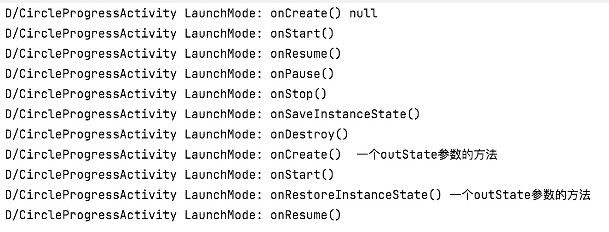

问题 ，Activity恢复后 mStateSaved,是怎么恢复的？


就是onSavedInstanceState 的官方API文档2

这里问题的场景是Activity已经关闭了,rpc请求很久再回来,导致了这个问题,所以我觉得判断livedate激活状态就可以了

可是这个改动应该只能在resume吧？

LiveData started 和 resumed 都可以

Livedata 会感知activity生命周期

这个有可能 activity 也在 started / resumed 状态下发出吧？ 这样的话，showDialog 应该也还会崩溃，因为onSavedInstanceState 是在 paused 时候发生的，这个时候应该还是 started 状态。

```
/**

* 后续考虑做个技改把它加到[BaseDialogFragment]里面

*/

fun showWithLifecycle(fragmentActivity: FragmentActivity, tag: String? = null) {

  val liveData = showWithLifecycleLiveData ?: MutableLiveData<Boolean>().also {

    it.observe(fragmentActivity) { this.show(fragmentActivity.supportFragmentManager, tag) }

    showWithLifecycleLiveData = it

  }

  liveData.value = true

}
```


onSaveInstanceState保存分析

https://juejin.cn/post/6995791487426363405


状态恢复

https://www.jianshu.com/p/58579627f70a


https://juejin.cn/post/7057564670567120903


 **can not perform this action after onsaveinstancestate dialogfragment show** 


developer  -> 不保留活动 


onSaveInstanceState以下5种情况被调用：

1、当用户按下手机home键的时候。

2、长按手机home键或者按下菜单键时。

3、手机息屏时。

4、FirstActivity启动SecondActivity，FirstActivity就会调用，也就是说打开新Activity时，原Activity就会调用。

5、默认情况下横竖屏切换时。


打开Activity -> Home  -> 再从后台拿出来




既然状态的保存与恢复都必须要把Fragment带上，那么一旦当Fragment的状态已保存过了，那么就不应该再改变Fragment的状态。因此FragmentManager的每一个操作前，都会调用一个方法来检查状态是否保存过了：

```java
private void checkStateLoss() {
    if (mStateSaved) {
        throw new IllegalStateException(
                    "Can not perform this action after onSaveInstanceState");
    }
    if (mNoTransactionsBecause != null) {
        throw new IllegalStateException(
                    "Can not perform this action inside of " + mNoTransactionsBecause);
    }
}
```


```java
/**
 * This is the same as {@link #onSaveInstanceState} but is called for activities
 * created with the attribute {@link android.R.attr#persistableMode} set to
 * <code>persistAcrossReboots</code>. The {@link android.os.PersistableBundle} passed
 * in will be saved and presented in {@link #onCreate(Bundle, PersistableBundle)}
 * the first time that this activity is restarted following the next device reboot.
 *
 * @param outState Bundle in which to place your saved state.
 * @param outPersistentState State which will be saved across reboots.
 *
 * @see #onSaveInstanceState(Bundle)
 * @see #onCreate
 * @see #onRestoreInstanceState(Bundle, PersistableBundle)
 * @see #onPause
 */
public void onSaveInstanceState(@NonNull Bundle outState,
        @NonNull PersistableBundle outPersistentState) {
    onSaveInstanceState(outState);
}
```


为什么会有这个异常


https://blog.csdn.net/lzf_acraftsman/article/details/108831949

https://juejin.cn/post/6844903458605105160


fragment重叠原因

