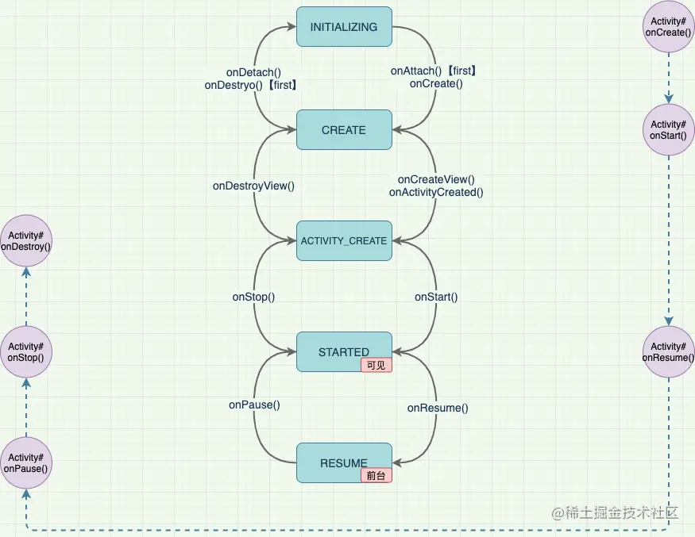

https://juejin.cn/post/6970998913754988552#heading-16

https://developer.android.com/reference/android/app/Fragment.html

https://developer.android.com/guide/components/fragments.html

https://www.51cto.com/article/672135.html

https://juejin.cn/post/7021398731056480269


```
static final int INVALID_STATE = -1;   // 为空时无效
static final int INITIALIZING = 0;     // 未创建
static final int CREATED = 1;          // 已创建，位于后台
static final int ACTIVITY_CREATED = 2; // Activity已经创建，Fragment位于后台
static final int STOPPED = 3;          // 创建完成，没有开始
static final int STARTED = 4;          // 开始运行，但是位于后台
static final int RESUMED = 5;          // 显示到前台

```

作者：小松漫步
链接：https://juejin.cn/post/7021398731056480269


下面的lifecycle也可以看到,fragment生命周期的状态转移。


## Lifecycle

https://developer.android.com/guide/fragments/lifecycle

* onViewCreated(View view, Bundle savedInstanceState)

Called immediately after `onCreateView(android.view.LayoutInflater, android.view.ViewGroup, android.os.Bundle)` has returned, but before any saved state has been restored in to the view.


#### 状态转移

Fragment

```java
static final int INITIALIZING = -1;          // Not yet attached.
static final int ATTACHED = 0;               // Attached to the host.
static final int CREATED = 1;                // Created.
static final int VIEW_CREATED = 2;           // View Created.
static final int AWAITING_EXIT_EFFECTS = 3;  // Downward state, awaiting exit effects
static final int ACTIVITY_CREATED = 4;       // Fully created, not started.
static final int STARTED = 5;                // Created and started, not resumed.
static final int AWAITING_ENTER_EFFECTS = 6; // Upward state, awaiting enter effects
static final int RESUMED = 7;                // Created started and resumed.
```




这个图和现在fragment状态有点不同，现在新增了一些状态，有必要的话，自己研究绘制一张。


## commit

```
commit();
commitAllowingStateLoss();
commitNow();
commitNowAllowingStateLoss();
```


#### commitAllowingStateLoss VS  commit()


可以看到 allowStateLoss 如果是false，mHost,mDestroyed=true,就会crash了,否则只是return了,所以从这里看，他们区别不大。


```java
void enqueueAction(@NonNull OpGenerator action, boolean allowStateLoss) {
    if (!allowStateLoss) {
        if (mHost == null) {
            if (mDestroyed) {
                throw new IllegalStateException("FragmentManager has been destroyed");
            } else {
                throw new IllegalStateException("FragmentManager has not been attached to a "
                        + "host.");
            }
        }
        checkStateLoss();
    }
    synchronized (mPendingActions) {
        if (mHost == null) {
            if (allowStateLoss) {
                // This FragmentManager isn't attached, so drop the entire transaction.
                return;
            }
            throw new IllegalStateException("Activity has been destroyed");
        }
        mPendingActions.add(action);
        scheduleCommit();
    }
}
```


https://huxian99.github.io/2016/08/28/cj3qymo360000owxk9zp17alo/


#### commitNow VS  commit()


## Fragment 使用

##### fragment回调

```
var mListener: IFeedBackListener? = null

override fun onAttach(context: Context) {
    super.onAttach(context)
    if (parentFragment is IFeedBackListener) {
        mListener = parentFragment as IFeedBackListener
    } else if (context is IFeedBackListener) {
        mListener = context
    } else {
        throw RuntimeException(context?.toString() + " must implement ISelectListener")
    }
}
```

https://noteforme.github.io/2017/10/05/Fragment/


**Fragment本质是View**

「当然了Fragment本质是View但是又不仅限于此，」 在真实的项目中，界面往往很复杂，业务逻辑也很复杂，往往需要处理各种UI状态变化，比如：增加一组View，替换一组View，删除一组View，还需要和Activity协作。总之，如果让开发者自己去实现这一套逻辑，恐怕比使用Fragment要麻烦的多吧。尽管Fragment看起来蛮复杂的，但是还是远比我们自己去实现相同功能简单的多。

**3.1.2 Fragment本质不仅限于View**

Fragment作为一个View可以被添加到Activity的布局中去。但是他更强大，还有以下几个特性：

1. 处理生命周期，比Activity生命周期还要复杂
2. 通过FragmentTransaction操作多个Fragment
3. 通过FragmentManager维护一个回退栈，回退到上一个FragmentTransaction操作的界面

https://www.51cto.com/article/672135.html


**commit() vs commitAllowingStateLoss()**


commit()和commitAllowingStateLoss()在实现上唯一的不同就是当你调用commit()的时候, FragmentManger会检查mDestory, mHost 如果mHost ==null, 就抛出IllegalStateException.


https://juejin.cn/post/7063377212736536607


**FragmentPagerAdapter与FragmentStatePagerAdapter的区别**

FragmentPagerAdapter适用于页面较少的情况，destroyItem方法中只是调用了fragmentransaction的detach方法

FragmentStatePagerAdapter适用于页面较多的情况，每次切换ViewPager的时候是回收内存的。destroyItem调用了fragmentransaction的remove方法


**Fragment 各个方法细节**


[**https://fuhongliang.gitbooks.io/android/content/di-shi-san-zhang-mian-shi-ti/mu-ke-wang-quan-mian-sheng-ji-android-mian-shi/fragmentmian-shi-ti.html**](https://fuhongliang.gitbooks.io/android/content/di-shi-san-zhang-mian-shi-ti/mu-ke-wang-quan-mian-sheng-ji-android-mian-shi/fragmentmian-shi-ti.html)


onSaveInstanceState 方法啥时候调用。


但是为什么要这么做呢？

原因是在Android 11版本后的activity会管理fragment，也就是说在activity 在执行onSaveInstanceState()的时候会保存fragment的状态，用于在恢复activity的时候使用。那么在保存fragment的状态后，就不能再去改变fragment的状态，也就是不允许提交事务，这样才能保障activity恢复的时候，可以显示原来fragment的状态。

https://blog.csdn.net/xx326664162/article/details/88379490

https://blog.csdn.net/qq_19560943/article/details/78112903


 横竖屏切换

被系统回收（复现 进入开发者选项 -》不保留活动）

https://www.jianshu.com/p/c12a98a36b2b

#####  BottomNavigationView error

使用BottomNavigationView出现很严重的问题,很久才找到原因

```
 Caused by: android.view.InflateException: Binary XML file line #16: Binary XML file line #16: Error inflating class com.google.android.material.bottomnavigation.BottomNavigationView
     Caused by: android.view.InflateException: Binary XML file line #16: Error inflating class com.google.android.material.bottomnavigation.BottomNavigationView
```

因为 AndroidManifest.xml  application下的android:theme="@style/AppTheme"多出了,把下面的删除了就好了.

```
<item name="android:textColorSecondary">#ffffff</item>
<item name="android:actionOverflowButtonStyle">@style/OverflowMenuStyle</item>
<item name="android:listDivider">@drawable/divider</item>
```

#####   重叠原因 

>  旋转屏幕时候，创建的homeFragment会被回收,在销毁前，执行了onSaveInstanceState(Bundle outState)这个方法。这个方法会保存activity的一些信息，其中就包括添加过的fragment，Activity重建后，再次初始化homeFragment，接着显示，导致了重叠的问题。


##### 代码验证

```
private fun initFragment() {
    if (homeFragment == null) {
        homeFragment = HomeFragment()
        addFragment(homeFragment!!)
        showFragment(homeFragment)
    }
}

override fun onCreate(savedInstanceState: Bundle?) {
    super.onCreate(savedInstanceState)
    Timber.d("onCreate() $homeFragment")
    initFragment()
    Timber.d("initFragment() $homeFragment")   
}

 override fun onDestroy() {
        super.onDestroy()
        Timber.tag(TAG).d("onDestroy() homeFragment $homeFragment")
 }

```

日志

```
 D/TabBottomActivity LaunchModeActivity: onCreate() taskId  641
 D/TabBottomActivity LaunchModeActivity: onCreate() homeFragment null
 D/TabBottomActivity LaunchModeActivity: initFragment() homeFragment HomeFragment{1adc3fa} (b0660244-39c4-4104-b558-f5384c7adb0d) id=0x7f09010e}
 D/TabBottomActivity LaunchModeActivity: onStart()
 D/TabBottomActivity LaunchModeActivity: onResume()
 D/TabBottomActivity LaunchModeActivity: onPause()
 D/TabBottomActivity LaunchModeActivity: onSaveInstanceState()
 D/TabBottomActivity LaunchModeActivity: onStop()
 D/TabBottomActivity LaunchModeActivity: onDestroy()
 D/TabBottomActivity LaunchModeActivity: onDestroy() homeFragment HomeFragment{1adc3fa} (d84f5956-fa2c-4cd2-8397-0904040d2a6f)}
 D/TabBottomActivity LaunchModeActivity: onCreate() taskId  641
 D/TabBottomActivity LaunchModeActivity: onCreate() homeFragment null
 D/TabBottomActivity LaunchModeActivity: initFragment() homeFragment HomeFragment{ac076db} (f8ee348b-6ff7-4b1e-ba27-6e47e848f623) id=0x7f09010e}
 D/TabBottomActivity LaunchModeActivity: onStart()
 D/TabBottomActivity LaunchModeActivity: onRestoreInstanceState()
 D/TabBottomActivity LaunchModeActivity: onResume()
```

从 initFragment（） 1adc3fa , ac076db 可以看到，HomeFrgment重新创建了.

##### 处理方法

1. onSaveInstanceState 不保存信息

   ```kotlin
      override fun onSaveInstanceState(outState: Bundle) {
   //        super.onSaveInstanceState(outState)
       }
   ```

   这种方式的弊端就是，切换后总是回到首页.

2. onSaveInstanceState() 保存Fragment

   ```
   override fun onCreate(savedInstanceState: Bundle?) {
       super.onCreate(savedInstanceState)
   
       if (savedInstanceState != null) {
           /*获取保存的fragment  没有的话返回null*/
           homeFragment = supportFragmentManager.getFragment(savedInstanceState, HOME_FRAGMENT_KEY) as HomeFragment?
           healthFragment = supportFragmentManager.getFragment(savedInstanceState, DASHBOARD_FRAGMENT_KEY) as HealthFragment?
           personFragment = supportFragmentManager.getFragment(savedInstanceState, NOTICE_FRAGMENT_KEY) as PersonFragment?
           addToList(homeFragment)
           addToList(healthFragment)
           addToList(personFragment)
       } else {
           initFragment()
       }
    }
    
    override fun onSaveInstanceState(outState: Bundle) {
           super.onSaveInstanceState(outState)
           Timber.d("MainActivity onSaveInstanceState")
           /*fragment不为空时 保存*/if (homeFragment != null) {
               supportFragmentManager.putFragment(outState!!, HOME_FRAGMENT_KEY, homeFragment!!)
           }
           if (healthFragment != null) {
               supportFragmentManager.putFragment(outState!!, DASHBOARD_FRAGMENT_KEY, healthFragment!!)
           }
           if (personFragment != null) {
               supportFragmentManager.putFragment(outState!!, NOTICE_FRAGMENT_KEY, personFragment!!)
           }
      }
    
   ```


这种方式，可以解决问题，但是打印的日志HomeFragment还是不一样，是什么情况？

```
D/TabBottomActivity LaunchModeActivity: onCreate() taskId  4437
 D/TabBottomActivity LaunchModeActivity: initFragment() homeFragment HomeFragment{dc2914d} (5f30b0dd-a8d2-4b3c-a27f-1d160a9da58e) id=0x7f09010e}
 D/TabBottomActivity LaunchModeActivity: onStart()
 D/TabBottomActivity LaunchModeActivity: onResume()
 D/TabBottomActivity$onCreate: navigation_health
 D/TabBottomActivity LaunchModeActivity: onPause()
 D/TabBottomActivity LaunchModeActivity: onSaveInstanceState()
 D/TabBottomActivity: MainActivity onSaveInstanceState
 D/TabBottomActivity LaunchModeActivity: onStop()
 D/TabBottomActivity LaunchModeActivity: onDestroy()
 D/TabBottomActivity LaunchModeActivity: onDestroy() homeFragment HomeFragment{dc2914d} (ab276ea2-5fa2-4d79-b6a6-af7143b114e8)}
 D/TabBottomActivity LaunchModeActivity: onCreate() taskId  4437
 D/TabBottomActivity: fragmentList数量1
 D/TabBottomActivity: fragmentList数量2
 D/TabBottomActivity: fragmentList数量2
 D/TabBottomActivity LaunchModeActivity: initFragment() homeFragment HomeFragment{9139494} (5f30b0dd-a8d2-4b3c-a27f-1d160a9da58e) id=0x7f09010e}
 D/TabBottomActivity LaunchModeActivity: onStart()
 D/TabBottomActivity LaunchModeActivity: onRestoreInstanceState()
 D/TabBottomActivity LaunchModeActivity: onResume()
 D/TabBottomActivity LaunchModeActivity: onPause()
 D/TabBottomActivity LaunchModeActivity: onSaveInstanceState()
 D/TabBottomActivity: MainActivity onSaveInstanceState
 D/TabBottomActivity LaunchModeActivity: onStop()
 D/TabBottomActivity LaunchModeActivity: onDestroy()
 D/TabBottomActivity LaunchModeActivity: onDestroy() homeFragment HomeFragment{9139494} (cadcb63f-8516-4d44-8f3c-75b0c8e9f27f)}
```


https://blog.csdn.net/yuzhiqiang_1993/article/details/75014591

https://www.jianshu.com/p/78ec81b42f92


##### 下面这种方式没理解

https://www.jianshu.com/p/d9143a92ad94

https://www.jianshu.com/p/c12a98a36b2b


## 横竖屏切换，Fragment实例复用

setRetainInstance=true

**retainInstance = true已经过期，改用ViewModel**

LifeFragment

```
override fun onCreate(savedInstanceState: Bundle?) {
    super.onCreate(savedInstanceState)
    retainInstance = true
}
```

```
private fun initFragment() {
    var lifeFragment = supportFragmentManager.findFragmentById(R.id.fl_content)
    if (lifeFragment == null) {
        lifeFragment = LifeFragment()
        supportFragmentManager.beginTransaction().add(R.id.fl_content, lifeFragment).commit()
    }
    Timber.d("LifeFragment $lifeFragment")
}
```

切换屏幕后 LifeFragment,ondestroy()没志行,后面的Oncreate()也没有创建.

```
 D/LifeActivity LaunchModeActivity: onCreate() taskId  599
 D/LifeActivity: LifeFragment LifeFragment{6a86311} (70133a14-6dcf-4f8b-beee-6cd31d6623ba) id=0x7f090109}
 D/LifeFragment LaunchModeFragment: onAttach(Context context)
 D/LifeFragment LaunchModeFragment: onCreate() savedInstanceState    null
 D/LifeFragment LaunchModeFragment: onCreateView()
 D/LifeFragment LaunchModeFragment: onActivityCreated()
 D/LifeFragment LaunchModeFragment: onStart()
 D/LifeFragment LaunchModeFragment: onResume()
 D/LifeFragment LaunchModeFragment: onPause() 
 D/LifeFragment LaunchModeFragment: onStop()
 D/LifeFragment LaunchModeFragment: onDestroyView()
 D/LifeFragment LaunchModeFragment: onDetach()
 D/LifeFragment LaunchModeFragment: onAttach(Context context)
 D/LifeActivity LaunchModeActivity: onCreate() taskId  599
 D/LifeActivity: LifeFragment LifeFragment{6a86311} (70133a14-6dcf-4f8b-beee-6cd31d6623ba) id=0x7f090109}
 D/LifeFragment LaunchModeFragment: onCreateView()
 D/LifeFragment LaunchModeFragment: onActivityCreated()
 D/LifeFragment LaunchModeFragment: onStart()
 D/LifeFragment LaunchModeFragment: onResume()
```


##### Fragment之间传递数据

1. Fragment.setArguments()方法传递bundle

2. findFragmentById()找到tag,然后直接操作Framgent

   ```java
     public void onArticleSelected(int position) {
           ArticleFragment articleFrag = (ArticleFragment)
                   getSupportFragmentManager().findFragmentById(R.id.article_fragment);
   
           if (articleFrag != null) {
               articleFrag.updateArticleView(position);
           } else {
               ArticleFragment newFragment = new ArticleFragment();
               Bundle args = new Bundle();
               args.putInt(ArticleFragment.ARG_POSITION, position);
               newFragment.setArguments(args);
   
               FragmentTransaction transaction = getSupportFragmentManager().beginTransaction();
               transaction.replace(R.id.fragment_container, newFragment);
               transaction.addToBackStack(null);
               transaction.commit();
           }
       }
   ```

   

3. 接口回调

4. ViewModel Livedata


##### 给已经创建frament传递数据

也是直接 Fragment.refresh(),第一行代码第三版P227，也是这样做的。


##### fragment回退栈

tx.addToBackStack(null); 添加回退功能，类似Activity压栈的过程

<https://www.jianshu.com/p/fe16553ca2ca>

<https://blog.csdn.net/zhiyuan0932/article/details/52593039>

Fragment控制父Fragment展示

[Communication between nested fragments in Android](https://stackoverflow.com/questions/39491655/communication-between-nested-fragments-in-android)

https://blog.csdn.net/u011481547/article/details/71552720

Fragmet全局流程图

<https://kotlintc.com/articles/5693>

https://mp.weixin.qq.com/s/MOWdbI5IREjQP1Px-WJY1Q

https://juejin.im/post/5bcd58b6e51d45404c71d23f

https://mp.weixin.qq.com/s/_hdbMOA2TVvX4jFnMu15bg