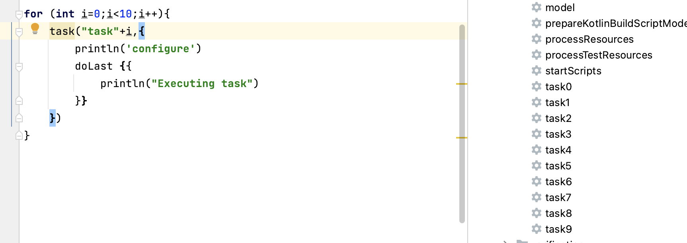

可以研究下 Project Api 


### Gradle Lifecycle

https://docs.gradle.org/current/userguide/build_lifecycle.html


- Initialization

  Detects the [settings file](https://docs.gradle.org/current/userguide/organizing_gradle_projects.html#sec:settings_file).Evaluates the settings file to determine which projects and included builds participate in the build.Creates a [`Project`](https://docs.gradle.org/current/dsl/org.gradle.api.Project.html) instance for every project.

- Configuration

  Evaluates the build scripts of every project participating in the build.Creates a task graph for requested tasks.

  本质上把build.gradle从上到下跑一遍。

- Execution

  Schedules and executes each of the selected tasks in the order of their dependencies.

  

### 任务

https://www.bilibili.com/video/BV1dK411K7Pg

https://www.bilibili.com/video/BV1DE411Z7nt

https://www.bilibili.com/video/BV1dp4y1e7W4


注意Android stuio默认关闭task 按钮

##### 静态任务

```groovy
println("gradle study")


task("helloworld",{
    println('configure')
    doLast {{
        println("Executing task")
    }}
})
```


./gradlew helloworld


##### 动态任务





"configure" 在生命周期Configuration 阶段就执行。

dolast dofirst只是加入到任务中，只有指定具体执行的任务，才会执行，就像上面的 ./gradlew helloworld，指明helloworld任务。


闭包

```
task testGrdele{
    println("testGrdele")
}

//闭包的概念, 像kotlin匿名函数
task closure{
    mEach{
        println it
    }

    mEachWithParams { m, n ->//  -> 将闭包的参数和主体分离开
        println "${m} is ${n}"
    }
}
def mEach(closure){
    for (int i in 1..5){
        closure(i)
    }
}

def mEachWithParams(closure){
    def map = ['name':'groovy','age':10]
    map.each {
        closure(it.key,it.value)
    }
}
```


### Plugin

#### Scrpit Plugin


##### CustomGradlePlugin

 ./gradlew CustomGradlePlugin


```groovy
//1.脚本插件
//app模块下的build.gradle文件中定义的对象插件
class CustomGradlePlugin implements Plugin<Project> {

    @Override
    void apply(Project target) {
        target.task("showCustomPlugin") {
            doLast {
                println("this is CustomGradlePlugin")
            }
        }
    }
}
```


./gradlew scriptPlugin

```
apply from: "config.gradle"
```

```groovy
project.task("scriptPlugin") {
    doLast {
        println("$project.name:this is a scriptPlugin")
    }
}
```


ankotlin:this is a scriptPlugin


##### MyAwesomePlugin


```groovy
class MyAwesomePlugin implements Plugin<Project>{

    @Override
    void apply(Project project) {
        task("helloworld22",{
            println('configure')
            doLast {{
                println("Executing task")
            }}
        })
    }
}

apply plugins : MyAwesomePlugin
```


buildscript 可以把java complile的classpath加入到build.gradle中


#### Use Plungin in build.gradle


```
buildscript {
    repositories {
        mavenCentral()
    }
    dependencies {
        classpath group: 'org.apache.commons', name: 'commons-lang3', version: '3.5'
    }
}

allprojects {
    repositories {
        mavenCentral()
    }
}

apply plugin: 'java'

dependencies {
    implementation group: 'org.apache.commons', name: 'commons-lang3', version: '3.5'
}

if (StringUtils.isNoneEmpty()){
    
}
```

这样就能使用java的方法在build.gradle中。


