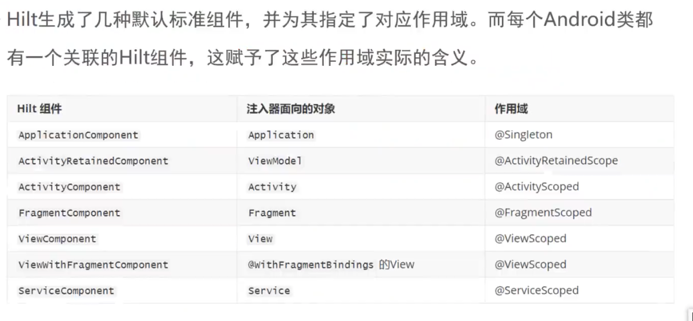
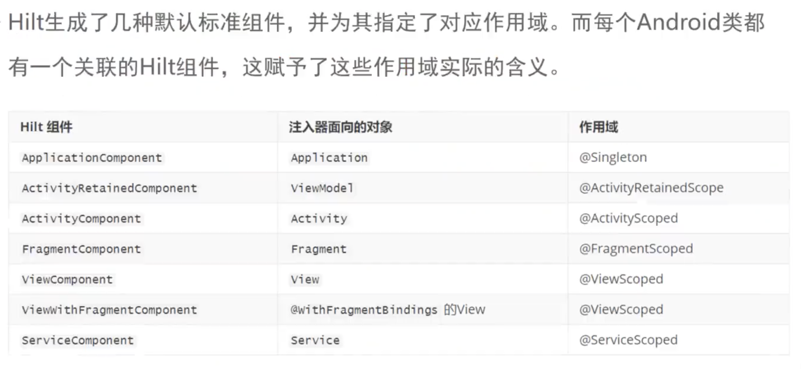
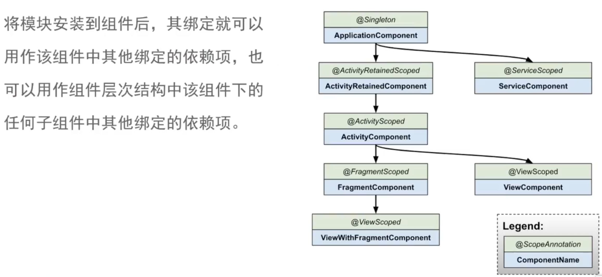

https://developer.android.google.cn/training/dependency-injection/hilt-jetpack?hl=zh-cn

https://mp.weixin.qq.com/s/OEX1d2cU1zGG5BBM-nANBg


依赖注入有什么用

* 自动加载

* 自动加载的关键 : 数据共享

  

https://www.bilibili.com/video/BV1e54y1S72A/?spm_id_from=333.788.recommend_more_video.-1


### Hilt

由于会和Dagger冲突，所以写在JYKot里

##### 优势


##### Hilt使用步骤

1. 配置HiltAndroidApp注解

```java
@HiltAndroidApp // 1.  HiltAndroidApp注解
class MyApp : Application() {
  
}
```

2. 建立绑定,就是说User对象实例由谁提供

   * 可以通AppModule提供

     ```java
     //Module装载到ApplicationComponent中,Module作用域就被限定起来了
     @InstallIn(ApplicationComponent.class) //通过这种方式和组件关联
     @Module
     public class AppModule {
     
         @Provides
         User1 provideUser() {
             return new User1();
         }
     }
     ```

   * 也可以通过构造方法提供

     ```java
     public class User {
         @Inject //方式一
         public User() {
         }
     }
     ```

3. 往Activity注入实例

   主要是@AndroidEntryPoint  @Inject

   ```java
   @AndroidEntryPoint
   public class HiltActivity extends AppCompatActivity {
   
       String TAG ="HiltActivity";
       @Inject
       User user; //inject注解作用在User变量上,注入对象实例
   
       @Inject
       User1 user1; // 方式2
   
       @Override
       protected void onCreate(Bundle savedInstanceState) {
           super.onCreate(savedInstanceState);
           setContentView(R.layout.activity_hilt);
           Log.i(TAG, "user: " + user);
           Log.i(TAG, "user1: " + user1);
       }
   }
   ```

运行结果

> 28743-28743/com.john.kot I/HiltActivity: user: com.john.kot.hilt.User@d33a8d5
> 28743-28743/com.john.kot I/HiltActivity: user1: com.john.kot.hilt.User1@62df8ea


##### 默认标准组件

组件实例由关联的Android类来创建的




##### ActivityScoped作用域

```java
//Module装载到ApplicationComponent中
@InstallIn(ActivityComponent.class) //通过这种方式和组件关联
@Module
public class AppModule1 {

    @ActivityScoped //ActivityComponent只能设置ActivityScoped作用域
    @Provides
    User1 provideUser() {
        return new User1();
    }
}
```


```java
@AndroidEntryPoint
public class HiltActivity extends AppCompatActivity {

    String TAG ="HiltActivity";
 		//inject注解作用在User变量上,注入对象实例

    @Inject
    User1 user1; // 方式2

    @Inject
    User1 user2;

    @Override
    protected void onCreate(Bundle savedInstanceState) {
        super.onCreate(savedInstanceState);
        setContentView(R.layout.activity_hilt);

        //测试  ActivityComponent
        Log.i(TAG, "user1: " + user1);
        Log.i(TAG, "user2: " + user2);

        startActivity(new Intent(this,SecondActivity.class));
    }
}
```


```java
@AndroidEntryPoint
public class SecondActivity extends AppCompatActivity {
    String TAG = "SecondActivity";
    @Inject
    User1 user3;
    @Override
    protected void onCreate(Bundle savedInstanceState) {
        super.onCreate(savedInstanceState);
        setContentView(R.layout.activity_second);
        Log.i(TAG, "user3: " + user3);
    }
}
```


运行结果

> 2021-09-25 23:02:57.595 29397-29397/com.john.kot I/HiltActivity: user1: com.john.kot.hilt.User1@62df8ea
> 2021-09-25 23:02:57.595 29397-29397/com.john.kot I/HiltActivity: user2: com.john.kot.hilt.User1@62df8ea
> 2021-09-25 23:02:57.883 29397-29397/com.john.kot I/SecondActivity: user3: com.john.kot.hilt.User1@1aa35b5

可以看到作用域在Activity中


##### AppModule1

修改成 ApplicationComponent 和Singleton

```java
//Module装载到ApplicationComponent中
@InstallIn(ApplicationComponent.class) //通过这种方式和组件关联
@Module
public class AppModule1 {

    @Singleton //ActivityComponent只能设置ActivityScoped作用域
    @Provides
    User1 provideUser() {
        return new User1();
    }
}
```

运行结果

> 2021-09-25 23:09:24.752 29553-29553/com.john.kot I/HiltActivity: user1: com.john.kot.hilt.User1@62df8ea
> 2021-09-25 23:09:24.752 29553-29553/com.john.kot I/HiltActivity: user2: com.john.kot.hilt.User1@62df8ea
> 2021-09-25 23:09:25.106 29553-29553/com.john.kot I/SecondActivity: user3: com.john.kot.hilt.User1@62df8ea

明显一样的实例了


#### Hilt使用

这个和上面的一样,上面的是后来写的。

#####  方式一

1.生成组件

```java
@HiltAndroidApp
class MyApp : Application() {
  
}
```

2. 建立绑定

   通过@Inject告诉Dagger可以通过，构造方法创建实例

   ```java
   public class User {
       @Inject
       public User() {
       }
   }
   ```

   

3. 注入对象 

   ```java
   @AndroidEntryPoint
   public class HiltActivity extends AppCompatActivity {
   
       @Inject
       User user; //inject注解作用在User变量上,注入对象实例
   
       @Override
       protected void onCreate(Bundle savedInstanceState) {
           super.onCreate(savedInstanceState);
           setContentView(R.layout.activity_hilt);
       }
   }
   ```


​		必须是ComponentActivity的子类


> 29021-29021/com.john.kot I/HiltActivity: user: com.john.kot.hilt.User@2c507f


##### 方式二

Module

不通过下面这种方式

```java
public class User {
  //    @Inject 不在这里，而是在Module提交对象创建
    public User() {
    }
}
```


```
//Module装载到ApplicationComponent中
@InstallIn(ApplicationComponent.class) //通过这种方式和组件关联
@Module
public class AppModule {
    @Provides 
    User provideUser(){
        return new User(); //Module提交对象创建
    }
}
```


>  29143-29143/com.john.kot I/HiltActivity: user: com.john.kot.hilt.User@43b8a20


#### 默认标准组件





#### 组件层次结构



ActivityComponent是ApplicationComponent的子组件，那么

ActivityComponent可以获取到ApplicationComponent提供的对象的实例.


#### 组件默认绑定

36-预定义榜单限定符


##### 构造方法绑定


```java
// 已经绑定的类
public class ViewModel {
    String TAG = "ViewModel";
    User1 user;
    Application application;
    Activity activity;

    @Inject
    public ViewModel(User1 user, Application application, Activity activity) {
        this.user = user;
        this.application = application;
        this.activity = activity;
    }

    public void  test(){
        Log.i(TAG, "test:user "+user);
        Log.i(TAG, "test: application "+application);
        Log.i(TAG, "test: activity"+activity);
    }
}
```


```java
@Inject
ViewModel viewModel;

@Override
protected void onCreate(Bundle savedInstanceState) {
    super.onCreate(savedInstanceState);
    setContentView(R.layout.activity_hilt);
    //测试  ActivityComponent
    Log.i(TAG, "user1: " + user1);
    Log.i(TAG, "user2: " + user2);
    startActivity(new Intent(this, SecondActivity.class));

    viewModel.test();
}
```


运行结果

> 2021-09-26 11:09:24.519 5113-5113/com.john.kot I/HiltActivity: user1: com.john.kot.hilt.User1@d7d8c73
> 2021-09-26 11:09:24.519 5113-5113/com.john.kot I/HiltActivity: user2: com.john.kot.hilt.User1@d7d8c73
> 2021-09-26 11:09:24.526 5113-5113/com.john.kot I/ViewModel: test:user com.john.kot.hilt.User1@d7d8c73
> 2021-09-26 11:09:24.526 5113-5113/com.john.kot I/ViewModel: test: application com.john.kot.MyApp@3320730
> 2021-09-26 11:09:24.526 5113-5113/com.john.kot I/ViewModel: test: activitycom.john.kot.hilt.HiltActivity@1934801

可以看到都有 Application Activity实例对象


##### Activity默认绑定

```java
public class User2 {
}

public class ViewModel1 {
    String TAG = "ViewModel1";
    User2 user;
    Application application;
    Activity activity;

    public ViewModel1(User2 user, Application application, Activity activity) {
        this.user = user;
        this.application = application;
        this.activity = activity;
    }

    public void  test(){
        Log.i(TAG, "test:user "+user);
        Log.i(TAG, "test: application "+application);
        Log.i(TAG, "test: activity"+activity);
    }
}

//Module装载到ApplicationComponent中
@InstallIn(ActivityComponent.class) //通过这种方式和组件关联
@Module
public class AppModule2 {

    @ActivityScoped //ActivityComponent只能设置ActivityScoped作用域
    @Provides
    User2 provideUser() {
        return new User2();
    }

    @Provides
    ViewModel1 provideViewModel(User2 user, Application application, Activity activity) {
        return new ViewModel1(user, application, activity);
    }
}
```


```java
viewModel1.test();
```


运行结果

> 2021-09-26 11:36:26.826 4615-4615/com.john.kot I/HiltActivity: user1: com.john.kot.hilt.User1@e57fd2d
> 2021-09-26 11:36:26.826 4615-4615/com.john.kot I/HiltActivity: user2: com.john.kot.hilt.User1@e57fd2d
> 2021-09-26 11:36:26.848 4615-4615/com.john.kot I/ViewModel: test:user com.john.kot.hilt.User2@868b262
> 2021-09-26 11:36:26.848 4615-4615/com.john.kot I/ViewModel: test: application com.john.kot.MyApp@4b9fff3
> 2021-09-26 11:36:26.848 4615-4615/com.john.kot I/ViewModel: test: activitycom.john.kot.hilt.HiltActivity@2adda8b


#### 预定义限定符

Qualify

```java
//Module装载到ApplicationComponent中
@InstallIn(ActivityComponent.class) //通过这种方式和组件关联
@Module
public class AppModule3 {

    @ActivityScoped //ActivityComponent只能设置ActivityScoped作用域
    @Provides
    User3 provideUser() {
        return new User3();
    }

    @Provides
    ViewModel3 provideViewModel(User3 user, Application application, Activity activity,@ActivityContext Context context) {
        return new ViewModel3(user, application, activity,context);
    }
}
```


>  2021-09-26 11:47:52.867 5273-5273/com.john.kot I/ViewModel1: test: context=com.john.kot.hilt.HiltActivity@2adda8b

@ActivityContext换成@ApplicationContext

> 2021-09-26 11:50:00.444 5376-5376/com.john.kot I/ViewModel1: test: context=com.john.kot.MyApp@4b9fff3


#### Hilt支持Jetpack组件


##### ViewModel

* User由我们自己提供

* Application application, Activity activity由 Dagger提供
* Context预定义的限定符.

```java
public class MainViewModel extends ViewModel {
    String TAG = "MainViewModel";

    User3 user;
    Application application;
    Activity activity;

    Context context;

    @ViewModelInject
    public MainViewModel(User3 user, Application application, Activity activity,@ApplicationContext  Context context) {
        this.user = user;
        this.application = application;
        this.activity = activity;
        this.context =context;
    }

    public void  test(){
        Log.i(TAG, "test:user="+user);
        Log.i(TAG, "test: application="+application);
        Log.i(TAG, "test: activity="+activity);
        Log.i(TAG, "test: context="+context);
    }
}
```


https://www.bilibili.com/video/BV1Ki4y1A7hA?spm_id_from=333.999.0.0


https://www.bilibili.com/video/BV1BK4y1V7no?p=4&spm_id_from=pageDriver

https://developer.android.com/codelabs/android-hilt?hl=zh-cn#7

#### 字节码技术

Javassit 动态修改字节码


