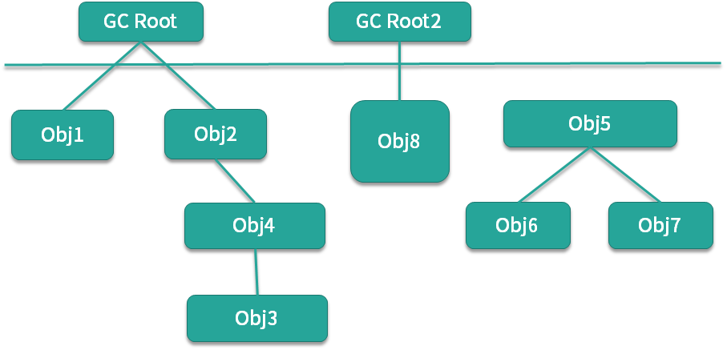
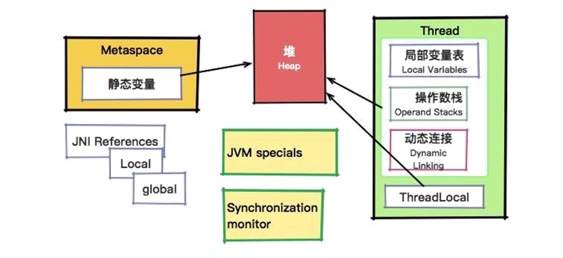

#### 垃圾回收

#### 可达性分析

​	从GC Roots向下追溯、搜索，会产生一个叫做Refrence Chain的链条。当一个对象不能和任何一个GC Root产生关系时，就会被回收。

​	

如图所示，Obj5、Obj6、Obj7，由于不能和 GC Root 产生关联，发生 GC 时，就会被摧毁。

垃圾回收就是围绕着 GC Roots 去做的。同时，它也是很多内存泄露的根源，因为其他引用根本没有这样的权利。

那么，什么样的对象，才会是 GC Root 呢？这不在于它是什么样的对象，而在于它所处的位置。

https://kaiwu.lagou.com/course/courseInfo.htm?courseId=31#/detail/pc?id=1029


#### GC Roots 有哪些

GC Roots 是一组必须活跃的引用。用通俗的话来说，就是程序接下来通过直接引用或者间接引用，能够访问到的潜在被使用的对象。

GC Roots 包括：

- Java 线程中，当前所有正在被调用的方法的引用类型参数、局部变量、临时值等。也就是与我们栈帧相关的各种引用。
- 所有当前被加载的 Java 类。
- Java 类的引用类型静态变量。
- 运行时常量池里的引用类型常量（String 或 Class 类型）。
- JVM 内部数据结构的一些引用，比如 sun.jvm.hotspot.memory.Universe 类。
- 用于同步的监控对象，比如调用了对象的 wait() 方法。
- JNI handles，包括 global handles 和 local handles。

这些 GC Roots 大体可以分为三大类，下面这种说法更加好记一些：

- 活动线程相关的各种引用。

- 类的静态变量的引用。

- JNI 引用。

  ​	

  注意

  - 我们这里说的是活跃的引用，而不是对象，对象是不能作为 GC Roots 的。
  - GC 过程是找出所有活对象，并把其余空间认定为“无用”；而不是找出所有死掉的对象，并回收它们占用的空间。所以，哪怕 JVM 的堆非常的大，基于 tracing 的 GC 方式，回收速度也会非常快。

##### 引用计数算法(忽略)

当前主流的商用程序语言(Java、C#，上溯至前面提到的古老的Lisp)的内存管理子系统，都是 通过可达性分析(Reachability Analysis)算法来判定对象是否存活的。这个算法的基本思路就是通过 一系列称为“GC Roots”的根对象作为起始节点集，从这些节点开始，根据引用关系向下搜索，搜索过 程所走过的路径称为“引用链”(Reference Chain)，如果某个对象到GC Roots间没有任何引用链相连， 或者用图论的话来说就是从GC Roots到这个对象不可达时，则证明此对象是不可能再被使用的。

```java
/**
* testGC()方法执行后，objA和objB会不会被GC呢? * @author zzm
*/
public class ReferenceCountingGC {
	public Object instance = null;
	private static final int _1MB = 1024 * 1024;
/**
* 这个成员属性的唯一意义就是占点内存，以便能在GC日志中看清楚是否有回收过 */
	private byte[] bigSize = new byte[2 * _1MB];
	public static void testGC() {
		ReferenceCountingGC objA = new ReferenceCountingGC(); ReferenceCountingGC objB = new ReferenceCountingGC(); 		objA.instance = objB;
		objB.instance = objA;
		objA = null; objB = null;
	// 假设在这行发生GC，objA和objB是否能被回收?
		System.gc(); }
	}
```

##### 能够找到 Reference Chain 的对象，就一定会存活么？

引用级别

将引用分为强引用(Strongly Re-ference)、软 引用(Soft Reference)、弱引用(Weak Reference)和虚引用(Phantom Reference)4种，这4种引用强 度依次逐渐减弱。

* ·强引用是最传统的“引用”的定义，是指在程序代码之中普遍存在的引用赋值，即类似“Object obj=new Object()”这种引用关系。无论任何情况下，只要强引用关系还存在，垃圾收集器就永远不会回 收掉被引用的对象。

* 软引用是用来描述一些还有用，但非必须的对象。只被软引用关联着的对象，在系统将要发生内 存溢出异常前，会把这些对象列进回收范围之中进行第二次回收，如果这次回收还没有足够的内存， 才会抛出内存溢出异常。在JDK 1.2版之后提供了SoftReference类来实现软引用。

  ```java
  // 伪代码
  
  Object object = new Object();
  
  SoftReference<Object> softRef = new SoftReference(object);
  
  ```

  

* 弱引用也是用来描述那些非必须对象，但是它的强度比软引用更弱一些，被弱引用关联的对象只 能生存到下一次垃圾收集发生为止。当垃圾收集器开始工作，无论当前内存是否足够，都会回收掉只 被弱引用关联的对象。在JDK 1.2版之后提供了WeakReference类来实现弱引用。

  ```java
  // 伪代码
  
  Object object = new Object();
  
  WeakReference<Object> softRef = new WeakReference(object);
  
  ```

  

* 虚引用也称为“幽灵引用”或者“幻影引用”，这是一种形同虚设的引用，在现实场景中用的不是很多。虚引用必须和引用队列（ReferenceQueue）联合使用。如果一个对象仅持有虚引用，那么它就和没有任何引用一样，在任何时候都可能被垃圾回收。

  虚引用主要用来跟踪对象被垃圾回收的活动。