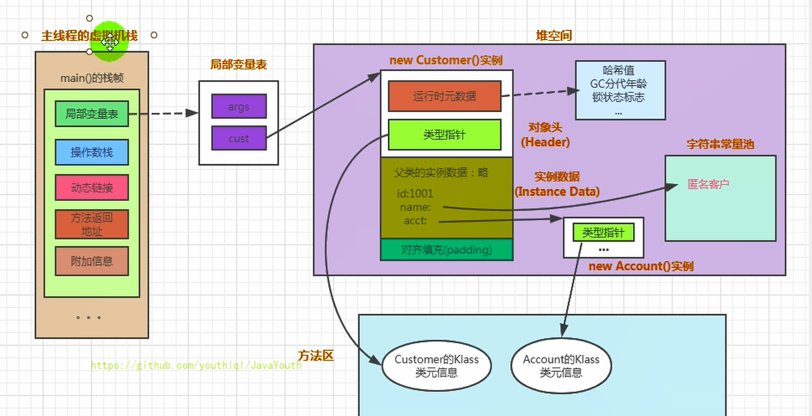

#### 对象的访问定位


1. Person类的.class信息存放在 方法区中
2. person变量存放在Java栈的局部变量表中
3. Person对象存放在Java堆中
4. 在Person堆中，有个指针指向方法区的person类型数据,表示person对象是方法区中的Person类New出来的.


**内存布局总结**

```java
public class Customer{
    int id = 1001;
    String name;
    Account acct;

    {
        name = "匿名客户";
    }
    public Customer(){
        acct = new Account();
    }
    public static void main(String[] args) {
        Customer cust = new Customer();
    }
}
class Account{

}
```

图解内存布局




#### 原子性(Atomicity)

​		由 J a v a 内 存 模 型 来 直 接 保 证 的 原 子 性 变 量 操 作 包 括 r e a d 、 l o a d 、 a s s i gn 、 u s e 、 s t o r e 和 w r i t e 这 六 个 ， 我们大致可以认为，基本数据类型的访问、读写都是具备原子性的(例外就是long和double的非原子性 协定，读者只要知道这件事情就可以了，无须太过在意这些几乎不会发生的例外情况)。

如果应用场景需要一个更大范围的原子性保证(经常会遇到)，Java内存模型还提供了lock和 unlock操作来满足这种需求，尽管虚拟机未把lock和unlock操作直接开放给用户使用，但是却提供了更 高 层 次 的 字 节 码 指 令 m o n i t o r e n t e r 和 m o n i t o r e xi t 来 隐 式 地 使 用 这 两 个 操 作 。 这 两 个 字 节 码 指 令 反 映 到 J a v a 代码中就是同步块——synchronized关键字，因此在synchronized块之间的操作也具备原子性。


##### **long 和 double 的原子性**

在前面，我们讲述了 long 和 double 和其他的基本类型不太一样，好像不具备原子性，这是什么原因造成的呢？

​	long 和 double 的值需要占用 64 位的内存空间，而对于 64 位值的写入，可以分为两个 32 位的操作来进行。

这样一来，本来是一个整体的赋值操作，就可能被拆分为低 32 位和高 32 位的两个操作。如果在这两个操作之间发生了其他线程对这个值的读操作，就可能会读到一个错误、不完整的值。		


#### 可 见 性 ( Vi s i b i l i t y )

可见性就是指当一个线程修改了共享变量的值时，其他线程能够立即得知这个修改。上文在讲解 volat ile变量的时候我们已详细讨论过这一点。Java内存模型是通过在变量修改后将新值同步回主内 存，在变量读取前从主内存刷新变量值这种依赖主内存作为传递媒介的方式来实现可见性的，无论是 普通变量还是volat ile变量都是如此。普通变量与volat ile变量的区别是，volat ile的特殊规则保证了<u>新值 能立即同步到主内存</u>，以及每次使用前立即从主内存刷新。因此我们可以说volat ile保证了多线程操作 时变量的可见性，而普通变量则不能保证这一点。

能立即同步到主内存 ？？ 感觉也有问题


示例

```java
/**
 * 描述：     演示可见性带来的问题
 */
public class VisibilityProblem {

    int a = 10;
    int b = 20;

    private void change() {
        a = 30;
        b = a;
    }


    private void print() {
        System.out.println("b=" + b + ";a=" + a);
    }

    public static void main(String[] args) {
        while (true) {
            VisibilityProblem problem = new VisibilityProblem();
            new Thread(new Runnable() {
                @Override
                public void run() {
                    try {
                        Thread.sleep(1);
                    } catch (InterruptedException e) {
                        e.printStackTrace();
                    }
                    problem.change();
                }
            }).start();

            new Thread(new Runnable() {
                @Override
                public void run() {
                    try {
                        Thread.sleep(1);
                    } catch (InterruptedException e) {
                        e.printStackTrace();
                    }
                    problem.print();
                }
            }).start();
        }
    }
}
```

会出现 `b = 30;a = 30 `  		` b = 20;a = 10`  	` b = 20;a = 30` 

还会有一种情况 `b = 30;a = 10`, 这种情况就会有可见性问题,**a 的值已经被第 1 个线程修改了，但是其他线程却看不到**，由于 a 的最新值却没能及时同步过来，所以才会打印出 a 的旧值。


#####  主内存和工作内存的关系

CPU 有多级缓存，导致读的数据过期,由于 CPU 的处理速度很快，相比之下，内存的速度就显得很慢，所以为了提高 CPU 的整体运行效率，减少空闲时间，在 CPU 和内存之间会有 cache 层，也就是缓存层的存在。虽然缓存的容量比内存小，但是缓存的速度却比内存的速度要快得多，其中 L1 缓存的速度仅次于寄存器的速度


越靠近核心，其容量就越小，但是速度也越快.

###### 线程可见性问题的实质

线程间对于共享变量的可见性问题，并不是直接由多核引起的，而是由我们刚才讲到的这些 L3 缓存、L2 缓存、L1 缓存，也就是**多级缓存**引起的：每个核心在获取数据时，都会将数据从内存一层层往上读取，同样，后续对于数据的修改也是先写入到自己的 L1 缓存中，然后等待时机再逐层往下同步，直到最终刷回内存。

假设 core 1 修改了变量 a 的值，并写入到了 core 1 的 L1 缓存里，但是还没来得及继续往下同步，由于 core 1 有它自己的的 L1 缓存，core 4 是无法直接读取 core 1 的 L1 缓存的值的，那么此时对于 core 4 而言，变量 a 的值就不是 core 1 修改后的最新的值，core 4 读取到的值可能是一个**过期**的值，从而引起多线程时可见性问题的发生。

###### 什么是主内存和工作内存

Java 作为高级语言，屏蔽了 L1 缓存、L2 缓存、L3 缓存(可以看作 工作内存)，也就是多层缓存的这些底层细节，用 JMM 定义了一套读写数据的规范。我们不再需要关心 L1 缓存、L2 缓存、L3 缓存等多层缓存的问题，我们只需要关心 JMM 抽象出来的主内存和工作内存的概念。


每个线程只能够直接接触到工作内存，无法直接操作主内存，而工作内存中所保存的正是主内存的共享变量的副本，主内存和工作内存之间的通信是由 JMM 控制的。

JMM 有以下规定：

（1）所有的变量都存储在主内存中，同时每个线程拥有自己独立的工作内存，而工作内存中的变量的内容是主内存中该变量的拷贝；

（2）线程不能直接读 / 写主内存中的变量，但可以操作自己工作内存中的变量，然后再同步到主内存中，这样，其他线程就可以看到本次修改；

（3） 主内存是由多个线程所共享的，但线程间不共享各自的工作内存，如果线程间需要通信，则必须借助主内存中转来完成。

https://kaiwu.lagou.com/course/courseInfo.htm?courseId=16#/detail/pc?id=298


#### 指令重排序

假设我们写了一个 Java 程序，包含一系列的语句，我们会默认期望这些语句的实际运行顺序和写的代码顺序一致。但实际上，编译器、JVM 或者 CPU 都有可能出于优化等目的，对于实际指令执行的顺序进行调整，这就是**重排序**。

##### 重排序的好处


左侧 3 行 Java 代码，右侧是这 3 行代码可能被转化成的指令。可以看出 a = 100 对应的是 Load a、Set to 100、Store a，意味着从主存中读取 a 的值，然后把值设置为 100，并存储回去，同理， b = 5 对应的是下面三行  Load b、Set to 5、Store b，最后的 a = a + 10，对应的是 Load a、Set to 110、Store a。如果你仔细观察，会发现这里有两次“Load a”和两次“Store a”，说明存在一定的重排序的优化空间。


重排序后， a 的两次操作被放到一起，指令执行情况变为 Load a、Set to 100、Set to 110、 Store a。下面和 b 相关的指令不变，仍对应 Load b、 Set to 5、Store b。

可以看出，重排序后 a 的相关指令发生了变化，节省了一次 Load a 和一次 Store a。重排序通过减少执行指令，从而提高整体的运行速度，这就是重排序带来的优化和好处。

##### **重排序的 3 种情况**

下面我们来看一下重排序的 3 种情况。

（1）编译器优化

编译器（包括 JVM、JIT 编译器等）出于优化的目的，例如当前有了数据 a，把对 a 的操作放到一起效率会更高，避免读取 b 后又返回来重新读取 a 的时间开销，此时在编译的过程中会进行一定程度的重排。不过重排序并不意味着可以任意排序，它需要需要保证重排序后，不改变单线程内的语义，否则如果能任意排序的话，程序早就逻辑混乱了。

（2）CPU 重排序

CPU 同样会有优化行为，这里的优化和编译器优化类似，都是通过乱序执行的技术来提高整体的执行效率。所以即使之前编译器不发生重排，CPU 也可能进行重排，我们在开发中，一定要考虑到重排序带来的后果。

（3） 内存的“重排序”

内存系统内不存在真正的重排序，但是内存会带来看上去和重排序一样的效果，所以这里的“重排序”打了双引号。由于内存有缓存的存在，在 JMM 里表现为主存和本地内存，而主存和本地内存的内容可能不一致，所以这也会导致程序表现出乱序的行为。

https://kaiwu.lagou.com/course/courseInfo.htm?courseId=16#/detail/pc?id=295