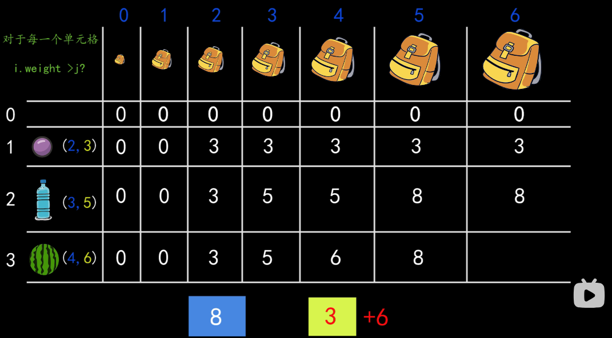

随想录

背包问题理论基础

https://www.bilibili.com/video/BV1cg411g7Y6/

有N件物品和一个最多能背重量为W 的背包。第i件物品的重量是weight[i]，得到的价值是 value[i] 。


```
dp[i][j] 
[0,i]物品任取放容量为j的背包

不放物品i : dp[i-1][j]
放物品i :  dp[i-1][j-weight[i]] + value[i]， 那么就是前i-1种物品的选择，减去当前i物品的重量 + 当前i物品的价值，其实就转化为 i-1种物品 j-weight[i]的容量下的最大值。

dp[i][j] = max(dp[i-1][j], dp[i-1][j-weight[i]] + value[i])
```

从上面的递推公式可以看出，当前值都是由 左上角的值，其实我觉得是正上角， 来递推出来的。`dp[i-1][j]`


随想录的解法，物品0是第一个物品，所以X方向初始化是有值的

下面两个视频，x,y都初始化0，感觉更好。

01背包问题，这个视频讲的很好 

https://www.bilibili.com/video/BV1pY4y1J7na

https://www.bilibili.com/video/BV1K4411X766

对第0行，第0行没有任何物品，在任何背包容量下，前0个物品，能装进背包的最大价值为0.

对第0列，第0列没有任何容量，在任何物品都无法放进背包，因此价值也都为0.

最后一个单元格的数字，就是我们要得到的最终答案。



1. 不放葡萄的情况下的最优解：当前单元格上方的值。
2. [2,1] 放葡萄情况下： 葡萄占用2，并且葡萄无法再次被选择 ， 此时问题从背包容量为2的情况下，对前一种物品取舍选择后获得的容量，变成了背包容量最大为0的情况下，对前0种物品进行取舍选择后获得的最大价值。


第2行3列的单元格，背包容量最大为3的情况下，对前面2种物品进行选择。

对于i行j列的单元格，背包容量最大为j的情况下，对前面i种物品进行选择，能使得背包价值最大，也就是说每个单元格都是当前条件下的最优解。


