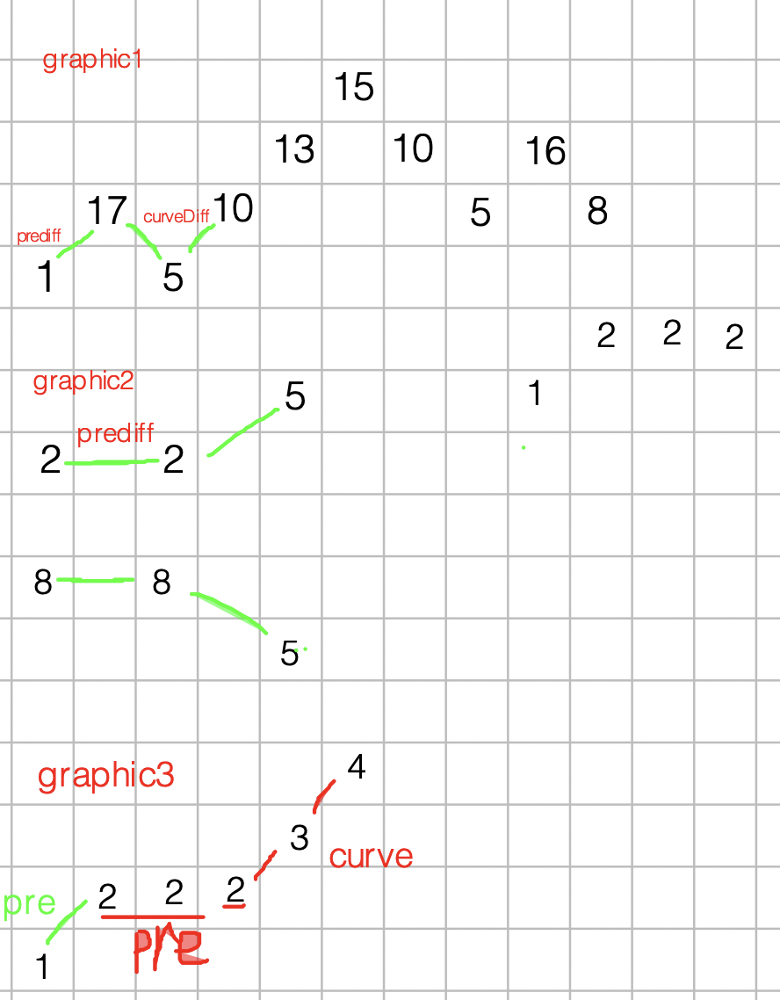
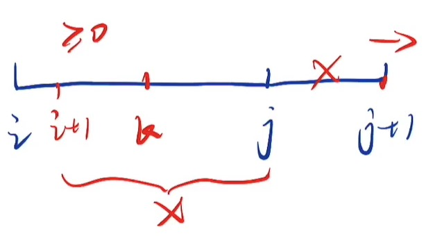

https://www.bilibili.com/video/BV1sA4y1S7Sp

这个视频讲到暴力 对数器可以验证答案，有意思。


有同学问了如何验证可不可以用贪心算法呢？

**刷题或者面试的时候，手动模拟一下感觉可以局部最优推出整体最优，而且想不到反例，那么就试一试贪心**。


贪心算法一般分为如下四步：

- 将问题分解为若干个子问题
- 找出适合的贪心策略
- 求解每一个子问题的最优解
- 将局部最优解堆叠成全局最优解

这个四步其实过于理论化了，我们平时在做贪心类的题目 很难去按照这四步去思考，真是有点“鸡肋”。

做题的时候，只要想清楚 局部最优 是什么，如果推导出全局最优，其实就够了。

https://www.bilibili.com/video/BV1XY411A766

https://www.bilibili.com/video/BV1Hz4y117CP/


#### [455.分发饼干](https://leetcode.cn/problems/assign-cookies/)

##### 分解题目

1. 每个孩子最多只能给一块饼干。
2. 每个孩子 `i`，都有一个胃口值 `g[i]`，每块饼干 `j`，都有一个尺寸 `s[j]` 。如果 `s[j] >= g[i]`，我们可以将这个饼干 `j` 分配给孩子 `i`。

##### Idea

```
g = [1,3], s = [1,2,4]
```

1. 对孩子的胃口值和， 饼干的大小进行排序，得到两行数组。

2. 如上面示例，s中的s[0]=1饼干大小，满足g[0]=1 孩子的胃口值,那么同时向右移动.s[1]=2 不满足g[1],s指针向右移动，s[2]满足g[1].

   这样所有孩子都满足了。


上面思路和随想录的不一样，随想录的是大饼干喂 胃口值大的孩子，不过觉得我这个更好理解。

##### Code

```kotlin
    fun findContentChildren(g: IntArray, s: IntArray): Int {
        if (s.isEmpty()) return 0
        Arrays.sort(g)  // 写了s.isEmpty()， 一开始忘了加这个排序
        Arrays.sort(s)
        var pg = 0
        var ps = 0
        var count = 0
        while (pg < g.size && ps < s.size) { // 控制边界
            if (s[ps] >= g[pg]) {       //饼干满足孩子的胃口大小.
                count++
                pg++
                ps++
            } else {
                ps++    //饼干不满足孩子的胃口大小，饼干数组指针往右走.
            }
        }
        return count
    }
```


#### 376摆动序列

##### Idea

摆动序列，其实求波峰 波谷的个数，所以有一个方向改变就算一个波动。


1. 根据图1可以看到

   preDiff = 17-1 >0 , curveDiff = 5 -10<0 ，这个就是一个摆动序列。还有

   preDiff = 5-10 <0 , curveDiff = 16 -5>0 的情况，这又是另一种情况的摆动序列。

2. 根据图2可以看到

   preDiff ==0  , curveDiff = 5 -2 > 0,  

   preDiff ==0  , curveDiff = 5 -8 > 0,  题目说 两个不等元素的序列也视作摆动序列。所以这种情况也是摆动序列。 但是我感觉这个和前面的 “如果连续数字之间的差严格地在正数和负数之间交替，则数字序列称为 **摆动序列**”,是有矛盾的。

   根据 1.2,所以条件可以合并, preDiff  >=0 , curveDiff <=0 ,preDiff <=0 , curveDiff >=0

3. 图3，只有2个摆动，但是根据根据1，2的总结代码在2,3节点处，红色pre的地方也有1个摆动，这种情况要去掉，因为他是同方向的摆动。所以pre应该停在绿色的地方，只有摆动发生她才需要改变，平波不用管。




```kotlin
fun wiggleMaxLength(nums: IntArray): Int {
    if (nums.size <= 1) {
        return nums.size
    }
    var preDiff = 0 //前一对差值
    var curveDiff = 0
    var result = 1
    for (i in 1 until nums.size) { // 第一个数已经计入摆动序列了，所以从1开始
        curveDiff = nums[i] - nums[i - 1] // 因为要给值给preDiff，所以从i开始，随想录c++解法是从0开始的。
        if ((preDiff >= 0 && curveDiff < 0) || (preDiff <= 0 && curveDiff > 0)) {
            result++
            preDiff = curveDiff
        }
    }
    return result
}
```


#### 53 最大子序和

  -2,	1,	-3,	4,	-1,	2,	1,	-5,	4

*Q *P 

##### IDEA

1. 题意是找到最大和的连续子数组， 所以是不能对数组排序。
2. 这题可以考虑用双指针解法，移动*p，从0开始 加上指针对应的计数。如果计数增加则是正数计入，如果减小则重置，移动 *q指针。

上面这个思路是不行的，4,	-1,	2,	1这种就有问题。


间隔后新的黄色部分是重置数据。


根据随想录的思路

局部最优：当前“连续和”为负数的时候立刻放弃，从下一个元素重新计算“连续和”，因为负数加上下一个元素 “连续和”只会越来越小。

这句话看起来有问题，但是也拿不出反例.


```kotlin
fun maxSubArray(nums: IntArray): Int {
    var result = 0
    var maxResult = Int.MIN_VALUE
    for (pIndex in nums.indices) {
        result += nums[pIndex]
        maxResult = maxResult.coerceAtLeast(result)
        if (result < 0) {
            result = 0
        }
    }
    return maxResult
}
```


#### 122 买卖股票的最佳时机 II


```
7,	1,	5,	3,	6,	4
	-6	4		-2	3		-2
```


假如第0天买入，第3天卖出，那么利润为：prices[3] - prices[0]。

相当于(prices[3] - prices[2]) + (prices[2] - prices[1]) + (prices[1] - prices[0])。

**此时就是把利润分解为每天为单位的维度，而不是从0天到第3天整体去考虑！**

那么根据prices可以得到每天的利润序列：(prices[i] - prices[i - 1]).....(prices[1] - prices[0])。


```kotlin
fun maxProfit(prices: IntArray): Int {
    val diffArray = IntArray(prices.size - 1)
    for (i in 1 until prices.size) {
        println(i)
        diffArray[i - 1] = prices[i] - prices[i - 1]
    }
    var sum = 0
    for (i in diffArray.indices) {
        if (diffArray[i] > 0) {
            sum += diffArray[i]
        }
    }
    return sum
}
```


#### 55 跳跃游戏

[2,3,1,1,4]

##### 题意

给定一个非负整数数组，你最初位于数组的第一个位置。

数组中的每个元素代表你在该位置可以跳跃的最大长度，比如在2的位置，可以跳一格到3的位置，也可以两格到1的位置。


上面第二幅图，第一条线应该有问题，应该覆盖到2 3 1


遍历每个位置，确定每个位置能覆盖的最大范围。


```kotlin
fun canJump(nums: IntArray): Boolean {
    var coverArea = 0
    for (i in 0..coverArea) { // 注意:这里是coverArea,需要确定能走多少步
        coverArea = (i + nums[i]).coerceAtLeast(coverArea) //新的范围和 之前的范围做比较
        if (coverArea >= nums.size - 1) {
            return true
        }
    }
    return false
}
```


#### 45 跳跃游戏 II

##### Idea

题目意思 总是可以到达数组的最后一个位置


```kotlin
fun jump(nums: IntArray): Int {
    var maxCover = 0
    var count = 0
    for (i in 0..maxCover) {
        if (i + nums[i] > maxCover) {
            maxCover = i + nums[i]
        } else {
            count++
        }

        if (maxCover >= nums.size) {
            println("count $count")
            return count
        }
    }
    return count
}
```


找到能覆盖的最远距离，如果移动到了这个地方，那么就计算一次，直到  nums.size - 1- 1个节点，然后再count++就可以了。


```kotlin
    fun jump(nums: IntArray): Int {
        var nextCover = 0
        var count = 0
        var currentCover = 0
        for (i in 0 until nums.size - 1) {
            nextCover = Math.max(i + nums[i], nextCover)
            if (i == currentCover) {
                currentCover = nextCover
                count++
            }
        }
        return count
    }
```


#### [1005. K 次取反后最大化的数组和](https://leetcode.cn/problems/maximize-sum-of-array-after-k-negations/)

1. 先对数组进行排序，把 < 0的数按位取反 ,直到数组的数据都>0,此时翻转了n次
2. 对翻转后的数组重新进行排序，对最小的数 翻转 k-n 次


My Idea

```kotlin
fun largestSumAfterKNegations(nums: IntArray, k: Int): Int {
    Arrays.sort(nums)
    var balanceK = 0
    for (i in 0 until k) { // kotlin用while 应该更好
        if (i >= nums.size || nums[i] > 0) {
            balanceK = k - i
            break
        }
        nums[i] = Math.abs(nums[i])
    }
    Arrays.sort(nums)
    if (balanceK > 0 && (balanceK % 2) > 0) {
        nums[0] = -nums[0]
    }
    var sum = 0
    for (value in nums) {
        sum += value
    }
    return sum
}
```


这个也可以

https://www.bilibili.com/video/BV1iY411s7qB


```kotlin
fun largestSumAfterKNegations(nums: IntArray, k: Int): Int {
    val typedArray = nums.toTypedArray() // 转成数组
    Arrays.sort(typedArray, Comparator.comparingInt(Math::abs)) // 按照绝对值排序
    var k = k
    for (i in typedArray.indices) {
        if (k > 0 && typedArray[i] < 0) {  // 碰到数组中>0的数
            typedArray[i] *= -1
            k--
        }
    }
    Arrays.sort(typedArray)
    if (k % 2 > 0) {
        typedArray[0] *= -1
    }
    var sum = 0
    for (value in nums) {
        sum += value
    }
    return sum
}
```

 参考随想录，但是编译不通过

https://www.bilibili.com/video/BV138411G7LY


#### [134 加油站](https://leetcode.cn/problems/gas-station/)

##### 暴力解法

```kotlin
fun canCompleteCircuit(gas: IntArray, cost: IntArray): Int {
    for (i in gas.indices) {
        var balance = gas[i] - cost[i]
        var index = (i + 1) % gas.size
        while (balance > 0 && i != index) {  // 还有油的话，没走完一圈，继续走
            balance += (gas[index] - cost[index])
            index = (index + 1) % gas.size
        }
        if (balance >= 0 && (index == i)) {//走完一圈，返回下标
            return i
        }
    }
    return -1
}
```


##### 贪心解法

这里k不用看




https://www.bilibili.com/video/BV1DF411L7cz

j 到 j+1跑不到 , 从i 到 j +1 油量<0

1. 因为 i 能开到j,从 i 出发到 i+1 油量 >=0 ,  那么 i+1 到 j+1 油量一定 <0.
2. 如果起点在 i+1, 因为 i 到j+1<0 ,因此 i 到  i+1>=0 , i+1 到j+1一定<0.

总结来看,  i 到 j+1<0 ,中间不用看，直接从 j+1开始即可。


LC134我的解法有问题，看到随想录的解法后感觉很妙


```kotlin
fun canCompleteCircuit(gas: IntArray, cost: IntArray): Int {
    var totalSum = 0 //  所有路程需要的油量
    var currentSum = 0  // 当前位置开始所需要的油量
    var start = 0
    for (i in gas.indices) {
        totalSum += gas[i] - cost[i]
        currentSum += gas[i] - cost[i]
        if (currentSum < 0) { // 到i加油站需要油量 <0, 如果接下来 gas[i+1] - cost[i+1]还是<0,那么start ,currentSum 继续更新
            start = i + 1
            currentSum = 0
        }
    }
    if (totalSum < 0) {
        return -1
    }
    return start
}
```

1.  到i加油站需要油量 <0, 如果接下来 gas[i+1] - cost[i+1]还是<0,那么start ,currentSum 继续更新.
2.  j ,j+1是负数节点,如果存在这样一个节点,满足条件，那么j+1开始后面一圈的一定都是>0


