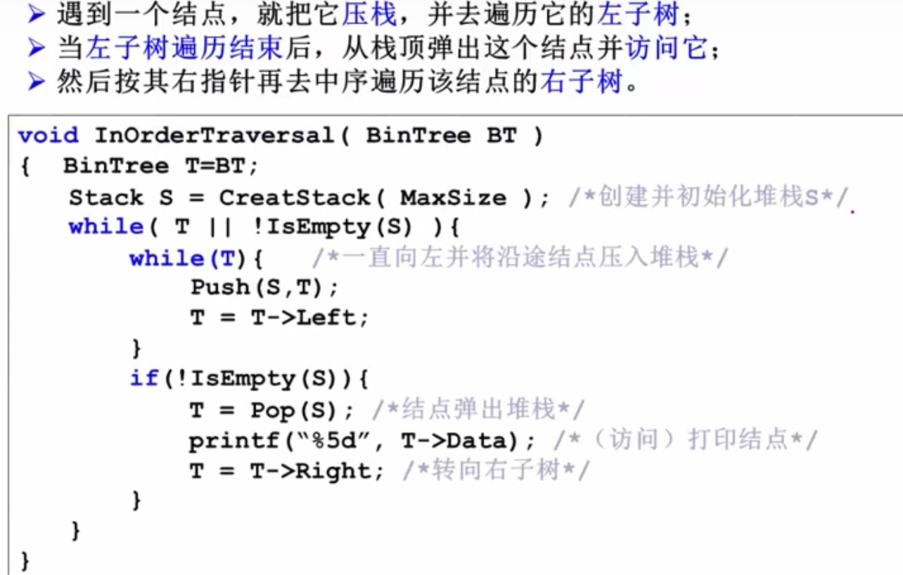
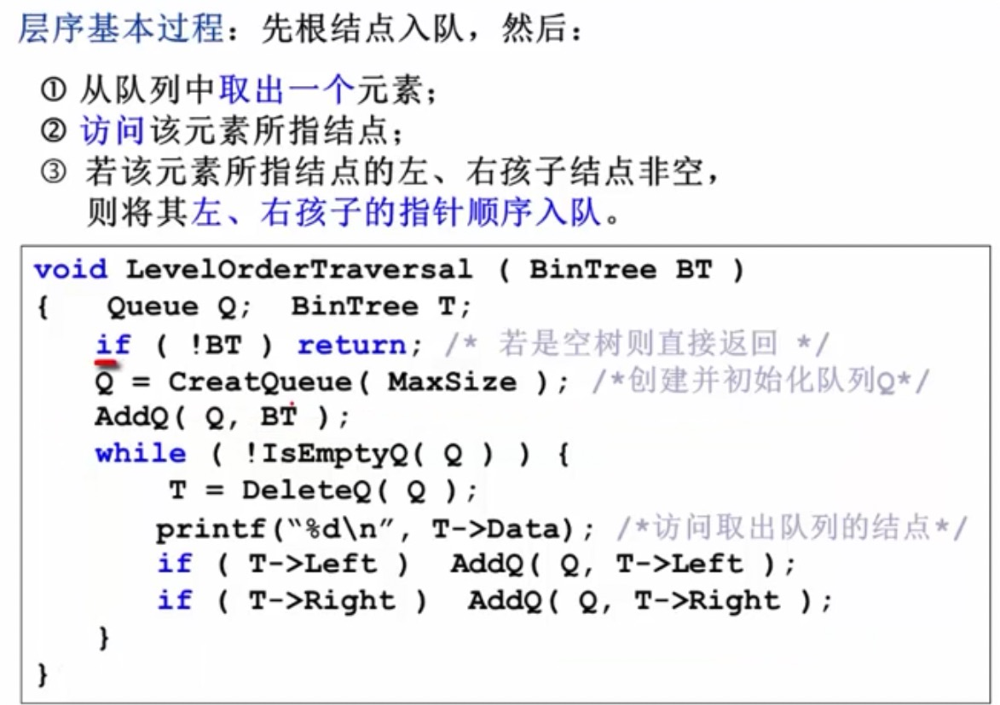

二叉树算法思维

https://www.bilibili.com/video/BV1nG411x77H


TreeOperation.java打印树


#### Tree


https://www.bilibili.com/video/BV1JW411i731


##### 完全二叉树

数组存储方式


i 是数组下标


#### 遍历


每个Node都有3次访问机会，谁先出现就代表什么序.


中间节点  在哪,代表的遍历方式

- 先序遍历  preorder traversal ：中左右
- 中序遍历 inorder traversal：左中右
- 后序遍历 postorder traversal：左右中

https://github.com/azl397985856/leetcode/blob/master/thinkings/tree.md


##### preorder traversal 递归


二叉树的遍历动画

 

https://www.bilibili.com/video/BV1RR4y1j7kh


B的左边遍历完成后，开始遍历B的右子树

遍历过程

1. 访问根节点
2. 先序遍历其左子树
3. 先序遍历其右子树

```c
void PreOrderTraversal(BinTree BT){
  if(BT){
    printf("%d", BT -> Data);
    PreOrderTraversal(BT->Left)
    PreOrderTraversal(BT->Right)
  }
}
```


https://www.bilibili.com/video/BV1JW411i731?p=34&vd_source=d4c5260002405798a57476b318eccac9


##### 非递归

https://www.bilibili.com/video/BV15f4y1W7i2


##### 构建和打印树

https://blog.nowcoder.net/n/f3799d64ed764fd49c63947d617d4cd5

https://leetcode.cn/playground/VDCGQ8Ds/

https://leetcode.cn/circle/discuss/vpcMyM/


中序遍历





##### 层序遍历 

也叫 广度优先遍历

用队列实现


while遍历纵向层数

for遍历横向





#### 确定二叉树

必须有中序遍历，和先 后 序遍历之一


二叉搜索树

BST. Binary Search Tree


##### [144. 二叉树的前序遍历](https://leetcode.cn/problems/binary-tree-preorder-traversal/)

递归


```kotlin
    fun preorderTraversal(root: TreeNode?): List<Int> {
        val linkedList = LinkedList<Int>()
        preTraversal(root, linkedList)
        return linkedList
    }

    private fun preTraversal(node: TreeNode?, linkedList: LinkedList<Int>) {
        if (node == null) return // 这样的递归基更好
        linkedList.add(node.`val`)
        preTraversal(node.left, linkedList)
        preTraversal(node.right, linkedList)
    }
```


迭代

随想录

前序遍历是中左右，每次先处理的是中间节点，那么先将根节点放入栈中，然后将右孩子加入栈，再加入左孩子。

为什么要先加入 右孩子，再加入左孩子呢？ 因为这样出栈的时候才是中左右的顺序。


5 4 1 2 6


```kotlin
fun preorderTraversal1(root: TreeNode?): List<Int> {
    val linkedList = LinkedList<Int>()
    val stack = Stack<TreeNode>()
    root?.let{
        stack.push(it)
    }
    while (!stack.empty()) {
        val popNode = stack.pop()
        popNode.`val`.let{
            linkedList.add(it)
        }
        popNode.right?.let {
            stack.push(it)
        }
        popNode.left?.let {
            stack.push(it)
        }
    }
    return linkedList
}
```


##### [94. 二叉树的中序遍历](https://leetcode.cn/problems/binary-tree-inorder-traversal/)

递归

```kotlin
    fun inorderTraversal(root: TreeNode?): List<Int> {
        val linkedList = LinkedList<Int>()
        orderRecursive(root, linkedList)
        return linkedList
    }

    private fun orderRecursive(node: TreeNode?, linkedList: LinkedList<Int>) {
        if (node == null) return
        orderRecursive(node.left, linkedList)
        linkedList.add(node.`val`)
        orderRecursive(node.right, linkedList)
    }
```


迭代法

随想录


```kotlin
fun inorderTraversal1(root: TreeNode?): List<Int> {
    val linkedList = LinkedList<Int>()
    if (root == null) return linkedList
    val stack = Stack<TreeNode>()
    var node = root
    while (node != null || !stack.empty()) { //node != null 第一次可以进来
        if (node != null) {
            stack.push(node)
            node = node.left
        } else {
            val resultNode = stack.pop()
            linkedList.add(resultNode.`val`)
            node = resultNode.right
        }
    }
    return linkedList
}
```


##### [145. 二叉树的后序遍历](https://leetcode.cn/problems/binary-tree-postorder-traversal/)

递归

```kotlin
    //recurive
    fun postorderTraversal(root: TreeNode?): List<Int> {
        val linkedList = LinkedList<Int>()
        recursiveTraversal(root, linkedList)
        return linkedList
    }

    private fun recursiveTraversal(node: TreeNode?, linkedList: LinkedList<Int>) {
        if (node == null) return
        recursiveTraversal(node.left, linkedList)
        recursiveTraversal(node.right, linkedList)
        linkedList.add(node.`val`)
    }
```


迭代法


```kotlin
   fun postorderTraversal(root: TreeNode?): List<Int> {
        var mRoot = root
        val resultList = LinkedList<Int>()
        val stack = Stack<TreeNode>()
        var preNode: TreeNode? = null
        while (mRoot != null || !stack.isEmpty()) {
            while (mRoot != null) {
                stack.push(mRoot)
                mRoot = mRoot.left
            }
            mRoot = stack.pop()
            if (mRoot?.right == null || mRoot.right == preNode) { // 一开始写成这样 mRoot == preNode,导致死循环
                resultList.add(mRoot.`val`)
                preNode = mRoot
                mRoot = null
            } else {
                stack.push(mRoot)
                mRoot = mRoot.right
            }
        }
        return resultList
    }
```


https://leetcode.cn/problems/binary-tree-postorder-traversal/solution/er-cha-shu-de-hou-xu-bian-li-by-leetcode-solution/ 动图

官方题解


迭代法统一写法

https://leetcode.cn/problems/binary-tree-inorder-traversal/solution/dai-ma-sui-xiang-lu-che-di-chi-tou-qian-xjof1/

这个统一法还没研究，先往后学吧，地铁上看了下，其实也不难


#### [102. 二叉树的层序遍历](https://leetcode.cn/problems/binary-tree-level-order-traversal/)


按照顺序，下一层的放在后面.

##### 迭代写法

```kotlin
fun levelOrder(root: TreeNode?): List<List<Int>> {
    val layerList = LinkedList<List<Int>>()
    val queue = LinkedList<TreeNode>()
    if (root != null) {
        queue.offer(root)
    }
    while (queue.isNotEmpty()) {
        val layerSize = queue.size // queue大小，下面循环在不断变化，所以要先定义出来
        val linkedList = LinkedList<Int>()
        for (i in 0 until layerSize) {
            val headNode = queue.poll()
            linkedList.add(headNode.`val`)
            headNode.left?.let { queue.offer(it) }
            headNode.right?.let { queue.offer(it) }
        }
        layerList.add(linkedList)
    }
    return layerList
}
```


##### 递归解法

递归解法一开始没理解，再看了下，思路很妙

```kotlin
fun levelOrder1(root: TreeNode?): List<List<Int>> {
    val layerList = LinkedList<LinkedList<Int>>()
    if (root==null){
        return layerList
    }
    val depth = 0 // 层级
    return recursive(layerList, root, depth)
}

private fun recursive(layerList: LinkedList<LinkedList<Int>>, node: TreeNode?, depth: Int): List<List<Int>> {
    if (layerList.size <= depth) { //二维数组长度不超过这个层级,随想录这里是用 ==,不过我觉得<=更好
        val linkedList = LinkedList<Int>()
        layerList.add(linkedList)
    }
    node?.`val`?.let { layerList[depth].add(it) } // 拿到当前层级节点的值
    val mDepth = depth + 1
    if (node?.left != null) {
        recursive(layerList, node.left, mDepth)
    }
    if (node?.right != null) {
        recursive(layerList, node.right, mDepth)
    }
    return layerList
}
```


https://leetcode.cn/problems/binary-tree-level-order-traversal/solution/er-cha-shu-de-ceng-xu-bian-li-by-leetcode-solution/

https://programmercarl.com/0102.%E4%BA%8C%E5%8F%89%E6%A0%91%E7%9A%84%E5%B1%82%E5%BA%8F%E9%81%8D%E5%8E%86.html


#### [107. 二叉树的层序遍历 II](https://leetcode.cn/problems/binary-tree-level-order-traversal-ii/)


```kotlin
    fun levelOrderBottom(root: TreeNode?): List<List<Int>> {
        val resultList = LinkedList<ArrayList<Int>>()
        val queue = LinkedList<TreeNode>()
        if (root != null) {
            queue.offer(root)
        }
        while (queue.isNotEmpty()) {
            val layerSize = queue.size // queue循环中 不断的变化
            val arrayList = ArrayList<Int>()
            for (i in 0 until layerSize) {
                val headNode = queue.poll()
                if (headNode != null) {
                    arrayList.add(headNode.`val`)
                    headNode.left?.let { queue.offer(it) }
                    headNode.right?.let { queue.offer(it) }
                }
            }
            resultList.addFirst(arrayList)
        }
        return resultList
    }	
```


#### [199. 二叉树的右视图](https://leetcode.cn/problems/binary-tree-right-side-view/)

##### 广度优先遍历

```kotlin
fun rightSideView(root: TreeNode?): List<Int> {
    val resultList = LinkedList<Int>()
    val queue = LinkedList<TreeNode>()
    if (root != null) {
        queue.add(root)
    }
    while (queue.isNotEmpty()) {
        val layoutSize = queue.size
        for (i in 0 until layoutSize) {
            val headNode = queue.poll()
            if (i == layoutSize - 1) {
                resultList.add(headNode.`val`)
            }
            headNode?.left?.let { queue.offer(it) }
            headNode?.right?.let { queue.offer(it) }
        }
    }
    return resultList
}
```


##### DFS 深度优先遍历

这个DFS很妙，这次只是先理解,二刷的时候可以自己写写

```java
class Solutions{
	  List<Integer> res = new ArrayList<>();
  	public List<Integer> rightSideView(TreeNode root){
       dfs(root,0)
       return res;
    }
  prvidate void dfs(TreeNode root, int depth){
    if(root ==null){
      return;
    }
    if(depth == res.size()){ // 当前层级第一个右节点还没有，添加到结果中
      res.add(root.val)
    }
    depth++;
    dfs(root.right,depth)
    dfs(root.left,depth)
  }
}
```

理解在官方视频中.

https://leetcode.cn/problems/binary-tree-right-side-view/solution/er-cha-shu-de-you-shi-tu-by-leetcode-solution/


#### [637. 二叉树的层平均值](https://leetcode.cn/problems/average-of-levels-in-binary-tree/)

```kotlin
fun averageOfLevels(root: TreeNode?): DoubleArray {
    val resultList = ArrayList<Double>()
    val queue = LinkedList<TreeNode>()
    if (root != null) {
        queue.offer(root)
    }
    while (queue.isNotEmpty()) {
        val layoutSize = queue.size
        var layerSum = 0.toDouble()
        for (i in 0 until layoutSize) {
            val node = queue.poll()
            layerSum += node.`val`
            node?.left?.let { queue.offer(it) }
            node?.right?.let { queue.offer(it) }
        }
        val average = resultList.add(layerSum * 1.00000 / layoutSize)
    }
    return resultList.toDoubleArray()
}
```


#### [429. N 叉树的层序遍历](https://leetcode.cn/problems/n-ary-tree-level-order-traversal/)


```kotlin
fun levelOrder(root: Node?): List<List<Int>> {
    val result = LinkedList<ArrayList<Int>>()
    val queue = LinkedList<Node>()
    if (root != null) {
        queue.offer(root)
    }
    while (queue.isNotEmpty()) {
        val layoutSize = queue.size // 该层级的节点数
        val layerResult = ArrayList<Int>()
        for (i in 0 until layoutSize) {
            val pollNode = queue.poll()
            layerResult.add(pollNode.`val`)
            pollNode.children.forEach { // 只有这里有点不同
                queue.offer(it)
            }
        }
        result.add(layerResult)
    }
    return result
}
```


#### [515. 在每个树行中找最大值](https://leetcode.cn/problems/find-largest-value-in-each-tree-row/)

```kotlin
fun largestValues(root: TreeNode?): List<Int> {
    val answer = ArrayList<Int>()
    val queue = LinkedList<TreeNode>()
    if (root != null) {
        queue.offer(root)
    }
    while (queue.isNotEmpty()) {
        val layerSize = queue.size
        var maxValue = Int.MIN_VALUE //最小值 , 每一层级都要初始化，否则拿到上一层级的值，就不是最小值，会有问题
        for (i in 0 until layerSize) {
            val pollNode = queue.poll()
            maxValue = pollNode.`val`.coerceAtLeast(maxValue) // 比较取最大值
            pollNode?.left?.let { queue.offer(it) }
            pollNode?.right?.let { queue.offer(it) }
        }
        answer.add(maxValue)
    }
    return answer
}
```


[116. 填充每个节点的下一个右侧节点指针](https://leetcode.cn/problems/populating-next-right-pointers-in-each-node/)


一开始用这种方式，但是会提示 “超出内存限制"

```kotlin
    fun connect(root: Node?): Node? {
//        val answerList = ArrayList<String>() //根据题意, 一开始以为要返回这个答案,其实只要连接后 返回root就好了
        val queue = LinkedList<Node>()
        if (root != null) {
            queue.offer(root)
        }
        var preNode: Node?=null
        while (queue.isNotEmpty()) {
            val layerSize = queue.size
            preNode = null
            for (i in 0 until layerSize) {
                val curNode = queue.poll()
                preNode = curNode 
                if (preNode != null) {
                    preNode.next = curNode
                }
//                answerList.add(curNode.`val`.toString())
                if (i == layerSize - 1) {
                    curNode.next = null  // 最后个node 指向null
                //    answerList.add("#")
                }
                curNode?.left?.let { queue.offer(it) }
                curNode?.right?.let { queue.offer(it) }
            }
        }
        return root
    }
```


官方解法 还有另一种解法，二刷时可以研究研究

```kotlin
fun connect(root: Node?): Node? {
    val queue = LinkedList<Node>()
    if (root != null) {
        queue.offer(root)
    }
    while (queue.isNotEmpty()) {
        val layerSize = queue.size
        for (i in 0 until layerSize) {
            val curNode = queue.poll()
            if (i < layerSize - 1) {
                curNode.next = queue.peek()
            }
            curNode?.left?.let { queue.offer(it) }
            curNode?.right?.let { queue.offer(it) }
        }
    }
    return root
}
```


https://leetcode.cn/problems/populating-next-right-pointers-in-each-node/solution/tian-chong-mei-ge-jie-dian-de-xia-yi-ge-you-ce-2-4/


#### [117. 填充每个节点的下一个右侧节点指针 II](https://leetcode.cn/problems/populating-next-right-pointers-in-each-node-ii/)

和116题唯一的区别，116是完美二叉树


#### [104. 二叉树的最大深度](https://leetcode.cn/problems/maximum-depth-of-binary-tree/)

##### 广度优先 **Breadth-First-Search**


```kotlin
fun maxDepth(root: TreeNode?): Int {
    val queue = LinkedList<TreeNode>()
    var depth = 0
    if (root != null) {
        queue.offer(root)
    }
    while (queue.isNotEmpty()) {
        val layerSize = queue.size
        for (i in 0 until layerSize) {
            val pollNode = queue.poll()
            pollNode?.left?.let { queue.add(it) } 
            pollNode?.right?.let { queue.add(it) }
            if (i == layerSize - 1) {	
                depth++
            }
        }
    }
    return depth
}
```


##### 递归 Depth **First Search** 

这题用一个方法就可以了，遍历左右子树取最大值后 再加 1


这个其实也是先序遍历,左右中

https://programmercarl.com/0104.%E4%BA%8C%E5%8F%89%E6%A0%91%E7%9A%84%E6%9C%80%E5%A4%A7%E6%B7%B1%E5%BA%A6.html#%E9%80%92%E5%BD%92%E6%B3%95

```cpp
int leftdepth = getdepth(node->left);       // 左
int rightdepth = getdepth(node->right);     // 右
int depth = 1 + max(leftdepth, rightdepth); // 中
return depth;
```


**可以看看随想录的解法，里面有回溯的过程，过程更详细**


下面解法做了简化

```kotlin
fun maxDepth(root: TreeNode?): Int {
    val depth = 0
    if (root == null) return depth
    return dfsDepth(root, depth)
}

private fun dfsDepth(node: TreeNode?, depth: Int): Int {
    if (node == null) return depth
    val maxDepth = Math.max(dfsDepth(node.left, depth + 1), dfsDepth(node.right, depth + 1)) // 用max函数更直观
    return maxDepth
}
```


https://leetcode.cn/problems/maximum-depth-of-binary-tree/solution/er-cha-shu-de-zui-da-shen-du-by-leetcode-solution/


#### [559. N 叉树的最大深度](https://leetcode.cn/problems/maximum-depth-of-n-ary-tree/)

DFS


 这个DFS解法 看了官方题解答案，自己再做一次

https://leetcode.cn/problems/maximum-depth-of-n-ary-tree/solution/n-cha-shu-de-zui-da-shen-du-by-leetcode-n7qtv/


```kotlin
fun maxDepth(root: Node?): Int {
    if (root == null) return 0
    var maxDepth = 0
    root.children.forEach {
        val depth = maxDepth(it)
        maxDepth = Math.max(maxDepth, depth)
    }
    return maxDepth +1
}
```


BFS


```kotlin
fun maxDepth1(root: Node?): Int {
    val queue = LinkedList<Node>()
    if (root != null) {
        queue.offer(root)
    }
    var maxDepth = 0
    while (queue.isNotEmpty()) {
        val layerSize = queue.size
        for (i in 0 until layerSize) {
            val pollNode = queue.poll()
            if (i == 0) { // 这个条件可以去掉
                maxDepth++
            }
            pollNode.children.forEach {
                if (it != null)
                    queue.offer(it)
            }
        }
    }
    return maxDepth
}
```


```kotlin
fun maxDepth1(root: Node?): Int {
    val queue = LinkedList<Node>()
    if (root != null) {
        queue.offer(root)
    }
    var maxDepth = 0
    while (queue.isNotEmpty()) {
        val layerSize = queue.size
        maxDepth++ //拿到外面更好，不用判断i==1了,每次layerSize 遍历完就是一层了
        for (i in 0 until layerSize) {
            val pollNode = queue.poll()
            pollNode.children.forEach {
                if (it != null)
                    queue.offer(it)
            }
        }
    }
    return maxDepth
}
```


#### [111. 二叉树的最小深度](https://leetcode.cn/problems/minimum-depth-of-binary-tree/)


BFS

```kotlin
    fun minDepth(root: TreeNode?): Int {
        val queue = LinkedList<TreeNode>()
        if (root != null) {
            queue.offer(root)
        }
        var depth = 0
        while (queue.isNotEmpty()) {
            val layerSize = queue.size
            depth++ // 不用放下面判断，直接是一层新的
            for (i in 0 until layerSize) {
                val pollNode = queue.poll()
                if (pollNode.left == null && pollNode.right == null) {
                    return depth
                }
                pollNode?.left?.let { queue.offer(it) }
                pollNode?.right?.let { queue.offer(it) }
            }
        }
        return depth
    }
```

官方题解看起来，更好

https://leetcode.cn/problems/minimum-depth-of-binary-tree/solution/er-cha-shu-de-zui-xiao-shen-du-by-leetcode-solutio/


DFS


 https://leetcode.cn/problems/minimum-depth-of-binary-tree/solution/bfshe-dfsliang-chong-fang-shi-jie-jue-by-g4eh/

用了这个视频的解法

```kotlin
    fun minDepth(root: TreeNode?): Int {
        if (root == null) return 0
        //左子节点和右子节点都不为空，然后取最小值才有意义，否则就是错的
        if (root.left != null && root.right != null) { // 左右都不为空
            return Math.min(minDepth(root.left), minDepth(root.right)) + 1
        } else if (root.left == null) { //左不为空
            return minDepth(root.right) + 1
        }
        return minDepth(root.left) + 1 //右不为空
    }

```

理解了这个解法，再看官方的DFS解法，也简单明了

https://leetcode.cn/problems/minimum-depth-of-binary-tree/solution/er-cha-shu-de-zui-xiao-shen-du-by-leetcode-solutio/


#### [226. 翻转二叉树](https://leetcode.cn/problems/invert-binary-tree/)


##### 递归


```kotlin
//使用先序遍历
fun invertTree(root: TreeNode?): TreeNode? {
    if (root == null) return null
    swapNode(root) 
    invertTree(root.left)
    invertTree(root.right)
    return root
}


private fun swapNode(node: TreeNode?) {
    val temp = node?.left
    node?.left = node?.right
    node?.right = temp
}
```


```kotlin
public TreeNode invertTree(TreeNode root) {
    if(root == null) return null;
    invertTree(root.left);//注意这里是left
    TreeNode temp = root.left;
    root.left = root.right;
    root.right = temp;
    invertTree(root.left);//这里还是left
    return root;
}
```
————————————————
版权声明：本文为CSDN博主「xsybg」的原创文章，遵循CC 4.0 BY-SA版权协议，转载请附上原文出处链接及本声明。
原文链接：https://blog.csdn.net/xsybg/article/details/122687168


注意两个递归调用的参数都是root.left, 因为在第二步是交换root的左右孩子，所以在第三步要处理的右孩子其实已经变成了root的左孩子，是不是很有趣？
这个题目很简单，但是确实会稀里糊涂地通过，没搞清楚是树的哪一种遍历，看了代码随想录的解析感觉还挺惊喜的。
代码随想录的链接贴在这里：
————————————————
版权声明：本文为CSDN博主「xsybg」的原创文章，遵循CC 4.0 BY-SA版权协议，转载请附上原文出处链接及本声明。
原文链接：https://blog.csdn.net/xsybg/article/details/122687168


根据下面打印

4的坐子树中的1,3交换了两次， 6,9一次都没交换


```
      4      
    /   \    
  2       7  
 / \     / \ 
1   3   6   9
 
 
 node 4
      4      
    /   \    
  2       7  
 / \     / \ 
1   3   6   9
 
 
 node 2
      4      
    /   \    
  2       7  
 / \     / \ 
1   3   6   9
 
 
 node 1
      4      
    /   \    
  2       7  
 / \     / \ 
1   3   6   9
 
 
 node 1
      4      
    /   \    
  2       7  
 / \     / \ 
3   1   6   9
 
 
 node 2
      4      
    /   \    
  7       2  
 / \     / \ 
6   9   3   1
 
 
 node 3
      4      
    /   \    
  7       2  
 / \     / \ 
6   9   3   1
 
 
 node 3
      4      
    /   \    
  7       2  
 / \     / \ 
6   9   1   3

```


#####  广度优先遍历(层序遍历)

遍历左右节点就可以.然后交换就可以了


```kotlin
fun invertTree1(root: TreeNode?): TreeNode? {
    val queue = LinkedList<TreeNode>()
    if (root != null) {
        queue.offer(root)
    }
    while (queue.isNotEmpty()){
        val layerSize = queue.size
        for (i in 0 until layerSize){
            val pollNode = queue.poll()
            swapNode(pollNode)
            pollNode.left?.let { queue.offer(it) }
            pollNode.right?.let { queue.offer(it) }
        }
    }
    return root
}
```


