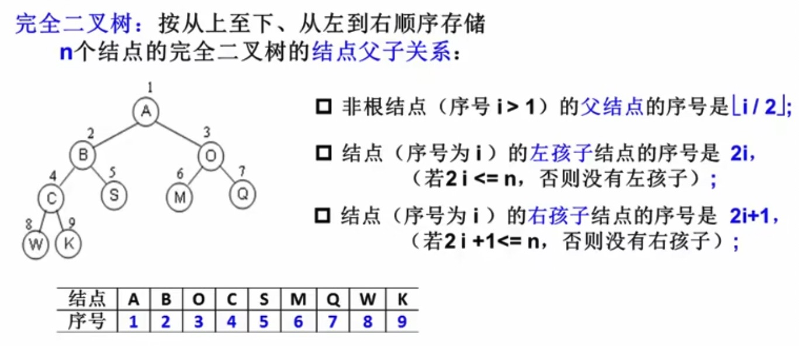

TreeOperation.java打印树


#### Tree


https://www.bilibili.com/video/BV1JW411i731


##### 完全二叉树

数组存储方式




i 是数组下标


#### 遍历


每个Node都有3次访问机会，谁先出现就代表什么序.


中间节点  在哪,代表的遍历方式

- 先序遍历  preorder traversal ：中左右
- 中序遍历 inorder traversal：左中右
- 后序遍历 postorder traversal：左右中

https://github.com/azl397985856/leetcode/blob/master/thinkings/tree.md


##### preorder traversal 递归


B的左边遍历完成后，开始遍历B的右子树

遍历过程

1. 访问根节点
2. 先序遍历其左子树
3. 先序遍历其右子树

```c
void PreOrderTraversal(BinTree BT){
  if(BT){
    printf("%d", BT -> Data);
    PreOrderTraversal(BT->Left)
    PreOrderTraversal(BT->Right)
  }
}
```


https://www.bilibili.com/video/BV1JW411i731?p=34&vd_source=d4c5260002405798a57476b318eccac9


##### 构建和打印树

https://blog.nowcoder.net/n/f3799d64ed764fd49c63947d617d4cd5

https://leetcode.cn/playground/VDCGQ8Ds/

https://leetcode.cn/circle/discuss/vpcMyM/


中序遍历


##### 层序遍历

用队列实现


#### 确定二叉树

必须有中序遍历，和先 后 序遍历之一


二叉搜索树

BST. Binary Search Tree


##### [144. 二叉树的前序遍历](https://leetcode.cn/problems/binary-tree-preorder-traversal/)

递归

```kotlin
    fun preorderTraversal(root: TreeNode?): List<Int> {
        val linkedList = LinkedList<Int>()
        preTraversal(root, linkedList)
        return linkedList
    }

    private fun preTraversal(node: TreeNode?, linkedList: LinkedList<Int>) {
        if (node == null) return // 这样的递归基更好
        linkedList.add(node.`val`)
        preTraversal(node.left, linkedList)
        preTraversal(node.right, linkedList)
    }
```


迭代

随想录

前序遍历是中左右，每次先处理的是中间节点，那么先将根节点放入栈中，然后将右孩子加入栈，再加入左孩子。

为什么要先加入 右孩子，再加入左孩子呢？ 因为这样出栈的时候才是中左右的顺序。


5 4 1 2 6


```kotlin
fun preorderTraversal1(root: TreeNode?): List<Int> {
    val linkedList = LinkedList<Int>()
    val stack = Stack<TreeNode>()
    root?.let{
        stack.push(it)
    }
    while (!stack.empty()) {
        val popNode = stack.pop()
        popNode.`val`.let{
            linkedList.add(it)
        }
        popNode.right?.let {
            stack.push(it)
        }
        popNode.left?.let {
            stack.push(it)
        }
    }
    return linkedList
}
```


##### [94. 二叉树的中序遍历](https://leetcode.cn/problems/binary-tree-inorder-traversal/)

递归

```kotlin
    fun inorderTraversal(root: TreeNode?): List<Int> {
        val linkedList = LinkedList<Int>()
        orderRecursive(root, linkedList)
        return linkedList
    }

    private fun orderRecursive(node: TreeNode?, linkedList: LinkedList<Int>) {
        if (node == null) return
        orderRecursive(node.left, linkedList)
        linkedList.add(node.`val`)
        orderRecursive(node.right, linkedList)
    }
```


迭代法

随想录


```kotlin
fun inorderTraversal1(root: TreeNode?): List<Int> {
    val linkedList = LinkedList<Int>()
    if (root == null) return linkedList
    val stack = Stack<TreeNode>()
    var node = root
    while (node != null || !stack.empty()) { //node != null 第一次可以进来
        if (node != null) {
            stack.push(node)
            node = node.left
        } else {
            val resultNode = stack.pop()
            linkedList.add(resultNode.`val`)
            node = resultNode.right
        }
    }
    return linkedList
}
```


##### [145. 二叉树的后序遍历](https://leetcode.cn/problems/binary-tree-postorder-traversal/)

递归

```kotlin
    //recurive
    fun postorderTraversal(root: TreeNode?): List<Int> {
        val linkedList = LinkedList<Int>()
        recursiveTraversal(root, linkedList)
        return linkedList
    }

    private fun recursiveTraversal(node: TreeNode?, linkedList: LinkedList<Int>) {
        if (node == null) return
        recursiveTraversal(node.left, linkedList)
        recursiveTraversal(node.right, linkedList)
        linkedList.add(node.`val`)
    }
```


迭代法


https://leetcode.cn/problems/binary-tree-postorder-traversal/solution/er-cha-shu-de-hou-xu-bian-li-by-leetcode-solution/ 动图


