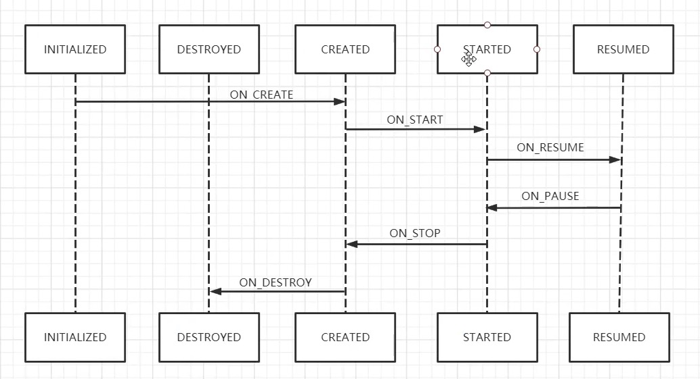

https://www.bilibili.com/video/BV19B4y1N7iV


### 优势

1. 确保界面符合数据状态
2. 不会发生内存泄漏
3. 不会因Activity停止而导致崩溃
4. 不再需要手动处理生命周期
5. 数据始终保持最新状态
6. 适当的配置更改
7. 共享资源


##### stiky event

https://juejin.cn/post/7019734258793054238


#### savedStateHandle 使用

 模拟app killed

https://developer.android.com/codelabs/android-lifecycles#6


```
adb shell ps -A |grep lifecycle
adb shell am kill 
```


##### 1. 为什么有粘性事件

Google官方文档中描述，设备横竖屏切换的时候，界面销毁重建，但是Activity生命周期并未结束，旋转后新建的空页面上数据需要重新填充，曾经的后台Activity返回到前台后立即接受最新的数据，所以LiveData在被再次观察时会立即推送数据更新。

##### 粘性实例

https://juejin.cn/post/6856688280231444487


2. 旋转屏幕，为什么能保持数据

   ```kotlin
   static class ObserverWithState {
       State mState;
       LifecycleEventObserver mLifecycleObserver;
   
       ObserverWithState(LifecycleObserver observer, State initialState) {
           mLifecycleObserver = Lifecycling.lifecycleEventObserver(observer);
           mState = initialState;
       }
   
       void dispatchEvent(LifecycleOwner owner, Event event) {
           State newState = event.getTargetState();
           mState = min(mState, newState);
           mLifecycleObserver.onStateChanged(owner, event); // onstart状态 能继续发送，不知道什么方法触发的。
           mState = newState;
       }
   }
   ```


#### livedata和viewmodel关系

viewmodel中的数据发生变化时通知页面


##### livedata active状态e




`LiveData` objects only consider subscriptions as active when their respective lifecycle owner is either [STARTED](https://developer.android.com/reference/android/arch/lifecycle/Lifecycle.State.html#started) or [RESUMED](https://developer.android.com/reference/android/arch/lifecycle/Lifecycle.State.html#resumed).

STARTED ， 

```java
@Override
boolean shouldBeActive() {
    return mOwner.getLifecycle().getCurrentState().isAtLeast(STARTED);
}
```


```kotlin
class EnumTest {
    @Test
    fun compareTest(){
        println("DESTROYED "+  State.DESTROYED.isAtLeast(State.STARTED))
        println("INITIALIZED "+  State.INITIALIZED.isAtLeast(State.STARTED))
        println("CREATED "+  State.CREATED.isAtLeast(State.STARTED))
        println("STARTED "+  State.STARTED.isAtLeast(State.STARTED))
        println("RESUMED "+  State.RESUMED.isAtLeast(State.STARTED))
    }
}
```

> DESTROYED false
> INITIALIZED false
> CREATED false
> STARTED true
> RESUMED true


https://blog.csdn.net/qq_44076155/article/details/121471697

https://juejin.cn/post/6955309901363036191

https://juejin.cn/post/7148049769057746952

从上面例子可以知道LiveData的核心主要在于这两步，liveData.observe()以及liveData.postValue()，一个是注册观察者，一个是发送通知。那么下面的解析就将这两个函数作为切入点。


mLastVersion : 观察者

mVersion :  	被观察者


##### 1.LiveData.observe()

从liveData.observe()跟踪进去:

LiveData.java

```java
 private SafeIterableMap<Observer<? super T>, ObserverWrapper> mObservers =
            new SafeIterableMap<>();
            
            ......
            
 @MainThread
 public void observe(@NonNull LifecycleOwner owner, @NonNull Observer<? super T> observer) {
        assertMainThread("observe");
        //✅ 第一部分
        if (owner.getLifecycle().getCurrentState() == DESTROYED) {
            // ignore
            return;
        }
        //✅ 第二部分
        LifecycleBoundObserver wrapper = new LifecycleBoundObserver(owner, observer);
        ObserverWrapper existing = mObservers.putIfAbsent(observer, wrapper);
        if (existing != null && !existing.isAttachedTo(owner)) {
            throw new IllegalArgumentException("Cannot add the same observer"
                    + " with different lifecycles");
        }
        if (existing != null) {
            return;
        }
        //✅ 第三部分
        owner.getLifecycle().addObserver(wrapper);
    }
复制代码
```

observe方法传有两个参数LifecycleOwner和Observer，LifecycleOwner是一个具有Android生命周期的类，一般传入的是Activity和Fragment，Observer是一个接口，内部存在void onChanged(T t)方法。

**✅ 第一部分：** observe内部一开始就存在一个生命周期的判断，

```
if (owner.getLifecycle().getCurrentState() == DESTROYED) {return;}
```

当组件生命周期已经Destroy了，也就没有必要再继续走下去，则直接return。在这里，LiveData对生命周期的感知也就慢慢显现出来了。

**✅ 第二部分：** 首先以LifecycleOwner和Observer作为参数创建了一个LifecycleBoundObserver对象，接着以Observer为key，新创建的LifecycleBoundObserver为value，存储到mObservers这个map中。在后面LiveData postValue中会遍历出该map的value值ObserverWrapper，获取组件生命周期的状态，已此状态来决定分不分发通知（这部分详情见“第二小节postValue()”）

那LifecycleBoundObserver是什么？

```js
class LifecycleBoundObserver extends ObserverWrapper implements LifecycleEventObserver {
        @NonNull
        final LifecycleOwner mOwner;

        LifecycleBoundObserver(@NonNull LifecycleOwner owner, Observer<? super T> observer) {
            super(observer);
            mOwner = owner;
        }

        .......
    }
复制代码
```

从源码可以看到，LifecycleBoundObserver继承ObserverWrapper并且实现了LifecycleEventObserver的接口，LifecycleEventObserver是监听组件生命周期更改并将其分派给接收方的一个接口，而在LifecycleBoundObserver的构造函数中将observer传给了父类ObserverWrapper。LifecycleBoundObserver其实只是包裹着LifecycleOwner和Observer得一个类，其中的实现有点代理模式的味道。

**✅ 第三部分：** `owner.getLifecycle().addObserver(wrapper)`将新创建的LifecycleBoundObserver添加到Lifecycle中，也就是说这个时候观察者注册成功，当LifecycleOwner也就是组件的状态发生改变时，也会通知到所匹配的observer。

到这里，UI层`viewModel.liveData.observe(this, object:Observer<String> {             override fun onChanged(value: String) {} })`注册观察者的内部解析也就大致清楚了。

##### 2.postValue()

liveData.postValue()是作为一个发射方来通知数据改变，其内部又做了哪些工作？接下来就一探究竟。直接从postValue中最核心的部分在于将参数value赋值给了一个全局变量源码开始：

```js
 protected void postValue(T value) {
        boolean postTask;
        synchronized (mDataLock) {
            postTask = mPendingData == NOT_SET;
            mPendingData = value;
        }
        if (!postTask) {
            return;
        }
        ArchTaskExecutor.getInstance().postToMainThread(mPostValueRunnable);
    }
复制代码
```

postValue中首先将参数value赋值给了一个全局变量mPendingData，它的初始值为一个空对象，而mPendingData只是作为一个中间媒介来存储value的值，在后续的操作中会用到，我们就暂时先记住它。

在最后就是一个将线程切换到主线程的操作，主要看mPostValueRunnable的实现：

```java
  private final Runnable mPostValueRunnable = new Runnable() {
        @SuppressWarnings("unchecked")
        @Override
        public void run() {
            Object newValue;
            synchronized (mDataLock) {
                newValue = mPendingData;
                mPendingData = NOT_SET;
            }
            setValue((T) newValue);
        }
    };
复制代码
```

在Runnable中,mPendingData赋值给了临时变量newValue，最后调用了setValue（）方法。我们都知道LiveData发送通知可以使用PostValue或者SetValue，而他两的区别就在于，PostValue可以在任意线程中调用，而SetValue只能在主线程中，因为PostValue多了一步上面切换主线程的操作。

OK，接下来就是PostValue/SetValue最核心的部分。

```js
    @MainThread
    protected void setValue(T value) {
        assertMainThread("setValue");
        mVersion++;
        mData = value;
        dispatchingValue(null);
    }
    
    .......
 
    void dispatchingValue(@Nullable ObserverWrapper initiator) {
        if (mDispatchingValue) {
            mDispatchInvalidated = true;
            return;
        }
        mDispatchingValue = true;
        do {
            mDispatchInvalidated = false;
            if (initiator != null) {
                considerNotify(initiator);
                initiator = null;
            } else {
            //✅ 第二部分
                for (Iterator<Map.Entry<Observer<? super T>, ObserverWrapper>> iterator =
                        mObservers.iteratorWithAdditions(); iterator.hasNext(); ) {
                    considerNotify(iterator.next().getValue());
                    if (mDispatchInvalidated) {
                        break;
                    }
                }
            }
        } while (mDispatchInvalidated);
        mDispatchingValue = false;
    }

复制代码
```

在setValue中，参数value将值赋给了一个全局变量mData，而这个mData最后将通过mObserver.onChanged((T) mData);将需要修改的value值分发给了UI。最后调用传入一个null调用dispatchingValue方法。

由于dispatchingValue里的参数为null，也就顺理成章的走到了**✅ 第二部分**。else一进入就是迭代器在遍历mObservers，而mObservers在第一小节“1.LiveData.observe()”中说得很清楚，它作为一个map，存储了Observer和ObserverWrapper。通过遍历，将每个观察者所匹配的ObserverWrapper作为参数传给了considerNotify（）方法。

```js
private void considerNotify(ObserverWrapper observer) {
        if (!observer.mActive) {
            return;
        }
        // Check latest state b4 dispatch. Maybe it changed state but we didn't get the event yet.
        //
        // we still first check observer.active to keep it as the entrance for events. So even if
        // the observer moved to an active state, if we've not received that event, we better not
        // notify for a more predictable notification order.
        if (!observer.shouldBeActive()) {
            observer.activeStateChanged(false);
            return;
        }
        if (observer.mLastVersion >= mVersion) {
            return;
        }
        observer.mLastVersion = mVersion;
        observer.mObserver.onChanged((T) mData);
    }
复制代码
```

而在considerNotify()中，先通过observer来获取组件生命周期的状态，如果处于非活动状态，则拒绝发起通知。在该方法的最后， `observer.mObserver.onChanged((T) mData)`，是不是很熟悉，这就是UI层一开始就实现的接口，而就在这找到了最后的发送方。


https://juejin.cn/post/6955309901363036191


##### 粘性事件原理


### 数据粘性

实例

https://juejin.cn/post/7148049769057746952

或者切换屏幕 turn the android phone on the horizontal


经过了解和使用 view model,databiding后，我觉得这个不是官方留的坑，在特定的场景可能还需要这样做，我获取手环睡眠数据此时有其他fragment还没创建，我就需要创建后才就监听到数据。


##### 方法1

我们能不能再创建新的ObserverWrapper的时候，直接把mVersion的值赋给mLastVersion，这样就符合(observer.mLastVersion >= mVersion)这一条件了，就不会再继续执行onChanged方法了

https://blog.csdn.net/geyuecang/article/details/89028283


##### singleLiveEvent

多个观察者，这个就不好用了。

其实这个方法解决的并不是粘性事件的问题，而是“数据倒灌”的问题。“数据倒灌”一词出自[KunMinX](https://links.jianshu.com/go?to=https%3A%2F%2Fxiaozhuanlan.com%2Fu%2Fkunminx)的Blog[**重学安卓：LiveData 数据倒灌 背景缘由全貌 独家解析**](https://links.jianshu.com/go?to=https%3A%2F%2Fxiaozhuanlan.com%2Ftopic%2F6719328450),即在setValue后,observe对此次set的value值会进行多次消费。比如进行第二次observe的时候获取到的数据是第一次的旧数据。这样会带来不可预期的后果。


https://github.com/android/architecture-samples/blob/dev-todo-mvvm-live/todoapp/app/src/main/java/com/example/android/architecture/blueprints/todoapp/SingleLiveEvent.java


> `m.compareAndSet(a,b)`,如果m==a ,返回true，同时将m置为b； 如果m==b，返回false。

##### 方法3

UnPeekLiveData

```java
public class ProtectedUnPeekLiveData<T> extends LiveData<T> {

    protected boolean isAllowNullValue;

    private final HashMap<Integer, Boolean> observers = new HashMap<>();

    public void observeInActivity(@NonNull AppCompatActivity activity, @NonNull Observer<? super T> observer) {
        LifecycleOwner owner = activity;
        Integer storeId = System.identityHashCode(observer);//源码这里是activity.getViewModelStore()，是为了保证同一个ViewModel环境下"唯一可信源"
        observe(storeId, owner, observer);
    }

    private void observe(@NonNull Integer storeId,
                         @NonNull LifecycleOwner owner,
                         @NonNull Observer<? super T> observer) {

        if (observers.get(storeId) == null) {
            observers.put(storeId, true);
        }

        super.observe(owner, t -> {
            if (!observers.get(storeId)) {
                observers.put(storeId, true);
                if (t != null || isAllowNullValue) {
                    observer.onChanged(t);
                }
            }
        });
    }
    
    @Override
    protected void setValue(T value) {
        if (value != null || isAllowNullValue) {
            for (Map.Entry<Integer, Boolean> entry : observers.entrySet()) {
                entry.setValue(false);
            }
            super.setValue(value);
        }
    }

    protected void clear() {
        super.setValue(null);
    }
}
```


，为每个传入的observer对象携带一个布尔类型的值，作为其是否能进入observe方法的开关。每当有一个新的observer存进来的时候，开关默认关闭。

每次setValue后，打开所有Observer的开关，允许所有observe执行。

这个确实清晰，简单


https://www.jianshu.com/p/d0244c4c7cc9

https://juejin.cn/post/6844903623252508685


##### 方法4


```kotlin
/**
 * Used as a wrapper for data that is exposed via a LiveData that represents an event.
 */
open class Event<out T>(private val content: T) {

    var hasBeenHandled = false
        private set // Allow external read but not write

    /**
     * Returns the content and prevents its use again.
     */
    fun getContentIfNotHandled(): T? {
        return if (hasBeenHandled) {
            null
        } else {
            hasBeenHandled = true
            content
        }
    }

    /**
     * Returns the content, even if it's already been handled.
     */
    fun peekContent(): T = content
}
```


UnPeekLiveData 或者 ELiveData 


https://juejin.im/post/5b2b1b2cf265da5952314b63

https://www.jianshu.com/p/79d909b6f8bd

https://juejin.im/post/6892704779781275662

https://www.jianshu.com/p/d0244c4c7cc9


#### LifeCycle

通过lifecycle旋转屏幕后，重新发送事件来分析，粘性事件。
https://developer.android.com/codelabs/android-lifecycles#2

