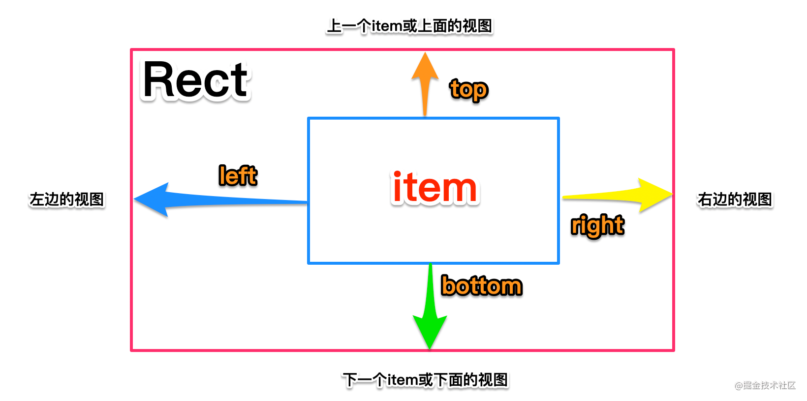

RecyclerView


#### 分割线


https://juejin.cn/post/6998712972856000543


#### ItemDecoration

##### onDraw

void onDraw(Canvas c, RecyclerView parent, State state)

参数的含义：

- Canvas c 》 canvas 绘制对象
- RecyclerView 》 parent RecyclerView 对象本身
- State state 》 当前 RecyclerView 的状态

作用就是绘制，可以在任何位置绘制，如果只是想绘制到每一项里面，那么就需要计算出对应的位置。

void onDrawOver(Canvas c, RecyclerView parent, State state)

跟上面一样，不同的地方在于绘制的总是在最上面，也就是绘制出来的不会被遮挡。


##### getItemOffsets

void getItemOffsets(Rect outRect, View view, RecyclerView parent, State state)

参数的含义：

- Rect outRect 》item 四周的距离对象
- View view 》 当前 view
- RecyclerView 》 parent RecyclerView 本身
- State state 》 RecyclerView 状态

这里可以设置 `item` 到 `RecyclerView` 各边的距离。这里需要说明一下，我这里说的到各边的距离指的是啥？





```kotlin
class SimpleItemDecoration : RecyclerView.ItemDecoration() {
    /**
     * @param outRect   全为0的rect，用来指定偏移区域
     * @param view      指RecyclerView中的Item
     * @param parent    指RecyclerView本身
     * @param state     状态
     */

    override fun getItemOffsets(
        outRect: Rect,
        view: View,
        parent: RecyclerView,
        state: RecyclerView.State
    ) {
        super.getItemOffsets(outRect, view, parent, state)
        if (parent.getChildAdapterPosition(view) == 0) {
            outRect.top = 10
            outRect.left = 30
            outRect.right = 60
            outRect.bottom = 90
        }
    }
}
```


```kotlin
biding.recyclerView.addItemDecoration(object : RecyclerView.ItemDecoration() {
    override fun onDraw(c: Canvas, parent: RecyclerView, state: RecyclerView.State) {
        super.onDraw(c, parent, state)
        paint.color = (Color.BLUE)
        c.drawRect(0F, 0f, 400f, 200f, paint)
    }

    override fun onDrawOver(c: Canvas, parent: RecyclerView, state: RecyclerView.State) {
        super.onDrawOver(c, parent, state)
        paint.color = Color.RED
        c.drawRect(0F, 0f, 200f, 100f, paint)
    }

    override fun getItemOffsets(
        outRect: Rect,
        view: View,
        parent: RecyclerView,
        state: RecyclerView.State
    ) {
        super.getItemOffsets(outRect, view, parent, state)
        outRect.set(20, 100, 0, 20)
    }
})
```


https://blog.csdn.net/w855227/article/details/80973321

https://www.jianshu.com/p/4eff036360da

https://www.jianshu.com/p/b2ef4f8e859f

https://github.com/YoKeyword/IndexableRecyclerView

https://juejin.im/post/5eae33a26fb9a043586c7f19

https://juejin.cn/post/6844903855335931911


#### 分割线高度和颜色


```xml
<?xml version="1.0" encoding="utf-8"?>
<shape xmlns:android="http://schemas.android.com/apk/res/android"
    android:shape="rectangle">
    <size android:height="1dp" />
    <solid android:color="@color/color_FFE4E7EA" />
</shape>
```


ItemDividerRfid.kt

```kotlin
class ItemDividerRfid(var context: Context, val orientation: Int = VERTICAL_LIST) :
    RecyclerView.ItemDecoration() {

    companion object {
        const val HORIZONTAL_LIST = LinearLayoutManager.HORIZONTAL
        const val VERTICAL_LIST = LinearLayoutManager.VERTICAL
    }

    private var mDivider: Drawable? = null


    init {
        mDivider = context.getDrawable(R.drawable.transportation_divider_item_color)
    }

    override fun onDraw(c: Canvas, parent: RecyclerView, state: RecyclerView.State) {
        if (orientation == VERTICAL_LIST) {
            drawVertical(c, parent)
        }
    }

    private fun drawVertical(c: Canvas, parent: RecyclerView) {
        val left = parent.paddingLeft
        val right = parent.width - parent.paddingRight
        val childCount = parent.childCount
        for (i in 0 until childCount) {
            val child = parent.getChildAt(i)
            val params = child.layoutParams as RecyclerView.LayoutParams
            val top = child.bottom + params.bottomMargin
            val bottom = top + (mDivider?.intrinsicHeight ?: 0)
            mDivider?.setBounds(left +ITEM_DIVIDER_HEIGHT_16, top, right-ITEM_DIVIDER_HEIGHT_16, bottom)
            mDivider?.draw(c)
        }
    }


    override fun getItemOffsets(
        outRect: Rect,
        view: View,
        parent: RecyclerView,
        state: RecyclerView.State
    ) {
        if (orientation == VERTICAL_LIST) {
            outRect.set(0, 0, 0, mDivider?.intrinsicHeight ?: 0)
        }
    }
}
```

https://blog.51cto.com/zhaoyanjun/3814502#3_453
