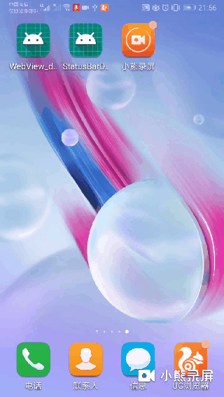

https://developer.android.com/training/appbar/setting-up.html

https://github.com/xiewenfeng/statusbartextcolorchange

https://mp.weixin.qq.com/s/NvmOlJzEkdrJREueIFd_DA


目前只要考虑 5.0以上系统就可以了,有些flag虽然被标记为Deprecated,但是系统也还在用，所以有必要研究。


 


### statebar

https://www.jianshu.com/p/f84f7e07e0d6

https://blog.csdn.net/u011200604/article/details/107959340


实现沉浸式状态栏主要跟以下四个Api相关:

- View#setSystemUiVisibility()
- Window#addFlags()
- View#setFitsSystemWindows
- Window#setStatusBarColor()


##### View#setSystemUiVisibility()及其各种Flags

首先setSystemUiVisibility()这个方法就是设置状态栏或者导航栏的各种属性的，哪都有些可以设置的属性呢？

*  View.SYSTEM_UI_FLAG_FULLSCREEN

  视图全屏并隐藏状态栏，当用户交互时（如下滑状态栏）会恢复隐藏的状态栏（例子：电子书阅读）缺点：进入Activity会产生一个从非全屏到全屏的闪动效果

  

  

* View.SYSTEM_UI_FLAG_IMMERSIVE_STICKY

  粘性沉浸模式，需要和SYSTEM_UI_FLAG_FULLSCREEN或者SYSTEM_UI_FLAG_HIDE_NAVIGATION联用，当使用View.setSystemUiVisibility(View.SYSTEM_UI_FLAG_FULLSCREEN|View.SYSTEM_UI_FLAG_IMMERSIVE_STICKY)联用时视图全屏，当用户产生交互时（如下滑状态栏）不会恢复状态栏，只会以半透明的方式覆盖在视图上面并在一定时间内自动消失

  ```java
  getWindow().getDecorView().setSystemUiVisibility(View.SYSTEM_UI_FLAG_FULLSCREEN|View.SYSTEM_UI_FLAG_IMMERSIVE_STICKY)
  ```

  

  

* View.SYSTEM_UI_FLAG_IMMERSIVE：
   沉浸模式，只能和View.SYSTEM_UI_FLAG_FULLSCREEN联用，效果和View.SYSTEM_UI_FLAG_IMMERSIVE_STICKY一样，目前已被后者替代。

* View.SYSTEM_UI_FLAG_LOW_PROFILE:
   低配模式，会隐藏一些不重要的状态栏和导航栏的图标,(用模拟器跑，只剩下电池了)

* View.SYSTEM_UI_FLAG_LAYOUT_FULLSCREEN：
   视图全屏且不会产生闪动，如果没有toolbar,contentview会占住statebar的位置，状态栏会覆盖在contentview上面.

  ```kotlin
      var isWhite = false
      fun change_statebar_element_color(view: View) {
          if (isWhite) {
              window.decorView.systemUiVisibility = SYSTEM_UI_FLAG_LAYOUT_STABLE //statebar 元素显示白色
              isWhite = false
          } else {
              window.decorView.systemUiVisibility =
                  SYSTEM_UI_FLAG_LAYOUT_FULLSCREEN or SYSTEM_UI_FLAG_LIGHT_STATUS_BAR  //显示黑色
              isWhite = true
          }
      }
  ```

  

* View.SYSTEM_UI_FLAG_LAYOUT_STABLE：
   使视图稳定，当使用fitSystemWindows（）（下面会介绍这个方法）需要视图稳定，一般和SYSTEM_UI_FLAG_LAYOUT_FULLSCREEN联用,我使用这个属性后，能使**statebar的电池条变成白色**。

  

* View.SYSTEM_UI_FLAG_LIGHT_STATUS_BAR:
   Android6.0系统以上增加的属性，设置了这个属性，状态栏会以与状态栏背景颜色兼容的模式绘制。什么意思呢？就是说如果当前的**状态栏颜色**是浅色，那么就有可能造成状态栏上的图标看不清了，但是如果你设置这个属性以后，状态栏的图标就会以深色绘制，这样就没有什么UI上的问题了。

  

##### Window#addFlags()

这种方式**感觉是setSystemUiVisibility之前的用法**了。

WindowManager.LayoutParams相关属性：

- FLAG_TRANSLUCENT_STATUS:
   Android4.4系统增加的属性，它会使状态栏透明,并且自动执行View.SYSTEM_UI_FLAG_LAYOUT_STABLE和View.SYSTEM_UI_FLAG_LAYOUT_FULLSCREEN
   
- FLAG_FULLSCREEN:
   视图全屏并隐藏状态栏，效果相当于View.SYSTEM_UI_FLAG_FULLSCREEN+View.SYSTEM_UI_FLAG_IMMERSIVE_STICKY，并且视图稳定（不会因为系统控件的变化（如输入法），而重新布局）
   
- FLAG_FORCE_NOT_FULLSCREEN：
   重写了FLAG_FULLSCREEN并强制显示状态栏（没有啥用）
   
- FLAG_DRAWS_SYSTEM_BAR_BACKGROUNDS：
   Android5.0系统以上支持，如果设置了该属性，系统栏（状态栏和导航栏）将以透明背景绘制，并且该窗口中的相应区域将填充setStatusBar（）和setNavigationBarColor（）中设置的颜色。
   
   现在项目就是用这种方式。
   
   1. 感觉这也是设置stateBar颜色一种主要的方式。
   2. 另一种就是自己设置statebar颜色。


#### 几种全屏模式

##### Lean back

倾斜模式

When users want to bring back the system bars, they simply tap the screen anywhere.

```kotlin
window.decorView.systemUiVisibility =
    SYSTEM_UI_FLAG_FULLSCREEN or SYSTEM_UI_FLAG_HIDE_NAVIGATION
```

轻触屏幕 会显示 底部导航如返回按钮 


##### Immersive

沉浸模式：从边缘滑动，显示系统Bar,也可以通过回调显示系统控件

```kotlin
window.decorView.systemUiVisibility =
    SYSTEM_UI_FLAG_FULLSCREEN or SYSTEM_UI_FLAG_HIDE_NAVIGATION or  SYSTEM_UI_FLAG_IMMERSIVE
```


##### Sticky immersive

从边缘滑动，显示系统Bar,statebar.又恢复了。

```kotlin
window.decorView.systemUiVisibility =
    SYSTEM_UI_FLAG_FULLSCREEN or SYSTEM_UI_FLAG_HIDE_NAVIGATION or  SYSTEM_UI_FLAG_IMMERSIVE_STICKY
```

https://developer.android.com/training/system-ui/immersive


android 11  systemUiVisibility过期需要更新


#### Statabar Color

1. Application AppTheme statusBarColor

   ```xml
   <style name="AppTheme" parent="Theme.AppCompat.Light.NoActionBar">
       <!-- Customize your theme here. -->
       <item name="colorPrimary">@color/colorPrimary</item>
       <item name="colorPrimaryDark">@color/colorPrimaryDark</item>
       <item name="colorAccent">@color/colorAccent</item>
       <item name="android:statusBarColor"> @android:color/white</item>
   </style>
   ```

2. Activity设置

   ```kotlin
   if (Build.VERSION.SDK_INT < Build.VERSION_CODES.R) {
       window.decorView.systemUiVisibility =
           View.SYSTEM_UI_FLAG_LIGHT_STATUS_BAR
   } else {
       window.insetsController?.setSystemBarsAppearance(
           WindowInsetsController.APPEARANCE_LIGHT_STATUS_BARS,
           WindowInsetsController.APPEARANCE_LIGHT_STATUS_BARS
       )
   }
   ```


##### Statabar element Color

两种方式

###### systemUiVisibility

```kotlin
window.decorView.systemUiVisibility = SYSTEM_UI_FLAG_LAYOUT_STABLE //statebar 元素显示白色

window.decorView.systemUiVisibility = SYSTEM_UI_FLAG_LIGHT_STATUS_BAR  //显示黑色
```


###### 主题配置>23

```xml
<item name="android:windowLightStatusBar">false</item>
```

false : 白色

true :  黑色

https://developer.android.com/training/system-ui

https://blog.csdn.net/shanshui911587154/article/details/86623646


#### WindowInsetsController

Android11 使用

##### statabar text color

```kotlin
    @RequiresApi(Build.VERSION_CODES.R)
    fun AppearanceLightStatusBars(view: android.view.View) {
        if (isWhite) {
            controller?.setSystemBarsAppearance(
                WindowInsetsController.APPEARANCE_LIGHT_STATUS_BARS,
                WindowInsetsController.APPEARANCE_LIGHT_STATUS_BARS
            )
        } else {
            controller?.setSystemBarsAppearance(
                0,
                WindowInsetsController.APPEARANCE_LIGHT_STATUS_BARS
            )
        }
        isWhite = !isWhite
    }
```


##### statebar hide

```kotlin
var isHide = true
@RequiresApi(Build.VERSION_CODES.R)
fun hide_state_bar(view: android.view.View) {
    if (isHide) {
        controller?.hide(WindowInsetsCompat.Type.statusBars())
    } else {
        controller?.show(WindowInsetsCompat.Type.statusBars())
    }
    isHide = !isHide
}
```

https://blog.csdn.net/jingzz1/article/details/111468726

https://juejin.cn/post/6940048488071856164

https://blog.csdn.net/qq_39038178/article/details/119657376


https://segmentfault.com/a/1190000022129198


### ToolBar


#####  颜色设置

  AppTheme下的设置

```xml
  <application
        android:name=".application.NBBApplication"
        android:allowBackup="true"
        android:icon="@mipmap/icon"
        android:label="@string/app_name"
        android:supportsRtl="true"
        android:theme="@style/AppTheme">

```

* Toolbar颜色:
  `<item name="colorPrimary">@color/toolbar_color</item>`

* 状态栏设置 : 
  `<item name="android:windowTranslucentStatus">true</item>`
   在 API 19 及更高版本上，Toolbar 内容延伸至状态栏上去了, statebar把toolbar给覆盖了
   要解决这个问题就需要下面的属性

 *  android:fitsSystemWindows ="true"
     这个属性能保持与statebar一定 的padding,能解决上面windowTranslucentStatus的重叠问题

      参考: [亦枫](http://yifeng.studio/2017/02/19/android-statusbar/) 

* 去掉阴影线

     toolbar底部会有一条阴影线,通过AppBarLayout标签下的app:elevation="0dp"去掉


##### 自定义返回键

` mToolbar.setNavigationIcon(R.mipmap.ic_back);//自定义返回键`

或者这样设置 
 `app:navigationIcon="@mipmap/ic_back"`

 

##### toolbar.xml解读

```
<?xml version="1.0" encoding="utf-8"?>
<android.support.design.widget.AppBarLayout xmlns:android="http://schemas.android.com/apk/res/android"
    xmlns:app="http://schemas.android.com/apk/res-auto"
    android:layout_width="match_parent"
    android:layout_height="wrap_content"
    app:elevation="0dp">                    			 //设置仰角,0dp可以去掉底部的线

    <android.support.v7.widget.Toolbar
        android:layout_width="match_parent"
        android:layout_height="?attr/actionBarSize"
        android:minHeight="?actionBarSize"
        android:theme="@style/ThemeOverlay.AppCompat.ActionBar"			//toolbar主题
        app:popupTheme="@style/ThemeOverlay.AppCompat.Light">

        <TextView
            android:id="@+id/tb_title"
            style="@style/TextAppearance.AppCompat.Widget.ActionBar.Title"
            android:layout_width="wrap_content"
            android:layout_height="wrap_content"
            android:layout_gravity="center"
            android:text="标题"
            android:textColor="#333333"
            android:textSize="18sp" />
    </android.support.v7.widget.Toolbar>

</android.support.design.widget.AppBarLayout>

```


还有一种方式是在application设置，这样就不用集成baseActivity

 http://blog.csdn.net/a553181867/article/details/51336899


### menu设置

AppBarLayout下的 `app:theme="@style/toolbar_menu"`用于设置menu

##### menu字体颜色

需要设置 app:theme ,用 android:theme不起作用.

`<item name="android:actionMenuTextColor">@color/text_my_black</item>`

##### menu事件


    @Override
    public boolean onCreateOptionsMenu(Menu menu) {
        getMenuInflater().inflate(R.menu.menu_login, menu);
        menu.findItem(R.id.item_right_text).setTitle("注册"); //设置文字
        return true;
    }
    
    @Override
    public boolean onOptionsItemSelected(MenuItem item) {
        switch (item.getItemId()) {
            
                break;
        }
        return super.onOptionsItemSelected(item);
    }

<https://blog.csdn.net/guyuealian/article/details/51721167>


使用toolbar过程中遇到了一些问题

问题 1

弹出键盘后 editext不见了，应该是toolbar被拉伸了


暂时解决方式:


```xml
     <activity
        android:name=".activity.WebActivity"
        android:hardwareAccelerated="true"
        android:screenOrientation="portrait"
        android:windowSoftInputMode="adjustPan" />
```
https://github.com/CoolThink/StatusBarAdapt/issues/2


##### fragment使用toolbar
http://wuxiaolong.me/2015/12/21/fragmentToolbar/


#####  三条线的颜色修改

```xml
<style name="DrawerArrowStyle" parent="Base.Widget.AppCompat.DrawerArrowToggle">
    <item name="spinBars">true</item>
    <item name="color">@android:color/white</item>
</style>
```

具体可以查看mineutil:PopupWindowActivity

* 溢出菜单三个点离右边的距离

 AppTheme中设置

```xml
 <item name="android:actionOverflowButtonStyle">@style/OverflowMenuStyle</item>

  <style name="OverflowMenuStyle" parent="Widget.AppCompat.Light.PopupMenu.Overflow">
        <item name="overlapAnchor">false</item>  <!--把该属性改为false即可使menu位置位于toolbar之下-->
        <item name="android:src">@mipmap/doc_ic_new_patient</item>
        <item name="android:paddingRight">15dp</item>
   </style>
```


| 操作符 | 描述                                     | 例子                           |
| ------ | ---------------------------------------- | ------------------------------ |
| ＆     | 如果相对应位都是1，则结果为1，否则为0    | （A＆B），得到12，即0000 1100  |
| \|     | 如果相对应位都是 0，则结果为 0，否则为 1 | （A \| B）得到61，即 0011 1101 |
| ^      | 如果相对应位值相同，则结果为0，否则为1   | （A ^ B）得到49，即 0011 0001  |


https://noteforme.github.io/2018/01/07/Operators/


### Support display cutouts

刘海屏

https://developer.android.com/guide/topics/display-cutout

https://blog.csdn.net/m0_64314432/article/details/121437314

https://developer.android.com/guide/topics/display-cutout?authuser=1

```kotlin
@TargetApi(28)
fun getNotchParams() {
    val decorView: View = window.decorView
    if (decorView != null) {
        decorView.post(Runnable {
            val windowInsets: WindowInsets = decorView.rootWindowInsets
            if (windowInsets != null) {
                // 当全屏顶部显示黑边时，getDisplayCutout()返回为null
                val displayCutout = windowInsets.displayCutout
                Log.e("TAG", "安全区域距离屏幕左边的距离 SafeInsetLeft:" + displayCutout!!.safeInsetLeft)
                Log.e("TAG", "安全区域距离屏幕右部的距离 SafeInsetRight:" + displayCutout.safeInsetRight)
                Log.e("TAG", "安全区域距离屏幕顶部的距离 SafeInsetTop:" + displayCutout.safeInsetTop)
                Log.e("TAG", "安全区域距离屏幕底部的距离 SafeInsetBottom:" + displayCutout.safeInsetBottom)
                // 获得刘海区域
                val rects: List<Rect> = displayCutout.boundingRects
                if (rects == null || rects.isEmpty()) {
                    Log.e("TAG", "不是刘海屏")
                } else {
                    Log.e("TAG", "刘海屏数量:" + rects.size)
                    for (rect in rects) {
                        Log.e("TAG", "刘海屏区域：$rect")
                    }
                }
            }
        })
    }
}
```


#### 骨架屏加载效果

https://juejin.cn/post/6963143268448239653

https://github.com/ethanhua/Skeleton

https://www.jianshu.com/p/ded3c7e8adfe


