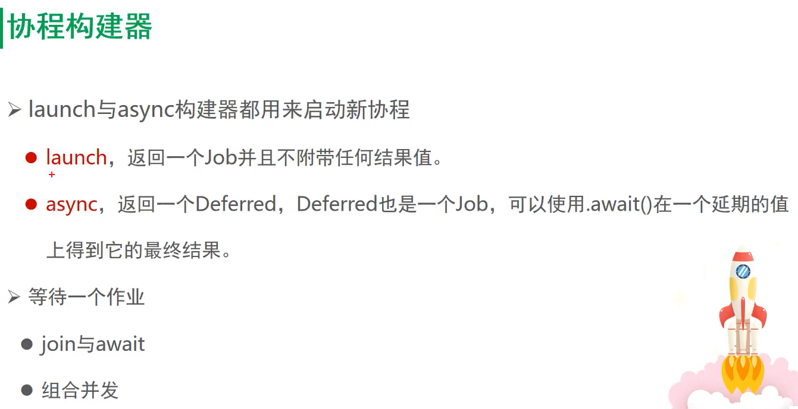
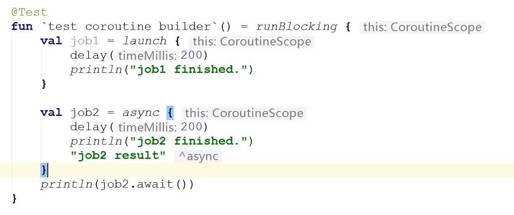
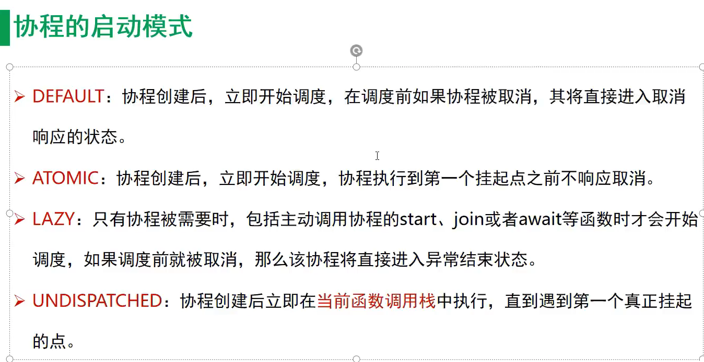

https://www.bilibili.com/video/BV1uo4y1y7ZF?p=24&spm_id_from=pageDriver








```kotlin
@Test
fun `test coroutine join`() = runBlocking {
    val job1 = launch() {
        delay(200)
        println("One")
    }
    job1.join() // job1执行完，再执行job2 job3
    val job2 = launch() {
        delay(200)
        println("Two")
    }
    val job3 = launch() {
        delay(200)
        println("Three")
    }
}

@Test
fun `test coroutine await`() = runBlocking {
    // 刷新界面，拿到执行结果后，再执行其他的。
    val job1 = async() {
        delay(200)
        println("One")
    }
    job1.await() // job1执行完，再执行job2 job3
    val job2 = async() {
        delay(200)
        println("Two")
    }
    val job3 = async() {
        delay(200)
        println("Three")
    }
}
```


```kotlin
@Test
fun `test sync`() = runBlocking {
    val time = measureTimeMillis {
        val one = doOne()
        val two = doTwo()
        println("The result : ${one + two}")
    }
    println("completed in $time ms")
}

@Test
fun `test combine async`() = runBlocking {
    val time = measureTimeMillis {
        val one = async{doOne()}
        val two = async{doTwo()}
        println("The result : ${one.await() + two.await()}")
    }
    println("completed in $time ms")
}

private suspend fun doOne(): Int {
    delay(1000)
    return 14
}

private suspend fun doTwo(): Int {
    delay(1000)
    return 25
}
```





job2中断 job1也中断

```kotlin
@Test
fun `test coroutineScope scope builder`() = runBlocking {
    coroutineScope {
        val job1 = launch {
            delay(400)
            println("job1 finished.")
        }
        val job2 = launch {
            delay(200)
            println("job2 finished.")
            "job2 result"
            throw  IllegalArgumentException()
        }
    }
}

```


job2中断 job1继续

```
@Test
fun `test supervisorScope scope builder`() = runBlocking {
    supervisorScope {
        val job1 = launch {
            delay(400)
            println("job1 finished.")
        }
        val job2 = launch {
            delay(200)
            println("job2 finished.")
            "job2 result"
            throw  IllegalArgumentException()
        }
    }
}
```


#### Job的生命周期


#### 协程的取消


CorountineScope和corountineScope的区别


##### 协程取消的异常


