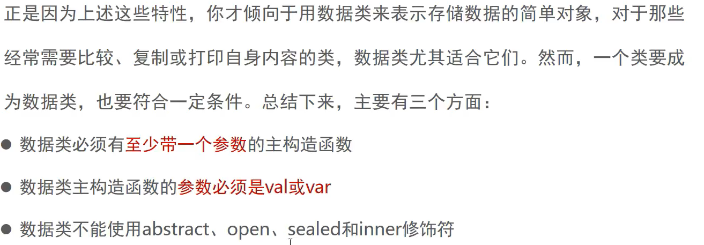
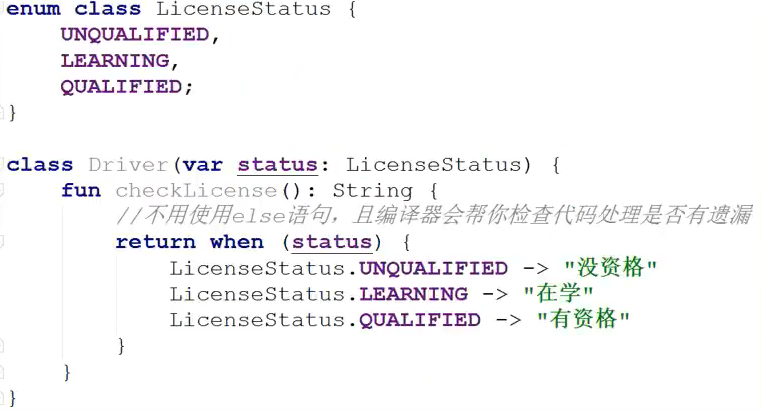

object目录下


### 对象相关

##### 继承

类默认是封闭的，要让某个类开放继承，必须使用opem关键字修饰它

```kotlin
open class Product(val name:String) {
    fun description() = "Product: $name"
   open fun load() = "Nothing.."
}
class LuxuryProduct : Product("Luxury"){
    override fun load() =" LuxuryProduct loading"
}

fun main() {
    val p : Product = LuxuryProduct()
    println(p.load())
}
```


##### 类型检测 智能类型转换


```kotlin
println(p is Product)
println(p is LuxuryProduct)
println(p is File)

if (p is LuxuryProduct){
    println((p as LuxuryProduct).special())
    println(p.special()) //只要转换一次，后面就直接可以使用，不用转换
}
```


##### Kotlin层次

无须在代码里显示指定，每一个类都会继承一个共同的叫做Any的超类。

##### Object关键字

定义一个能产生一个实例的类- 单例

Object关键字有三种方式

1. 对象声明

   有利于组织代码和管理状态，尤其是管理整个应用运行生命周期内的某些一致性状态

2. 对象表达式

   

   ```kotlin
   open class Player {
       open fun load() = "loading nothing.."
   }
   
   fun main() {
       //匿名内部类，实例p对象
       val p = object : Player(){
           override fun load()= "anonymous nothing.."
       }
       println(p.load())
   }
   ```

3. 伴生对象

   

   ```kotlin
   /**
    * 只要调用load() 或者实例化ConfigMap, 这个companion object才会被实例化
    * 而且也是单例的
    */
   class ConfigMap {
       companion object{
           private const val PATH = "xxxx"
           fun load() = File(PATH).readBytes()
       }
   }
   
   fun main() {
       //  类似于Java static
       ConfigMap.load()
   }
   ```


### 类相关

##### 嵌套类 


```kotlin
class InnerClassTest {
    class Equipment(var name:String){
        fun show() = println("equipment:$name")
    }
    fun battle(){

    }
}

fun main() {
    InnerClassTest.Equipment("shap knife").show()
}
```

##### 数据类


##### 数据类使用条件




```kotlin
data class Coordinate(var x:Int,var y:Int) {
    val isInBounds = x > 0 && y > 0
}

fun main() {
    println(Coordinate(10,20))
    println(Coordinate(10,20)==Coordinate(10,20)) //data默认重写equals方法
}
```

结果

> Coordinate(x=10, y=20) // 说明默认提供了toString方法


重写了equals方法

```java
   public boolean equals(@Nullable Object var1) {
      if (this != var1) {
         if (var1 instanceof Coordinate) {
            Coordinate var2 = (Coordinate)var1;
            if (this.x == var2.x && this.y == var2.y) {
               return true;
            }
         }

         return false;
      } else {
         return true;
      }
   }
}
```


##### Copy


注意:次构造函数数据不会copy过来

```kotlin
data  class Student(
        var name: String,
        val age: Int	 //age 主构造函数里声明的属性
){
    private val hobby = "music"
    val subject:String
    var score = 0

    init {
        println("initializing student")
        subject = "english"			//Init初始化块里的属性赋值和函数调用
    }
    constructor(_name: String):this(_name,10){
        score = 10; //次构造函数数据不会copy过来
    }

    override fun toString(): String {
        return "Student(name='$name', age=$age, hobby='$hobby', subject='$subject', score=$score)"
    }
}

fun main() {
    val s = Student("Jon")
    val copy = s.copy("girl")
    var s2 = s.copy(name = "girl2", age = 18)
    println(s)
    println(s2)
    println(copy)
}
```


##### 解构声明


1. 普通类

   ```kotlin
   class PlayerScore(val experience:Int,val level:Int) {
       operator fun component1() = experience
       operator fun component2() = level
   }
   
   fun main() {
       val (x,y) = PlayerScore(10, 20)
       println("$x, $y")
   }
   ```

   

2. Data数据类

   数据类自动生成解构语法

   ```kotlin
   data class Coordinate(var x:Int,var y:Int) {
       val isInBounds = x > 0 && y > 0
   }
   
   fun main() {
       println(Coordinate(10,20))
       println(Coordinate(10,20)==Coordinate(10,20)) 
   
       val(x,y) = Coordinate(10,20) //数据类自动生成解构语法
       println("$x , $y")
   }
   ```

   

##### 运算符重载

如果要将内置运算符应用在自定义类身上，你必须重写运算符函数，告诉编译器该如何操作自定义类


```kotlin
data class Coordinate2(var x:Int,var y:Int) {
    val isInBounds = x > 0 && y > 0

    operator fun plus(other:Coordinate2) = Coordinate2(x + other.x,y+other.y)
}

fun main() {
     val c1=Coordinate2(10, 20)
     val c2=Coordinate2(10, 20)
     println(c1 + c2)
}
```


### 枚举类

用来定义常量集合特殊的类

枚举类是一个实例

```kotlin
enum class Direction {
    EAST,
    WEST,
    SOUTH,
    NORTH
}

fun main() {
    println(Direction.EAST)
    println(Direction.EAST is Direction)
}
```


##### 枚举类定义函数

```kotlin
enum class Direction2(private val coordinate: Coordinate) {
    EAST(Coordinate(1, 0)), //EAST()是Direction2的实例
    WEST(Coordinate(-1, 0)),
    SOUTH(Coordinate(-1, 0)),
    NORTH(Coordinate(1, 0));

    //定义函数
    fun updateCoordinate(playerCoordinate: Coordinate) =
            Coordinate(playerCoordinate.x + coordinate.x, playerCoordinate.y + coordinate.y)
}

fun main() {
    println(Direction2.EAST.updateCoordinate(Coordinate(10, 20)))
}
```


##### 代数数据类型

可以用来表示一组子类型的闭集，枚举类就是一种简单的ADT




##### 密封类


```kotlin
//密封类
sealed class LicenseStatus2 {
    object UnQualified:LicenseStatus2()
    object Learning:LicenseStatus2()
    class Qualified(val licenseId:String):LicenseStatus2() //用来保存数据
}

class Driver2(var status: LicenseStatus2){
    fun checkLicense():String{
        return when(status){
            is LicenseStatus2.UnQualified -> "没资格"
            is LicenseStatus2.Learning -> "在学"
            is LicenseStatus2.Qualified -> "有资格，驾驶证编号: ${((this.status as LicenseStatus2.Qualified).licenseId)}"
        }
    }
}

fun main() {
    val status1 = LicenseStatus2.Learning
    val status = LicenseStatus2.Qualified("2333003")
    val driver = Driver2(status)
    println(driver.checkLicense())
}
```


##### 接口


InterfaceTest.kt

```kotlin
interface Movable{
    var maxSpeed:Int
    var wheels:Int
    fun move(movable:Movable):String
}

class Car(_name:String,override  var wheels:Int=4):Movable{
    override var maxSpeed: Int
        get() = TODO("Not yet implemented")
        set(value) {}

    override fun move(movable: Movable): String {
        TODO("Not yet implemented")
    }
}
```


##### 默认实现

可以在接口里提供默认属性getter方法和函数实现

```kotlin
interface Movable{
    val maxSpeed:Int
        get() = (1..500).shuffled().last()

    var wheels:Int
    fun move(movable:Movable):String
}

class Car(_name:String,override  var wheels:Int=4):Movable{

    override var maxSpeed: Int
        get() = super.maxSpeed
        set(value) {}

    override fun move(movable: Movable): String {
        TODO("Not yet implemented")
    }
}
```

抽象类


```kotlin
abstract class Gun(val range: Int) {
    abstract fun pullTrigger(): String
    protected fun doSomething() {
        println("doSomething")
    }
}

class AK47(val price: Int) : Gun(range = 500){
    override fun pullTrigger(): String {
        TODO()
    }
}
```


### 泛型


##### 定义泛型类


magicBox1.kt

```kotlin
class MagicBox<T>(item:T){
    protected var subject:T = item
}
class Boy(val name:String,val age:Int)
class Dog(val weight:Int)

fun main() {
    val box1 = MagicBox(Boy("John", 20))
    val box2 = MagicBox(Dog( 20))
}
```


##### 泛型函数 

1. 泛型参数也可以用于函数。

2. 定义一个函数用于获取元素，当且仅当MagicBox可用时，才能获取元素。

   

   magicBox2.kt

   ```kotlin
   class MagicBox<T>(item: T) {
       var available = false
       protected var subject: T = item
       fun fetch(): T? {
           return subject.takeIf { available } //当available =true，返回接收者对象
       }
   }
   
   class Boy(val name: String, val age: Int)
   class Dog(val weight: Int)
   
   fun main() {
       val box1 = MagicBox(Boy("John", 20))
       val box2 = MagicBox(Dog(20))
       box1.available = true
       box1.fetch()?.run {
           println("you find $name")
       }
   }
   ```


##### 多泛型参数

magicBox3.kt


```kotlin
class MagicBox<T>(item: T) {
    var available = false
    protected var subject: T = item
    fun fetch(): T? {
        return subject.takeIf { available } //当available =true，返回接收者对象
    }

    // return R缩写
    // 业务，把元素进行修改，魔盒里放的是男孩，取出来，变成男人
    //传入subjectModfunction是匿名函数类型 (T)->(R), 这个匿名函数传入的是 T 返回的是R,fetch执行返回的是R类型
    fun <R> fetch(subjectModFunction: (T) -> R): R? {
        return subjectModFunction(subject).takeIf { available }
    }
}

class Boy(val name: String, val age: Int)
class Man(val name: String, val age: Int)
class Dog(val weight: Int)

fun main() {
    val box1 = MagicBox(Boy("John", 20))
    val box2 = MagicBox(Dog(20))
    box1.available = true
    box1.fetch()?.run {
        println("you find $name")
    }

    val fetch = box1.fetch {
        Man(it.name, it.age.plus(15))
    }
}
```


##### 泛型类型约束

确保MagicBox只能装指定类型的物品， 如Human类型，咋弄?

magicBox4.kt

```kotlin
class MagicBox4<T:Human>(item: T) {      //这里添加约束
    var available = false
    protected var subject: T = item
    fun fetch(): T? {
        return subject.takeIf { available } //当available =true，返回接收者对象
    }

    // return R缩写
    // 业务，把元素进行修改，魔盒里放的是男孩，取出来，变成男人
    //传入subjectModfunction是匿名函数类型 (T)->(R), 这个匿名函数传入的是 T 返回的是R,fetch执行返回的是R类型
    fun <R> fetch(subjectModFunction: (T) -> R): R? {
        return subjectModFunction(subject).takeIf { available }
    }
}

open class Human(val age: Int)
class Boy(val name: String, age: Int) : Human(age)
class Man(val name: String,  age: Int):Human(age)
class Dog(val weight: Int)

fun main() {
    val box1 = MagicBox4(Boy("John", 20))
//    val box2 = MagicBox4(Dog(20)) //因为约束类型，导致这里会报错
    box1.available = true
    box1.fetch()?.run {
        println("you find $name")
    }

    val fetch = box1.fetch {
        Man(it.name, it.age.plus(15))
    }
}
```


##### vararg关键字与get函数

MagicBox能存放任何类型的Human实例，但一次只能放一个，如果要存放多个实例呢？

```kotlin
class MagicBox<T : Human>(vararg item: T) {
    var available = false
    protected var subject: Array<out T> = item //可变参数 必须写out
    fun fetch(index: Int): T? {
        return subject[index].takeIf { available } //当available =true，返回接收者对象
    }

    // return R缩写
    // 业务，把元素进行修改，魔盒里放的是男孩，取出来，变成男人
    //传入subjectModfunction是匿名函数类型 (T)->(R), 这个匿名函数传入的是 T 返回的是R,fetch执行返回的是R类型
    fun <R> fetch(index: Int, subjectModFunction: (T) -> R): R? {
        return subjectModFunction(subject[index]).takeIf { available }
    }

}

open class Human(val age: Int)
class Boy(val name: String, age: Int) : Human(age)
class Man(val name: String, age: Int) : Human(age)
class Dog(val weight: Int)

fun main() {
    val box1 = MagicBox(Boy("John", 20), Boy("Jack", 20), Boy("Jon", 20))
    box1.available = true
    box1.fetch(1)?.run {
        println("you find $name")
    }
    val fetch = box1.fetch(2) {
        Man(it.name, it.age.plus(15))
    }
}
```


##### []操作符

运算符重载

```kotlin
class MagicBox<T : Human>(vararg item: T) {
    var available = false
    protected var subject: Array<out T> = item //可变参数 必须写out
    fun fetch(index: Int): T? {
        return subject[index].takeIf { available } //当available =true，返回接收者对象
    }

    // return R缩写
    // 业务，把元素进行修改，魔盒里放的是男孩，取出来，变成男人
    //传入subjectModfunction是匿名函数类型 (T)->(R), 这个匿名函数传入的是 T 返回的是R,fetch执行返回的是R类型
    fun <R> fetch(index: Int, subjectModFunction: (T) -> R): R? {
        return subjectModFunction(subject[index]).takeIf { available }
    }

    operator fun get(index: Int): T? = subject[index]?.takeIf { available }

}

open class Human(val age: Int)
class Boy(val name: String, age: Int) : Human(age)
class Man(val name: String, age: Int) : Human(age)
class Dog(val weight: Int)

fun main() {
    val box1 = MagicBox(Boy("John", 20), Boy("Jack", 20), Boy("Jon", 20))
    box1.available = true
    box1.fetch(1)?.run {
        println("you find $name")
    }
    val fetch = box1.fetch(2) {
        Man(it.name, it.age.plus(15))
    }
    box1[0] //重写get
}
```


##### Out In


invariant（不变）

如果泛型类即将泛型类型作为函数参数，又将泛型类型作为函数的输出，那么即不用out也不用in.


为什么需要in out

如果泛型有继承关系，可以直接用,Java只能用具体类

```java
public class GenericTypeTest {
    public static void main(String[] args) {
//        ArrayList<CharSequence> list = new ArrayList<String>();
    }
}
```


1. 父类泛型对象可以赋值给子类泛型对象 ， 用in. 类似super
2. 子类泛型对象可以赋值给父类泛型对象，  用out 类似extends

```kotlin
// out
interface Production<out T> {
    fun product(): T
}

// in
interface Consumer<in T> {
    //    fun consume(item:T):T //Type parameter T is declared as 'in' but occurs in 'out' position in type T
    fun consume(item: T)
}

//不变
interface ProductionConsumer<T> {
    fun product(): T
    fun consume(item: T)
}

open class Food
open class FastFood:Food()
open class Burger :FastFood()

//生产者
class FoodStore : Production<Food>{
    override fun product(): Food {
        println("Product food")
        return Food()
    }
}

class FastFoodStore : Production<FastFood>{
    override fun product(): FastFood {
        println("Product FastFood")
        return FastFood()
    }
}

class BurgerFoodStore : Production<Burger>{
    override fun product(): Burger {
        println("Product Burger")
        return Burger()
    }
}

//消费者
class EveryBody : Consumer<Food>{
    override fun consume(item: Food) {
        println("Eat food.")
    }
}
class ModernPeople : Consumer<FastFood>{
    override fun consume(item: FastFood) {
        println("Eat fastFood")
    }
}
class AmericanPeople : Consumer<Burger>{
    override fun consume(item: Burger) {
        println("Eat Burger")
    }
}


fun main() {
    val production1 : Production<Food> = FoodStore() // 理解时，别看方法只看类就可以了，父子类关系

    //子类泛型对象可以复制给负累泛型对象，用out
    val production2 : Production<Food> = FastFoodStore() // 就是因为有 out，out删除就报错


    //父类泛型对象可以赋值给子类泛型对象 ， 用in
    val consumer1:Consumer<Burger> = EveryBody()
//    val consumer2:Consumer<Food> = ModernPeople()//Required:Consumer<Food> Found : ModernPeople
    val consumer2:Consumer<Burger> = ModernPeople()
    consumer2.consume(Burger())
//    consumer2.consume(Food())
    val consumer3:Consumer<Burger> = AmericanPeople()
}
```


##### Reified


```kotlin
class MagicBox<T : Human>() {
    //随机产生一个对象，如果不是指定类型的对象，就通过backup函数生成一个指定类型的对象
    /*  fun <T> randomOrBackup(backup: () -> T): T {    // backup: ()->T 函数 和randomOrBackup返回的都是T类型
          val items = listOf(Boy("jocnk", 20), Man("john", 20))
          val random = items.shuffled().first()
          return if (random is T) {
              random
          } else {
              backup()
          }
      } */

    // backup: ()->T 函数 和randomOrBackup返回的都是T类型
    //inline  reified一起使用
    inline fun <reified T> randomOrBackup(backup: () -> T): T {
        val items = listOf(Boy("jocnk", 20), Man("john", 20))
        val random = items.shuffled().first()
        println(random)
        return if (random is T) {
            random
        } else {
            backup()
        }
    }
}

open class Human(val age: Int)
class Boy(val name: String, age: Int) : Human(age){
    override fun toString(): String {
        return "Boy(name='$name')"
    }
}
class Man(val name: String, age: Int) : Human(age){
    override fun toString(): String {
        return "Man(name='$name')"
    }
}

fun main() {
    val box1: MagicBox<Man> = MagicBox()
    // 由backup函数推断出来T的类型
    val subject = box1.randomOrBackup { Man("Jimmy", 28) } //Man推断T类型
    println(subject)
}
```
