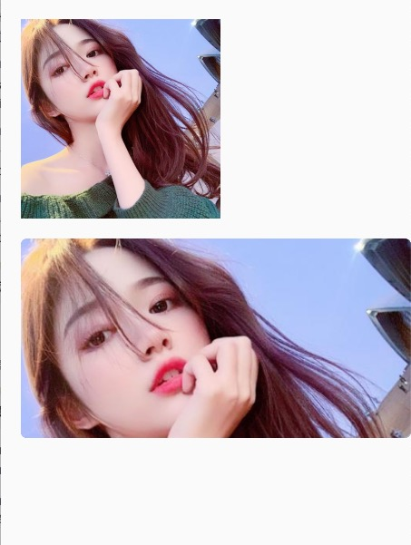

https://blog.csdn.net/xiaohanluo/article/details/52945791


### 全圆角

#### OutLine

```xml
<ImageView
    android:id="@+id/img_test"
    android:layout_width="wrap_content"
    android:layout_height="wrap_content"
    android:src="@drawable/music" />
```


```java
    mImg = findViewById(R.id.img_test);
    ViewOutlineProvider viewOutlineProvider = new ViewOutlineProvider() {
        @Override
        public void getOutline(View view, Outline outline) {
           outline.setOval(0,0,mImg.getWidth(), mImg.getHeight());
        }
    };
    mImg.setOutlineProvider(viewOutlineProvider);
    mImg.setClipToOutline(true);
```


原文链接：https://blog.csdn.net/weixin_43499030/article/details/92799689


#### CardView


### 部分圆角

#### ShapeableImageView

这种方式官方的无风险

```xml
<!-- layout.xml 就是在布局中定义-->
<com.google.android.material.imageview.ShapeableImageView
            android:layout_width="200dp"
            android:layout_height="wrap_content"
            android:scaleType="fitXY"
            android:strokeWidth="10dp"
            android:strokeColor="@color/purple"
            android:src="@drawable/ic_launcher_background"
            app:shapeAppearance="@style/RoundAndCutImageStyle" />
```


需要通过设置 app:shapeAppearance 才有用

```xml
<!--  style.xml  可以单独给每个角设置属性-->
    <style name="RoundAndCutImageStyle">
        <item name="cornerFamilyTopLeft">rounded</item>
        <item name="cornerFamilyBottomLeft">rounded</item>
        <item name="cornerFamilyTopRight">cut</item>
        <item name="cornerFamilyBottomRight">cut</item>
        <item name="cornerSize">50%</item>
        <item name="cornerSizeBottomLeft">20dp</item>
        <item name="cornerSizeTopLeft">20dp</item>
    </style>
```


左边是圆角，右边是“切角”


https://juejin.cn/post/6913083202387050509


####  BitmapShader


```java
	 Call this to create a new shader that will draw with a bitmap.
	 Params:
	 bitmap – The bitmap to use inside the shader
	 tileX – The tiling mode for x to draw the bitmap in.
	 tileY – The tiling mode for y to draw the bitmap in.
public BitmapShader(@NonNull Bitmap bitmap, @NonNull TileMode tileX, @NonNull TileMode tileY) {
    this(bitmap, tileX.nativeInt, tileY.nativeInt);
}
```


```kotlin
class BitmapShaderView @JvmOverloads constructor(
    context: Context?, attrs: AttributeSet?,
    defStyleAttr: Int = 0
) : View(context, attrs, defStyleAttr) {

    private var mWidth by Delegates.notNull<Int>()
    private var mHeight by Delegates.notNull<Int>()
    private lateinit var bmpShader: BitmapShader
    private lateinit var mPaint: Paint
    private lateinit var bmpRect: RectF

    override fun onSizeChanged(w: Int, h: Int, oldw: Int, oldh: Int) {
        super.onSizeChanged(w, h, oldw, oldh)
        mWidth = w  //屏幕宽
        mHeight = h //屏幕高
        bmpRect = RectF(0f, 0f, mWidth.toFloat(), mHeight.toFloat())
        val bitmap = BitmapFactory.decodeResource(resources, R.drawable.meitu122822234759011)
        //Shader.TileMode里有三种模式：CLAMP（拉伸）、MIRROR（镜像）、REPETA（重复）
        bmpShader = BitmapShader(bitmap, Shader.TileMode.CLAMP, Shader.TileMode.CLAMP)
        mPaint = Paint(Paint.ANTI_ALIAS_FLAG)
        mPaint.shader = bmpShader
    }

    override fun onDraw(canvas: Canvas?) {
        super.onDraw(canvas)
        canvas?.drawRect(bmpRect, mPaint)
    }
}
```


 先来看看BitmapShader属性的作用

 bitmap 指的是要作为纹理的图片，

 tileX 指的是在ｘ方向纹理的绘制模式

 tileY 指的是Ｙ方向上的绘制模式。


```java
    public enum TileMode {
        /**
         * Replicate the edge color if the shader draws outside of its
         * original bounds.
         */
        CLAMP   (0),
        /**
         * Repeat the shader's image horizontally and vertically.
         */
        REPEAT  (1),
        /**
         * Repeat the shader's image horizontally and vertically, alternating
         * mirror images so that adjacent images always seam.
         */
        MIRROR(2),
        /**
         * Render the shader's image pixels only within its original bounds. If the shader
         * draws outside of its original bounds, transparent black is drawn instead.
         */
        DECAL(3);

        TileMode(int nativeInt) {
            this.nativeInt = nativeInt;
        }
        final int nativeInt;
    }
```


***CLAMP 拉伸\***:设置x , 横向的最后一个横行像素，不断的重复，设置y，那么纵项的那一列像素，不断的重复；
***REPEAT 重复\***:就是横向、纵向不断重复这个bitmap
***MIRROR 镜像\***:横向不断翻转重复，纵向不断翻转重复；


##### CLAMP

```kotlin
BitmapShader(bitmap, Shader.TileMode.CLAMP, Shader.TileMode.CLAMP)
```


REPEAT


```kotlin
BitmapShader(bitmap, Shader.TileMode.REPEAT, Shader.TileMode.REPEAT)
```


##### MIRROR

```kotlin
BitmapShader(bitmap, Shader.TileMode.MIRROR, Shader.TileMode.MIRROR)
```


 


可以看到， x y 镜像映射


##### DECAL

最后这种就是正常显示的了


https://juejin.cn/post/6844903480809766920


##### 全部圆角

有了scale，就可以设置给我们的matrix；

然后使用mBitmapShader.setLocalMatrix(mMatrix);

最后将bitmapShader设置给paint。

关于drawable转bitmap的代码：


```kotlin
Math.max(width / bmp.width.toFloat(), height / bmp.height.toFloat())
```

View宽度 / 图片宽度 , View的高度/图片高度

他们取最大值，进行缩放，图片短的那一部分就会填满View,长的那一部分会被截掉,显示不全


计算scale

> 比如：view的宽高为50 * 100；图片的宽高为5*100 ； 最终我们应该按照宽的比例放大，而不是按照高的比例缩小；因为我们需要让缩放后的图片，自定大于我们的view宽高，并保证原图比例。

那么高度就被放大10倍到1000,值能显示到1/10


```kotlin
class RoundImageShaderView @JvmOverloads constructor(
    context: Context, attrs: AttributeSet?,
    defStyleAttr: Int = 0
) : AppCompatImageView(context, attrs, defStyleAttr) {
    private val TAG = "RoundImageShaderView"

    private lateinit var mRoundRect: RectF
    private lateinit var mBitmapShader: BitmapShader
    private val mMatrix = Matrix()
    private val mBitmapPaint = Paint();

    override fun onDraw(canvas: Canvas?) {
        super.onDraw(canvas)
        canvas?.drawRoundRect(mRoundRect, 20f, 20f, mBitmapPaint)
    }


    override fun onSizeChanged(w: Int, h: Int, oldw: Int, oldh: Int) {
        super.onSizeChanged(w, h, oldw, oldh)
        setUpShader()
        mRoundRect = RectF(0f, 0f, width.toFloat(), height.toFloat())
    }

    /**
     * 初始化BitmapShader
     */
    private fun setUpShader() {
        val drawable: Drawable = drawable ?: return
        val bmp = drawableToBitamp(drawable)
        // 将bmp作为着色器，就是在指定区域内绘制bmp
        mBitmapShader = BitmapShader(bmp!!, Shader.TileMode.CLAMP, Shader.TileMode.CLAMP)
        // 如果图片的宽或者高与view的宽高不匹配，计算出需要缩放的比例；缩放后的图片的宽高，一定要大于我们view的宽高；所以我们这里取大值；
        val scale = Math.max(width / bmp.width.toFloat(), height / bmp.height.toFloat())
        // shader的变换矩阵，我们这里主要用于放大或者缩小
        mMatrix.setScale(scale, scale)
        // 设置变换矩阵
        mBitmapShader.setLocalMatrix(mMatrix)
        // 设置shader
        mBitmapPaint.shader = mBitmapShader
    }


    /**
     * drawable转bitmap
     *
     * @param drawable
     * @return
     */
    private fun drawableToBitamp(drawable: Drawable): Bitmap? {
        if (drawable is BitmapDrawable) {
            val bd: BitmapDrawable = drawable
            return bd.bitmap
        }
        val w = drawable.intrinsicWidth
        val h = drawable.intrinsicHeight
        return Bitmap.createBitmap(w, h, Bitmap.Config.ARGB_8888)
    }
}
```


```xml
<com.john.kot.view.RoundImageShaderView
    android:id="@+id/iv_girl1"
    android:layout_width="200dp"
    android:layout_height="200dp"
    android:layout_marginStart="20dp"
    android:layout_marginTop="20dp"
    android:src="@drawable/meitu122822234759011"
    app:layout_constraintStart_toStartOf="parent"
    app:layout_constraintTop_toTopOf="parent" />

<com.john.kot.view.RoundImageShaderView
    android:id="@+id/iv_girl2"
    android:layout_width="match_parent"
    android:layout_height="200dp"
    android:layout_marginStart="20dp"
    android:layout_marginTop="20dp"
    android:src="@drawable/meitu122822234759011"
    app:layout_constraintStart_toStartOf="parent"
    app:layout_constraintTop_toBottomOf="@+id/iv_girl1" />
```





可以看到，高度部分截取了

https://blog.csdn.net/lmj623565791/article/details/41967509

https://developer.android.com/reference/android/graphics/PorterDuff.Mode


##### 部分圆角


##### 防止大图OOM


